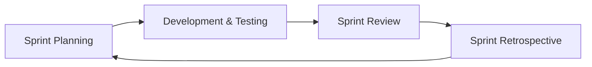
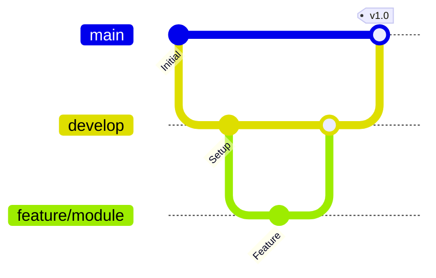
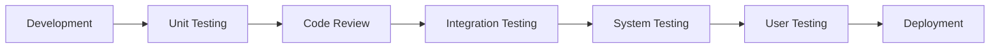
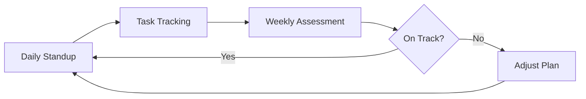

# 系统设计与分析
## SmartCampus
——Your Campus Life Helper
### Team Name
CampusCode
### Team Members
2353924 Feng Juncai  冯俊财
2351869 Ji Peng      纪鹏
2353240 Zhang Shikou 张诗蔻
2352993 Yu Yilian    于伊莲

## Project Description
#### 1. Background and Motivation

##### 1.1 Background

Modern universities offer various digital services (library, academic portal, dining, facility management), but these operate independently with separate interfaces, authentication systems, and data structures. Students must switch between multiple platforms daily. While many universities have developed integrated platforms to consolidate digital services, current implementations have limitations. For example, existing platforms focus primarily on academic management, with minimal integration of daily life services.

##### 1.2 Motivation

SmartCampus reimagines integrated campus platforms with a student-first approach, not replacing but enhancing existing infrastructure.

**Goal:** Comprehensive integration extending beyond academics to include daily life services—dining, packages, lost-and-found, etc.

#### 2. Main Goals

Create a comprehensive, user-friendly, one-stop digital platform that integrates all essential campus services, enhancing daily experiences for students, faculty, and staff.

#### 3. Intended Users and Key Usability Goals

##### 3.1 Students (Primary Users)

**User Profile:**
- Time-sensitive needs, value efficiency and convenience

**Key Benefits & Goals:**
- **Unified Access**: Single sign-on for all campus services, eliminating multiple logins
- **Time Efficiency**: Reduce daily routine tasks from 30-60 minutes to under 15 minutes
- **Real-time Information**: Live updates on seat availability, course enrollment, package arrivals
- **Personalization**: Customized dashboard and smart recommendations based on usage patterns
- **Mobile Convenience**: Access all services anytime, anywhere

**Usability Goals:**
- New users can quickly understand and complete basic tasks without extensive training
- Minimize steps required for frequent operations
- Fast response times for smooth user experience
- High task completion success rate with minimal errors

##### 3.2 Faculty Members

**User Profile:**
- Varying technical proficiency
- Focus on teaching efficiency and student management

**Key Benefits & Goals:**
- **Administrative Efficiency**: Reduce routine administrative workload
- **Simplified Course Management**: Streamlined grade entry, attendance, and material distribution
- **Enhanced Communication**: Direct channel to students for announcements and Q&A
- **Flexible Access**: Manage tasks via both desktop and mobile platforms

**Usability Goals:**
- Professional, academic-appropriate interface
- Minimal training required (<30 minutes for full proficiency)
- Support for batch operations
- Clear help documentation

##### 3.3 Administrative Staff

**User Categories:**
- Library administrators, Academic affairs officers, Facility managers, Student services staff

**Key Benefits & Goals:**
- **Process Automation**: Reduce manual processing by 60%
- **Data-Driven Decisions**: Real-time dashboards and comprehensive analytics
- **Improved Service Quality**: Faster response to student requests
- **Accountability**: Complete audit trails and reporting capabilities

**Usability Goals:**
- Powerful backend management tools
- Batch operation capabilities
- Role-based access control
- Comprehensive reporting features

#### 4. Notes on Existing Similar Products

| Platform | Key Features | Strengths | Limitations |
|----------|-------------|-----------|-------------|
| **Tongxinyun** (Our University) | Unified authentication, academic service management | • Official and reliable data • Stable infrastructure • Comprehensive academic functions | • Academic-only focus • No daily life services • Lacks personalization |
| **WeChat Mini Programs** | Quick access to campus services | • Lightweight, no installation • Fast and convenient • Wide accessibility | • Fragmented services • No data integration • Inconsistent experience |
| **Commercial Platforms** (今日校园, 易班) | Multi-university campus management solutions | • Professional and mature • Rich feature sets • Regular updates | • Generic design, not campus-specific • Privacy concerns with third-party data • Difficult to customize |

**Summary:** Existing solutions address specific needs but lack comprehensive integration. Tongxinyun handles academics well but ignores daily life. WeChat mini programs are convenient but fragmented. Commercial platforms are feature-rich but generic. **SmartCampus** aims to combine their strengths—institutional reliability, accessibility, and comprehensiveness—while adding integrated daily services, personalized experiences, and modern intelligent features tailored to our campus.

#### 5. Main Functionality and Characteristics

SmartCampus integrates four core subsystems to provide comprehensive campus services, combining essential academic functions with daily life conveniences through a unified platform.

##### 5.1 Library Service Subsystem

- **Seat Reservation and Management**: Real-time seat availability display with advance booking capabilities
- **Book Borrowing and Renewal**: Search, borrow, and renew books with automated due date reminders
- **Study Space Inquiry**: Browse and reserve different types of study spaces (quiet zones, group rooms, etc.)
- **Borrowing History Statistics**: Personal reading analytics and borrowing patterns

##### 5.2 Academic Service Subsystem

- **Online Course Selection**: Browse course catalog, check availability, and enroll in courses
- **Course Schedule Query**: Personal timetable with classroom locations and instructor information
- **Grade Inquiry & Analysis**: View grades with statistical analysis and GPA tracking
- **Exam Schedule Query**: Centralized exam timetable with location and time details
- **Credit Progress Tracking**: Monitor degree requirements and credit completion status

##### 5.3 Daily Life Service Subsystem

- **Canteen Ordering & Payment**: Browse menus, pre-order meals, and make mobile payments
- **Package Collection Notification**: Real-time alerts when packages arrive at campus collection points
- **Lost and Found Platform**: Report and search for items with photo uploads
- **Sports Facility Booking**: Reserve gyms, courts, and sports equipment
- **Campus Shuttle Schedule**: Timetable information

##### 5.4 Logistics Management Subsystem

- **Dormitory Repair Requests**: Submit maintenance requests with photo documentation
- **Utility Bill Inquiry & Payment**: Check and pay electricity and water bills online
- **Campus Card Top-up**: Add funds to campus card for various campus services
- **Facility Maintenance Management**: Track repair status and maintenance schedules

#### 6. Novelty of Your Solution and Enhancements Suggested

**1. True Service Integration**

Unify library, academic, dining, package, and maintenance services into a single platform. Students don't need to switch between multiple apps; one login solves all needs.

**2. Proactive Service Instead of Passive Inquiry**

System proactively pushes notifications (class reminders, book due date alerts, package arrival notifications). Reduce troubles caused by forgetting (such as overdue book fines, missing exams).

**3. Personalized User Experience**

Customize homepage based on user habits, prioritizing frequently used functions. Improve efficiency; even new users can get started quickly.

**4. Future Expandable Features:**
- Course evaluation system (for course selection reference)
- Campus second-hand trading platform
- Study group matching
- Campus events calendar

#### 7. Team Organization and Preliminary Project Planning

##### 7.1 Team Organization

| Member | Module | Specific Tasks |
|--------|--------|----------------|
| **Zhang Shikou** | Library Service Subsystem | • Seat reservation and management development • Book borrowing and renewal API integration • Study space query interface design • Borrowing history statistics and visualization |
| **Yu Yilian** | Academic Affairs Subsystem | • Online course selection system logic • Course schedule query and display • Grade inquiry functions • Exam schedule query module • Credit progress tracking algorithm |
| **Feng Juncai** | Life Service Subsystem | • Canteen ordering and payment integration • Express delivery notification push • Lost and found platform development • Sports facility booking system • Campus shuttle schedule query |
| **Ji Peng** | Logistics Management Subsystem | • Dormitory repair request workflow design • Utility bill inquiry and payment integration • Campus card recharge function implementation • Facility maintenance management backend |

##### 7.2 Preliminary Project Planning

#### 8. Engineering Process and Methodologies

##### 8.1 Requirements Analysis

We use **User Stories** and **Use Case Diagrams** to collect and analyze system requirements, ensuring functional completeness and traceability.

##### 8.2 System Design

We adopt **Object-Oriented Design** and **Front-End/Back-End Separation Architecture**. Data is exchanged through RESTful APIs and JSON format.

##### 8.3 Development Methodologies

We use **Agile Development** with 2-week iteration cycles for rapid delivery and flexible requirement adjustments.

**Iteration Process:**

##### 8.4 Coding Standards

**Code Review Process:**
- All code must be reviewed by at least one team member
- Review checklist: naming conventions, comments, performance, security, unit tests

**Version Control:**

##### 8.5 Testing Process

**Testing Flow:**

**Tools:** JUnit, Jest, Apifox

##### 8.6 Documentation Standards

**Technical Documentation:**
- API Documentation (Swagger)
- Database Design
- System Architecture

**Management Documentation:**
- Sprint Plans
- Standup Records
- Retrospectives

**User Documentation:**
- User Manual
- FAQ

##### 8.7 Risk Management

**Monitoring Process:**

Through standardized engineering practices including requirements analysis, system design, agile development, code review, multi-level testing, comprehensive documentation, and risk management, we ensure high-quality delivery of the campus service platform within the limited timeframe.

#### 9. Team Collaboration Platforms or Systems

To ensure efficient communication and seamless project coordination, our team utilizes two primary collaboration platforms: **WeChat** and **GitHub**.

#### 10. Potential for Further Development

SmartCampus has significant potential for expansion beyond its initial scope:

- **Study Group Matching**: Connect students with similar courses or study interests
- **Campus Events Platform**: Centralized event calendar with registration and reminders
- **Second-hand Trading Platform**: Campus marketplace for books, electronics, and other items
- **Course Evaluation System**: Student reviews and ratings to aid course selection
- **Campus Navigation**: Indoor/outdoor maps with real-time location services
- **Health Services Integration**: Medical appointment booking and health record access

#### 11. Related Technologies

**Development Platform:**
- Operating System: Windows
- IDE: Visual Studio Code

**Frontend Technologies:**
- Framework: Vue.js
- UI Library: Element UI
- State Management: Vuex
- Mobile: Flutter

**Backend Technologies:**
- Language: Java / Python / Node.js
- Framework: Spring Boot / Django / Express.js
- API: RESTful API
- Authentication: JSON Web Tokens

**Database:**
- Relational Database: MySQL
- Caching: Redis

**Development Tools:**
- Version Control: Git, GitHub
- API Testing: Apifox
- API Documentation: Swagger

**Testing Tools:**
- Unit Testing: JUnit / Jest / PyTest
- API Testing: Postman

**Deployment and DevOps:**
- Containerization: Docker
- Web Server: Nginx
- Cloud Platform: Alibaba Cloud

#### 12. Challenges We May Encounter

##### 12.1 Technical Challenges

**System Integration**
- **Challenge**: Connecting multiple subsystems (library, academic, dining, logistics) with different data formats
- **Mitigation**: Define unified API standards and data structures early in development

**Real-time Performance**
- **Challenge**: Handling concurrent users during peak times (course selection, seat booking) and ensuring real-time updates
- **Mitigation**: Implement caching strategies, load balancing, and efficient database queries

**Cross-platform Compatibility**
- **Challenge**: Ensuring consistent experience across web and mobile devices
- **Mitigation**: Adopt responsive design and conduct thorough cross-device testing

##### 12.2 Team Collaboration Challenges

**Time Management**
- **Challenge**: Balancing academic coursework with project development deadlines
- **Mitigation**: Create realistic sprint plans with buffer time and prioritize core features

**Skill Gaps**
- **Challenge**: Team members have varying levels of technical expertise
- **Mitigation**: Pair programming, code reviews, and regular knowledge sharing sessions

##### 12.3 Project Scope Challenges

**Feature Prioritization**
- **Challenge**: Risk of scope creep with too many desired features
- **Mitigation**: Focus on MVP (Minimum Viable Product) approach, implement core functions first

**Data Security**
- **Challenge**: Protecting sensitive student information and ensuring privacy compliance
- **Mitigation**: Implement proper authentication, role-based access control, and data encryption

**External Dependencies**
- **Challenge**: Limited access to existing campus systems for integration
- **Mitigation**: Use mock data for development and testing, prepare clear integration documentation

#### 13. Professional Growth and Benefits

**Full-Stack Development Experience:**
- Master both frontend (React/Vue) and backend (Spring Boot) technologies
- Learn complete development lifecycle from design to deployment
- Gain practical experience with databases, APIs, and system architecture

**System Integration and Design:**
- Practice designing scalable and maintainable systems
- Learn to integrate multiple services and handle data synchronization
- Understand trade-offs between performance and complexity

**Agile and Collaborative Development:**
- Experience real agile workflows (sprints, code reviews, version control)
- Master Git collaboration and branching strategies
- Learn to write testable code and ensure quality through automated testing

**Problem-Solving Skills:**
- Develop systematic debugging and troubleshooting approaches
- Learn to research solutions and make technical decisions
- Improve analytical thinking through real-world challenges

**Team Collaboration:**
- Enhance communication with team members and stakeholders
- Practice task coordination, time management, and prioritization
- Learn conflict resolution and consensus building

**User-Centered Thinking:**
- Translate user requirements into technical solutions
- Practice user experience design and usability testing
- Understand business processes and workflow optimization

**Portfolio and Professional Experience:**
- Build substantial project showcasing end-to-end delivery capability
- Gain industry-relevant experience with modern technologies
- Develop confidence for internship and job interviews

**Personal Growth:**
- Build self-directed learning abilities and resilience
- Develop innovation mindset balanced with practical constraints
- Cultivate professional work habits and communication skills
