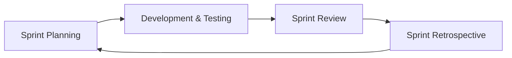
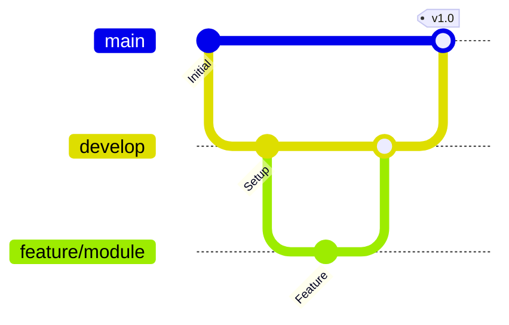
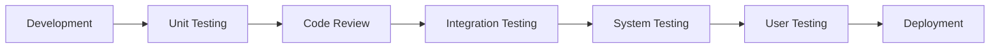
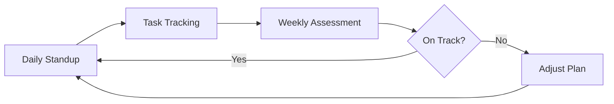

# 系统设计与分析
## SmartCampus 
——Your Campus Life Helper
### Team name 
CampusCode
### team members 
2353924 Feng Juncai  冯俊财
2351869 Ji Peng      纪鹏
2353240 Zhang Shikou 张诗蔻
2352993 Yu Yilian    于伊莲

## Project description
#### 1. Backgrounds & motivations
##### 1.1. Backgrounds

Modern universities offer various digital services (library, academic portal, dining, facility management), but these operate independently with separate interfaces, authentication systems, and data structures. Students must switch between multiple platforms daily.While many universities have developed integrated platforms to consolidate digital services, current implementations have limitations,for example, Existing platforms focus primarily on academic management, with minimal integration of daily life services.

##### 1.2. Motivations

SmartCampus reimagines integrated campus platforms with a student-first approach, not replacing but enhancing existing infrastructure.

Goal: Comprehensive integration extending beyond academics to include daily life services—dining, packages, lost-and-found, etc.

#### 2. Main goals  
 
Create a comprehensive, user-friendly, one-stop digital platform that integrates all essential campus services, enhancing daily experiences for students, faculty, and staff.
 
#### 3. Intended users and key usability goals 
##### 3.1. Students (Primary Users)
***User profile:***
- Time-sensitive needs, value efficiency and convenience
  
***Key Benefits & Goals:***
- *Unified Access*: Single sign-on for all campus services, eliminating multiple logins
- *Time Efficiency*: Reduce daily routine tasks from 30-60 minutes to under 15 minutes
- *Real-time Information*: Live updates on seat availability, course enrollment, package arrivals
- *Personalization*: Customized dashboard and smart recommendations based on usage patterns
- *Mobile Convenience*: Access all services anytime, anywhere
  
***Usability Goals:***
- *Learnability*: New users can quickly understand and complete basic tasks without extensive training
- *Efficiency*: Minimize steps required for frequent operations
- *Performance*: Fast response times for smooth user experience
- *Effectiveness*: High task completion success rate with minimal errors
##### 3.2. Faculty Members
***User Profile:***
  - Varying technical proficiency
  - Focus on teaching efficiency and student management

***Key Benefits & Goals:***
  - *Administrative Efficiency*: Reduce routine administrative workload 
  - *Simplified Course Management*: Streamlined grade entry, attendance, and material distribution
  - *Enhanced Communication*: Direct channel to students for announcements and Q&A
  - *Flexible Access*: Manage tasks via both desktop and mobile platforms

***Usability Goals:***
  - Professional, academic-appropriate interface
  - Minimal training required (<30 minutes for full proficiency)
  - Support for batch operations
  - Clear help documentation

##### 3.3. Administrative Staff

***User Categories:***
- Library administrators, Academic affairs officers, Facility managers, Student services staff

***Key Benefits & Goals:***
- **Process Automation**: Reduce manual processing by 60%
- **Data-Driven Decisions**: Real-time dashboards and comprehensive analytics
- **Improved Service Quality**: Faster response to student requests
- **Accountability**: Complete audit trails and reporting capabilities

***Usability Goals:***
- Powerful backend management tools
- Batch operation capabilities
- Role-based access control
- Comprehensive reporting features

 
#### 4. Notes on existing similar products: their utility and limitations and advantages and disadvantages
  
#### 4. Notes on Existing Similar Products
 

| Platform Type | Utility | Advantages | Limitations | Disadvantages |
|--------------|---------|------------|-------------|---------------|
| **Tongxinyun** (Our University) | Provides unified authentication and academic service management for students | • Stable infrastructure • Reliable official data • Comprehensive academic functions • Institutional support | • Academic-focused scope • Lacks daily life services • Limited personalization | • No dining/package/lost-and-found services • Traditional interface design • Missing smart recommendations • No proactive notifications |
| **WeChat Mini Programs** | Offers quick access to individual campus services through WeChat ecosystem | • Lightweight, no installation • Fast access • Low development costs • Works well for single tasks | • Fragmented service structure • No data integration • Platform restrictions | • Requires separate apps for each service • Inconsistent user experience • WeChat account dependency • Limited advanced features |
| **Commercial Platforms** (今日校园, 易班) | Delivers comprehensive campus management solutions across multiple universities | • Professional development • Regular updates • Mature architecture • Rich feature sets | • Generic design approach • Third-party data handling • Customization difficulties | • Not tailored to specific campus • Privacy concerns • Monetization priorities • Integration challenges with existing systems |

**Summary:** Existing solutions each serve specific purposes but lack comprehensive integration. Tongxinyun excels at academic administration but misses daily life services. WeChat mini programs provide convenience but create fragmentation. Commercial platforms offer breadth but sacrifice campus-specific customization and data privacy. SmartCampus aims to combine the institutional reliability of Tongxinyun, the accessibility of mini programs, and the comprehensiveness of commercial platforms, while addressing their collective shortcomings through integrated daily life services, personalized experiences, and modern intelligent features.
 

#### 5. Main functionality and characteristics

SmartCampus integrates four core subsystems to provide comprehensive campus services, combining essential academic functions with daily life conveniences through a unified platform.

##### 5.1 Library Service Subsystem 

- **Seat Reservation & Management**: Real-time seat availability display with advance booking capabilities
- **Book Borrowing & Renewal**: Search, borrow, and renew books with automated due date reminders
- **Study Space Inquiry**: Browse and reserve different types of study spaces (quiet zones, group rooms, etc.)
- **Borrowing History Statistics**: Personal reading analytics and borrowing patterns

##### 5.2 Academic Service Subsystem 

- **Online Course Selection**: Browse course catalog, check availability, and enroll in courses
- **Course Schedule Query**: Personal timetable with classroom locations and instructor information
- **Grade Inquiry & Analysis**: View grades with statistical analysis and GPA tracking
- **Exam Schedule Query**: Centralized exam timetable with location and time details
- **Credit Progress Tracking**: Monitor degree requirements and credit completion status

##### 5.3 Daily Life Service Subsystem 

- **Canteen Ordering & Payment**: Browse menus, pre-order meals, and make mobile payments
- **Package Collection Notification**: Real-time alerts when packages arrive at campus collection points
- **Lost & Found Platform**: Report lost items and search for found items with photo uploads
- **Sports Facility Booking**: Reserve gyms, courts, and sports equipment
- **Campus Shuttle Schedule**: timetable information

##### 5.4 Logistics Management Subsystem

- **Dormitory Repair Requests**: Submit maintenance requests with photo documentation
- **Utility Bill Inquiry & Payment**: Check and pay electricity and water bills online
- **Campus Card Top-up**: Add funds to campus card for various campus services
- **Facility Maintenance Management**: Track repair status and maintenance schedules

 
#### 6. Novelty of your solution and enhancements suggested 
 
**1. True Service Integration**
  Unify library, academic, dining, package, and maintenance services into a single platform. Students don't need to switch between multiple apps; one login solves all needs

**2. Proactive Service Instead of Passive Inquiry**
System proactively pushes notifications (class reminders, book due date alerts, package arrival notifications). Reduce troubles caused by forgetting (such as overdue book fines, missing exams)

**3. Personalized User Experience**
Customize homepage based on user habits, prioritizing frequently used functions. Improve efficiency; even new users can get started quickly

**4. Future Expandable Features:**
- Course evaluation system (for course selection reference)
- Campus second-hand trading platform
- Study group matching
- Campus events calendar
 

 
#### 7. Team organization and preliminary project planning

##### 7.1. Team organization

| Member | Module | Specific Tasks |
|--------|--------|----------------|
| **Zhang Shicui** |  Library Service Subsystem | • Seat reservation and management development • Book borrowing and renewal API integration • Study space query interface design • Borrowing history statistics and visualization |
| **Yu Yilian** |  Academic Affairs Subsystem | • Online course selection system logic implementation • Course schedule query and display • Grade inquiry and data analysis functions • Exam schedule query module • Credit progress tracking algorithm |
| **Feng Juncai** |  Life Service Subsystem | • Canteen ordering and payment integration • Express delivery notification push • Lost and found platform development • Sports facility booking system • Campus shuttle schedule query |
| **Ji Peng** | 🔧 Logistics Management Subsystem | • Dormitory repair request workflow design • Utility bill inquiry and payment integration • Campus card recharge function implementation • Facility maintenance management backend |

##### 7.2.preliminary project planning

#### 8. Engineering process and methodologies
 
##### 8.1 Requirements Analysis

We use **User Stories** and **Use Case Diagrams** to collect and analyze system requirements, ensuring functional completeness and traceability.

Main Outputs:
- User Stories List
- Use Case Diagrams
- Functional Requirements Document

##### 8.2 System Design

We adopt **Object-Oriented Design** and **Front-End/Back-End Separation Architecture**. Data is exchanged through RESTful APIs and JSON format.

Design Documents:
- Class Diagrams
- API Documentation
- Database Design (ER Diagrams + Table Structure)
 
##### 8.3 Development Methodologies

We use **Agile Development** with 2-week iteration cycles for rapid delivery and flexible requirement adjustments.

Iteration Process:

 
##### 8.4 Coding Standards

Code Review Process:
- All code must be reviewed by at least one team member
- Review checklist: naming conventions, comments, performance, security, unit tests

Version Control:

##### 8.5 Testing Process
 
Testing Flow:

Tools: JUnit, Jest, Apifox

##### 8.6 Documentation Standards

Technical: API Documentation (Swagger), Database Design, System Architecture
Management: Sprint Plans, Standup Records, Retrospectives
User: User Manual, FAQ

##### 8.7 Risk Management
Monitoring:

Through standardized engineering practices including requirements analysis, system design, agile development, code review, multi-level testing, comprehensive documentation, and risk management, we ensure high-quality delivery of the campus service platform within the limited timeframe.
 
#### 9. Team collaboration platforms or systems 
To ensure efficient communication and seamless project coordination, our team utilizes two primary collaboration platforms:**Wechat** and **GitHub**
#### 10. Potential for further development 
SmartCampus has significant potential for expansion beyond its initial scope: 
**Study Group Matching**: Connect students with similar courses or study interests
**Campus Events Platform**: Centralized event calendar with registration and reminders  
**Second-hand Trading Platform**: Campus marketplace for books, electronics, and other items
**Course Evaluation System**: Student reviews and ratings to aid course selection
**Campus Navigation**: Indoor/outdoor maps with real-time location services
**Health Services Integration**: Medical appointment booking and health record access
 

#### 11. Related technologies 
Development Platform:
- Operating System: Windows
- IDE: Visual Studio Code

Frontend Technologies:
- Framework: vue.js
- UI Library: Element UI
- State Management: Vuex
- Mobile: Flutter 
  
Backend Technologies:
- Language: Java / Python / Node.js
- Framework: Spring Boot / Django / Express.js
- API: RESTful API 
- Authentication: JSON Web Tokens

Database:
- Relational Database: MySQL 
- Caching: Redis

Development Tools:
- Version Control: Git, GitHub
- API Testing: Apifox
- API Documentation: Swagger 

Testing Tools:
- Unit Testing: JUnit / Jest / PyTest
- Api Testing: Postman 

Deployment and DevOps:
- Containerization: Docker
- Web Server: Nginx 
- Cloud Platform: Alibaba Cloud 
 

#### 12. Challenges that you think you may encounter during the project’s development

# 12. Challenges We May Encounter

## 12.1 Technical Challenges

**Integration Complexity**
- **Challenge**: Integrating multiple subsystems with different data structures
- **Mitigation**: Establish clear API contracts and data standards early

**Real-time Data Synchronization**
- **Challenge**: Ensuring seat availability, package notifications are updated in real-time
- **Mitigation**: Implement WebSocket or polling mechanisms with proper caching

**Performance Optimization**
- **Challenge**: Handling concurrent users during peak times (course selection, meal ordering)
- **Mitigation**: Load testing, database optimization, and caching strategies

**Mobile Responsiveness**
- **Challenge**: Ensuring consistent experience across different devices
- **Mitigation**: Responsive design principles and thorough cross-device testing

## 12.2 Team Collaboration Challenges

**Time Management**
- **Challenge**: Balancing coursework with project development
- **Mitigation**: Realistic sprint planning and flexible task allocation

**Skill Level Differences**
- **Challenge**: Team members have varying technical expertise
- **Mitigation**: Pair programming, code reviews, and knowledge sharing sessions

**Communication Gaps**
- **Challenge**: Misunderstandings in requirements or technical decisions
- **Mitigation**: Regular meetings, clear documentation, and open communication channels

## 12.3 Project Management Challenges

**Scope Creep**
- **Challenge**: Adding too many features beyond initial plan
- **Mitigation**: Strict prioritization and MVP (Minimum Viable Product) approach

**Testing Coverage**
- **Challenge**: Ensuring comprehensive testing with limited time
- **Mitigation**: Focus on critical path testing and automated test suites

**Data Security and Privacy**
- **Challenge**: Protecting sensitive student information
- **Mitigation**: Implement proper authentication, authorization, and data encryption

## 12.4 External Dependencies

**Third-party System Integration**
- **Challenge**: Limited access to existing campus systems (library, academic databases)
- **Mitigation**: Mock data for development, clear interface definitions

**Requirement Changes**
- **Challenge**: Stakeholder feedback may require significant changes
- **Mitigation**: Agile methodology allows for iterative adjustments

---

# 13. Professional Growth and Benefits

## 13.1 Technical Skills Development

**Full-Stack Development Experience**
- Gain hands-on experience with both frontend and backend technologies
- Learn complete software development lifecycle from design to deployment
- Master modern frameworks and tools used in industry

**System Design Capabilities**
- Practice designing scalable, maintainable system architecture
- Learn to balance trade-offs between performance, complexity, and maintainability
- Understand database design and optimization techniques

**API Development and Integration**
- Learn RESTful API design principles
- Practice API documentation and testing
- Gain experience integrating multiple services

## 13.2 Software Engineering Practices

**Agile Development Methodology**
- Experience real-world agile practices (sprints, standups, retrospectives)
- Learn to adapt to changing requirements
- Understand iterative development benefits

**Version Control and Collaboration**
- Master Git workflows and branching strategies
- Practice code review processes
- Learn collaborative development best practices

**Testing and Quality Assurance**
- Understand importance of comprehensive testing
- Learn to write unit, integration, and system tests
- Develop quality-conscious development habits

## 13.3 Project Management Skills

**Team Collaboration**
- Improve communication skills with technical and non-technical stakeholders
- Learn to coordinate work across multiple team members
- Practice conflict resolution and consensus building

**Time and Resource Management**
- Learn to estimate task complexity and duration
- Practice prioritization and deadline management
- Understand resource allocation in team projects

**Problem-Solving Abilities**
- Develop systematic approach to debugging and troubleshooting
- Learn to research and evaluate technical solutions
- Improve critical thinking and analytical skills

## 13.4 Domain Knowledge

**Understanding User Needs**
- Learn to translate user requirements into technical solutions
- Practice user-centered design thinking
- Gain experience in usability and user experience design

**Business Process Analysis**
- Understand how digital systems support organizational workflows
- Learn to identify inefficiencies and propose improvements
- Develop systems thinking perspective

## 13.5 Career Preparation

**Portfolio Development**
- Create substantial project for resume and interviews
- Demonstrate end-to-end project delivery capability
- Showcase both technical and soft skills

**Industry-Relevant Experience**
- Work with technologies and practices used in professional settings
- Build confidence in handling real-world complexity
- Prepare for internship and job interviews

**Networking and Teamwork**
- Build collaborative relationships with team members
- Learn from peers' different perspectives and approaches
- Develop professional work habits and communication style

## 13.6 Personal Growth

**Confidence Building**
- Overcome technical challenges and see tangible results
- Develop self-directed learning abilities
- Build resilience through problem-solving

**Innovation and Creativity**
- Practice designing solutions to real problems
- Learn to balance innovation with practical constraints
- Develop product thinking mindset

---

**Summary**: This project provides invaluable hands-on experience that bridges academic learning and professional practice. It develops not only technical skills but also essential soft skills like teamwork, communication, and project management. The comprehensive nature of SmartCampus—spanning multiple subsystems and technologies—offers a realistic preview of professional software development, preparing us for successful careers in the technology industry.

#### 13. A note on how this project can help your professional growth (how you would benefit from it).  