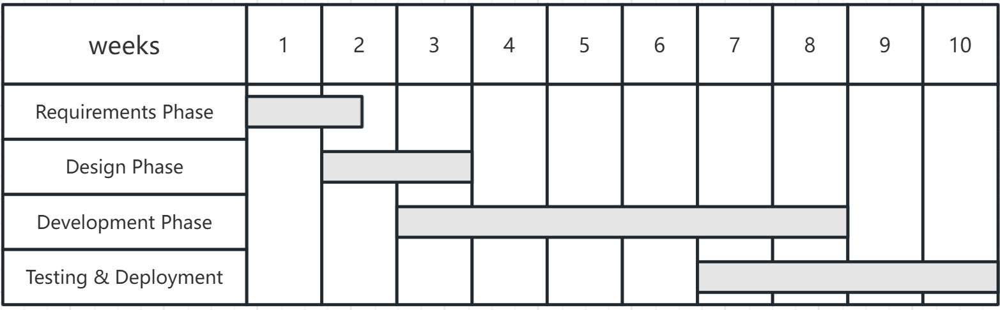
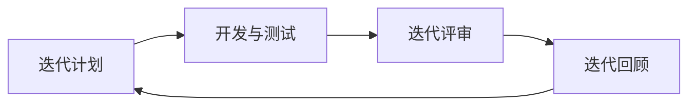
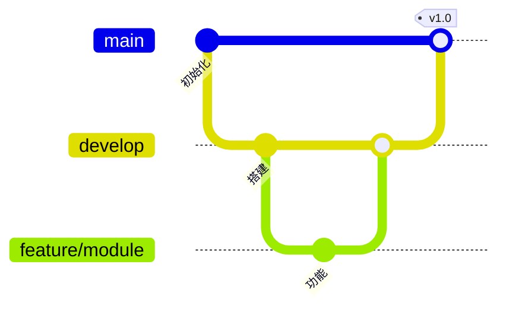
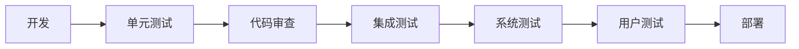
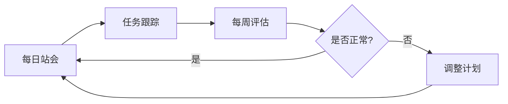

# 系统设计与分析
## 智慧校园
——你的校园生活助手

### 团队名称
CampusCode

### 团队成员
2353924 Feng Juncai  冯俊财
2351869 Ji Peng      纪鹏
2353240 Zhang Shikou 张诗蔻
2352993 Yu Yilian    于伊莲

## 项目描述

#### 1. 背景与动机

##### 1.1 背景

现代大学提供各种数字服务（图书馆、教务门户、餐饮、设施管理），但这些服务独立运营，使用不同的界面、认证系统和数据结构。学生必须在多个平台之间切换才能完成日常事务。虽然许多大学已经开发了集成平台来整合数字服务，但当前的实现仍存在局限性。例如，现有平台主要关注学术管理，对日常生活服务的集成较少。

##### 1.2 动机

智慧校园以学生为本，重新构想集成校园平台，不是替代而是增强现有基础设施。

**目标：**
- 实现超越学术范畴的全面集成
- 包含日常生活服务（餐饮、快递、失物招领等）

#### 2. 主要目标

创建一个综合性的、用户友好的一站式数字平台，集成所有重要的校园服务，提升学生、教职工的日常体验。

#### 3. 目标用户和关键可用性目标

##### 3.1 学生（主要用户）

**用户特征：**
- 时间敏感性需求，重视效率和便利性

**主要优势与目标：**
- **统一访问**：所有校园服务单点登录，无需多次登录
- **时间效率**：将日常例行任务从30-60分钟减少到15分钟以内
- **实时信息**：座位可用性、课程注册、快递到达等实时更新
- **个性化**：基于使用习惯的自定义仪表板和智能推荐
- **移动便利性**：随时随地访问所有服务

**可用性目标：**
- 新用户无需大量培训即可快速理解和完成基本任务
- 最小化常用操作所需步骤
- 快速响应时间确保流畅用户体验
- 高任务完成成功率，最小化错误

##### 3.2 教职工

**用户特征：**
- 技术熟练度各异
- 注重教学效率和学生管理

**主要优势与目标：**
- **行政效率**：减少日常行政工作负担
- **简化课程管理**：流畅的成绩录入、考勤和教材分发
- **增强沟通**：与学生直接沟通的公告和问答渠道
- **灵活访问**：通过桌面和移动平台管理任务

**可用性目标：**
- 专业、学术性的界面
- 最少培训要求（完全熟练使用时间少于30分钟）
- 支持批量操作
- 清晰的帮助文档

##### 3.3 行政人员

**用户类别：**
- 图书馆管理员、教务人员、设施管理员、学生服务人员

**主要优势与目标：**
- **流程自动化**：减少60%的人工处理
- **数据驱动决策**：实时仪表板和综合分析
- **提升服务质量**：更快响应学生请求
- **责任追踪**：完整的审计跟踪和报告功能

**可用性目标：**
- 强大的后台管理工具
- 批量操作能力
- 基于角色的访问控制
- 全面的报告功能

#### 4. 现有类似产品说明

| 平台 | 主要功能 | 优势 | 局限性 |
|------|---------|------|--------|
| **通信云** （我校） | 统一认证、 教务服务管理 | • 官方可靠数据 • 稳定基础设施 • 全面的教务功能 | • 仅限学术功能 • 缺少日常生活服务 • 缺乏个性化 |
| **微信小程序** | 快速访问 校园服务 | • 轻量级，无需安装 • 快速便捷 • 广泛可及 | • 服务分散 • 无数据集成 • 体验不一致 |
| **商业平台** （今日校园、易班） | 多校园管理解决方案 | • 专业成熟 • 功能丰富 • 定期更新 | • 通用设计，非校园特制 • 第三方数据隐私问题 • 难以定制 |

**总结：** 现有解决方案能解决特定需求但缺乏全面集成。通信云处理教务优秀但忽视日常生活。微信小程序便捷但分散。商业平台功能丰富但过于通用。**智慧校园**旨在结合它们的优势——机构可靠性、可访问性和全面性，同时添加集成的日常服务、个性化体验和为我校量身定制的现代智能特性。

#### 5. 主要功能和特点

智慧校园通过统一平台整合四个核心子系统，将基本教务功能与日常生活便利相结合，提供全面的校园服务。

##### 5.1 图书馆服务子系统

- **座位预约与管理**：实时显示座位可用性，支持提前预订
- **图书借阅与续借**：检索、借阅和续借图书，自动提醒到期
- **学习空间查询**：浏览和预订不同类型的学习空间（安静区、小组室等）
- **借阅历史统计**：个人阅读分析和借阅模式

##### 5.2 教务服务子系统

- **在线选课**：浏览课程目录，查看可用性并报名课程
- **课程表查询**：个人课表，包含教室位置和教师信息
- **成绩查询和分析**：查看成绩，统计分析和GPA追踪
- **考试安排查询**：集中的考试时间表，含地点和时间详情
- **学分进度追踪**：监控学位要求和学分完成状态

##### 5.3 日常生活服务子系统

- **食堂点餐与支付**：浏览菜单，预订餐食，移动支付
- **快递收取通知**：快递到达校园收件点时实时提醒
- **失物招领平台**：报告和搜索失物，支持照片上传
- **体育设施预约**：预订体育馆、场地和运动器材
- **校园班车时刻表**：班车时间信息

##### 5.4 后勤管理子系统

- **宿舍维修申请**：提交维修申请，支持照片记录
- **水电费查询缴费**：在线查询和支付水电费
- **校园卡充值**：为各类校园服务充值校园卡
- **设施维护管理**：跟踪维修状态和维护计划

#### 6. 解决方案的创新性和建议改进

**1. 真正的服务集成**
统一图书馆、教务、餐饮、快递和维修服务到单一平台。学生无需在多个应用间切换，一次登录解决所有需求。

**2. 主动服务代替被动查询**
系统主动推送通知（课程提醒、图书到期提醒、快递到达通知）。减少因遗忘造成的困扰（如图书超期罚款、错过考试）。

**3. 个性化用户体验**
根据用户习惯定制主页，优先显示常用功能。提高效率，新用户也能快速上手。

**4. 未来可扩展功能：**
- 课程评价系统（用于选课参考）
- 校园二手交易平台
- 学习小组匹配
- 校园活动日历

#### 7. 团队组织和初步项目规划

##### 7.1 团队组织

| 成员 | 模块 | 具体任务 |
|------|------|---------|
| **张诗蔻** | 图书馆服务子系统 | • 座位预约和管理开发 • 图书借阅和续借API集成 • 学习空间查询界面设计 • 借阅历史统计和可视化 |
| **于伊莲** | 教务服务子系统 | • 在线选课系统逻辑 • 课程表查询和显示 • 成绩查询功能 • 考试安排查询模块 • 学分进度追踪算法 |
| **冯俊财** | 生活服务子系统 | • 食堂点餐和支付集成 • 快递通知推送 • 失物招找平台开发 • 体育设施预约系统 • 校园班车时刻查询 |
| **纪鹏** | 后勤管理子系统 | • 宿舍维修申请工作流设计 • 水电费查询和支付集成 • 校园卡充值功能实现 • 设施维护管理后台 |

##### 7.2 初步项目规划

#### 8. 工程过程和方法论

##### 8.1 需求分析

我们使用**用户故事**和**用例图**收集和分析系统需求，确保功能完整性和可追溯性。

##### 8.2 系统设计

我们采用**面向对象设计**和**前后端分离架构**。通过RESTful API和JSON格式交换数据。

##### 8.3 开发方法论

我们使用**敏捷开发**，采用2周迭代周期，实现快速交付和灵活的需求调整。

**迭代流程：**

##### 8.4 编码规范

**代码审查流程：**
- 所有代码必须经过至少一名团队成员审查
- 审查清单：命名规范、注释、性能、安全性、单元测试

**版本控制：**

##### 8.5 测试流程

**测试流程：**

**工具：** JUnit（Java单元测试）、Jest（前端测试）、Apifox（接口测试）

##### 8.6 文档规范

**技术文档：**
- API文档（Swagger）
- 数据库设计
- 系统架构

**管理文档：**
- 迭代计划
- 站会记录
- 回顾总结

**用户文档：**
- 用户手册
- 常见问题解答

##### 8.7 风险管理

**监控流程：**

通过规范化的工程实践，包括需求分析、系统设计、敏捷开发、代码审查、多层次测试、全面文档和风险管理，我们确保在有限时间内高质量交付校园服务平台。

#### 9. 团队协作平台或系统

为确保高效沟通和无缝项目协调，我们的团队使用两个主要协作平台：**微信**和**GitHub**。

#### 10. 未来发展潜力

智慧校园具有显著的扩展潜力，超越初始范围：

- **学习小组匹配**：连接有相似课程或学习兴趣的学生
- **校园活动平台**：集中的活动日历，支持报名和提醒
- **二手交易平台**：校园图书、电子产品等物品交易市场
- **课程评价系统**：学生评价和评分帮助选课
- **校园导航**：室内外地图，实时位置服务
- **健康服务集成**：医疗预约和健康记录访问

#### 11. 相关技术

**开发平台：**
- 操作系统：Windows
- 集成开发环境：Visual Studio Code

**前端技术：**
- 框架：Vue.js
- UI库：Element UI
- 状态管理：Vuex
- 移动端：Flutter

**后端技术：**
- 语言：Java / Python / Node.js
- 框架：Spring Boot / Django / Express.js
- API：RESTful API
- 认证：JSON Web Tokens

**数据库：**
- 关系型数据库：MySQL
- 缓存：Redis

**开发工具：**
- 版本控制：Git、GitHub
- API测试：Apifox
- API文档：Swagger

**测试工具：**
- 单元测试：JUnit / Jest / PyTest
- 接口测试：Postman

**部署和运维：**
- 容器化：Docker
- Web服务器：Nginx
- 云平台：阿里云

#### 12. 可能遇到的挑战

##### 12.1 技术挑战

**系统集成**
- **挑战**：连接多个子系统（图书馆、教务、餐饮、后勤）的不同数据格式
- **缓解措施**：早期定义统一的API标准和数据结构

**实时性能**
- **挑战**：处理高峰期（选课、座位预约）的并发用户和确保实时更新
- **缓解措施**：实施缓存策略、负载均衡和高效数据库查询

**跨平台兼容性**
- **挑战**：确保web端和移动端的一致体验
- **缓解措施**：采用响应式设计并进行全面的跨设备测试

##### 12.2 团队协作挑战

**时间管理**
- **挑战**：平衡学术课程与项目开发截止日期
- **缓解措施**：制定包含缓冲时间的实际迭代计划，优先核心功能

**技能差距**
- **挑战**：团队成员技术专业水平各异
- **缓解措施**：结对编程、代码审查和定期知识分享会议

##### 12.3 项目范围挑战

**功能优先级**
- **挑战**：过多期望功能导致范围蔓延的风险
- **缓解措施**：关注最小可行产品(MVP)方法，首先实现核心功能

**数据安全**
- **挑战**：保护敏感学生信息并确保隐私合规
- **缓解措施**：实施适当的认证、基于角色的访问控制和数据加密

**外部依赖**
- **挑战**：获取现有校园系统的集成访问权限有限
- **缓解措施**：使用模拟数据进行开发和测试，准备清晰的集成文档

#### 13. 专业成长和收益

**全栈开发经验**
- 掌握前端（React/Vue）和后端（Spring Boot）技术
- 学习从设计到部署的完整开发生命周期
- 获得数据库、API和系统架构的实践经验

**系统集成和设计**
- 练习设计可扩展和可维护的系统
- 学习集成多个服务和处理数据同步
- 理解性能和复杂性之间的权衡

**敏捷和协作开发**
- 体验真实的敏捷工作流（迭代、代码审查、版本控制）
- 掌握Git协作和分支策略
- 学习编写可测试代码和通过自动化测试确保质量

**问题解决能力**
- 培养系统化的调试和故障排除方法
- 学习研究解决方案和做出技术决策
- 通过真实世界的挑战提升分析思维

**团队协作**
- 加强与团队成员和利益相关者的沟通
- 实践任务协调、时间管理和优先级排序
- 学习冲突解决和建立共识

**以用户为中心的思维**
- 将用户需求转化为技术解决方案
- 实践用户体验设计和可用性测试
- 理解业务流程和工作流优化

**作品集和专业经验**
- 构建展示端到端交付能力的重要项目
- 获得行业相关的现代技术经验
- 为实习和工作面试建立信心

**个人成长**
- 培养自主学习能力和韧性
- 培养平衡实际约束的创新思维
- 培养专业工作习惯和沟通技能