# System Analysis and Design

  

- [System Analysis and Design](#system-analysis-and-design)
  - [1. Introduction](#1-introduction)
    - [1.1 Background](#11-background)
    - [1.2 Motivation](#12-motivation)
    - [1.3 Scope](#13-scope)
    - [1.4 Target Users](#14-target-users)
      - [Primary Users: Students](#primary-users-students)
      - [Secondary Users: Faculty \& Staff](#secondary-users-faculty--staff)
  - [2. Strategic Analysis](#2-strategic-analysis)
    - [2.1 SWOT](#21-swot)
    - [2.2 Goals](#22-goals)
    - [2.3 Initiatives](#23-initiatives)
  - [3. Roadmap](#3-roadmap)
  - [4. Use case modelling and Business Process Modelling](#4-use-case-modelling-and-business-process-modelling)
    - [4.1 Use Case](#41-use-case)
      - [4.1.3 Life Services Subsystem](#413-life-services-subsystem)
    - [4.2 Activity Diagrams](#42-activity-diagrams)
      - [4.2.3 Life Service](#423-life-service)
  - [5. Glossary of terms](#5-glossary-of-terms)
  - [6. Supplementary specification](#6-supplementary-specification)
  - [7. Initial snapshots of the system's user interface](#7-initial-snapshots-of-the-systems-user-interface)
    - [7.3 Life Service](#73-life-service)
  - [8. AI tool usage disclosure](#8-ai-tool-usage-disclosure)
  - [9. References](#9-references)
  - [10. Team member contributions](#10-team-member-contributions)
  - [11. Agile artifacts](#11-agile-artifacts)
    - [11.1 Persona](#111-persona)

## 1. Introduction

**SmartCampus** — Your Campus Life Helper
**Team Name**：CampusCode
**Team Members**：
2353924 Feng Juncai    冯俊财
2351869 Ji Peng        纪鹏
2353240 Zhang Shikou   张诗蔻
2352993 Yu Yilian      于伊莲

### 1.1 Background

Modern universities offer various digital services (library, academic portal, dining, facility management), but these operate independently with separate interfaces, authentication systems, and data structures. Students must switch between multiple platforms daily. While many universities have developed integrated platforms to consolidate digital services, current implementations have limitations. For example, existing platforms focus primarily on academic management, with minimal integration of daily life services.

### 1.2 Motivation

SmartCampus reimagines integrated campus platforms with a student-first approach, enhancing rather than replacing existing infrastructure. Our motivation stems from recognizing that students' campus life extends beyond academics—they need to reserve library seats, check package notifications, report maintenance issues, and order meals efficiently. We aim to provide true integration encompassing both academic and daily life services, delivering proactive personalized experiences through mobile-first design.

### 1.3 Scope

SmartCampus focuses specifically on enhancing students' campus life by intelligently managing diverse services through four integrated subsystems. 

- The **Daily Life Service** Subsystem facilitates convenient canteen meal ordering with mobile payment integration, real-time package collection notifications linked to campus courier services, a comprehensive lost-and-found platform connecting the campus community, sports facility booking for gyms and courts, and campus shuttle schedule access with real-time location tracking.

- The **Library Service** Subsystem enables real-time seat reservation with availability tracking, book borrowing and renewal with automated due-date reminders, study space inquiry across campus locations, and personal reading analytics to help students track their academic progress. 

- The **Logistics Management** Subsystem streamlines dormitory repair requests with photo documentation and progress tracking, utility bill inquiry and convenient online payment options, campus card top-up services with transaction history, and comprehensive facility maintenance tracking across campus buildings.

- The **Academic Service** Subsystem provides intuitive online course selection, personalized schedule management with conflict detection, comprehensive grade inquiry with statistical analysis and trend visualization, exam schedule tracking with countdown reminders, and credit progress monitoring toward graduation requirements.

These four subsystems work together to create a unified, intelligent campus service ecosystem that addresses students' comprehensive needs throughout their daily campus life.

### 1.4 Target Users

#### Primary Users: Students

- **Population**: 15,000-30,000 per university
- **Needs**: Integrated access to library, academic, dining, and logistics services
- **Usage**: 80%+ mobile, high frequency during peak hours
- **Pain Points**: Multiple logins, scattered information, time-consuming tasks

#### Secondary Users: Faculty & Staff

- **Faculty**: Library access, course management, facility booking
- **Service Staff**: Administrators Staff
- **Needs**: Operational dashboards, real-time updates, reporting tools 

## 2. Strategic Analysis

Conduct a strategic analysis, such as a SWOT and TOWS analysis, for your team and the proposed product, and then clarify your business goals and initiatives. 

### 2.1 SWOT

Strengths:

- **Comprehensive Integration**: Unified platform for library, dining, logistics, and academic services
- **User-Centric Design**: Focus on reducing student task management time by 50%
- **Technical Expertise**: Team has strong background in system analysis and design
- **SSO Integration**: Seamless authentication across existing campus systems
- **Mobile-First Approach**: Responsive design for multi-device access

Weaknesses:

- **Resource Constraints**: Limited development team and budget
- **System Dependencies**: Relies on existing campus infrastructure and APIs
- **No Established Brand**: First-time product with no user base
- **Data Privacy Risks**: Handling sensitive student personal and academic information
- **Limited Testing Scope**: Cannot test with real users before deployment

Opportunities: 

- **High Market Demand**: 85% of surveyed students want unified campus services
- **Digital Transformation Trend**: Universities investing in smart campus initiatives
- **Market Gap**: Few comprehensive campus service platforms exist in China
- **Government Support**: National policies promoting smart education and digital campuses
- **Scalability Potential**: Can expand to other universities after successful pilot

Threats:

- **Existing Habits**: Students already use separate apps (WeChat, Alipay) for services
- **Competition**: Other universities developing similar platforms 
- **User Resistance**: Students may resist learning new platform
- **Budget Constraints**: Universities may have limited IT investment budgets
- **Technology Changes**: Rapid evolution of mobile technologies may require frequent updates

### 2.2 Goals

SmartCampus aims to create a comprehensive, user-friendly platform that integrates all essential campus services. Our primary objectives include implementing single sign-on authentication across all services, reducing students' daily routine task management time from 30-60 minutes to under 15 minutes through intelligent automation, and delivering personalized, proactive notifications based on individual user behavior patterns. We strive to seamlessly connect the four core subsystems while maintaining data security and user privacy.  

The platform maintains a clear focus on student-facing services to ensure optimal user experience and system efficiency. Future expansion possibilities include course evaluation systems, campus marketplace for student trading, study group matching based on courses and interests, and comprehensive event calendars, all contingent on user feedback and demonstrated demand.

### 2.3 Initiatives

To achieve our business objectives, we have identified four core strategic initiatives:

- Initiative 1: Unified Authentication & System Integration

Implement seamless single sign-on experience across all campus systems through OAuth 2.0 and a unified API gateway.

- Initiative 2: Intelligent Task Automation

Significantly reduce students' daily task management time through smart notifications, automatic renewals, and one-click workflows.

- Initiative 3: Mobile-First User Experience

Ensure optimal mobile performance and experience through responsive design and progressive web application technologies.

- Initiative 4: User Adoption & Continuous Improvement

Drive user behavior change and continuously optimize the product through interactive onboarding, campus-wide promotion, and rapid iteration.

## 3. Roadmap

Build an agile or MVP roadmap to provide a clear vision and timeline.  
| Phase | Objective | Key Features | Success Criteria |
|-------|-----------|--------------|------------------|
| **Phase 1: Foundation** | Establish core infrastructure and validate basic functionality | - Single Sign-On (SSO) - Library seat reservation & book borrowing - Basic canteen meal ordering - Course schedule inquiry - Mobile-responsive interface | - Core functionality operational - Positive pilot user feedback - System stability validated |
| **Phase 2: Expansion** | Extend service coverage based on user feedback | - Package notification system - Dormitory repair requests - Sports facility booking - Intelligent notifications - Campus shuttle tracking - Lost & Found platform | - Full system integration - Reduced task management time - High feature adoption |
| **Phase 3: Intelligence** | Enhance experience through smart features | - Personalized recommendations - Predictive notifications - Analytics dashboard - Auto-renewal for library books - Smart conflict detection - Admin management portal | - AI features operational - High user retention - Scalability demonstrated |

The development follows agile methodology with iterative sprints, continuous user feedback integration, and phased rollout to minimize risks and ensure quality delivery.

## 4. Use case modelling and Business Process Modelling

## 4.1. Use Cases Modeling

### 4.1.2. Academic Affairs Service Subsystem

- Use Case Diagram

- Detailed Specification for Use Case

Use Case: **Select Courses**
---

|Use Case| Select Courses |
| :---: | :--- | 
| ID | UC01 | 
| Specification | Students query course information through the system and register for courses of interest. The system automatically checks for time conflicts and updates the schedule. | 
| Actors | Student | 
| Pre-condition | - Student is logged into the system. - The course registration period is open. - Student has not reached the maximum course limit.| 
| Basic Path | 1. Student selects the "Select Courses" function. 2. System executes Search Courses. 3. Student browses the list of available courses. 4. Student selects one or more courses to register for. 5. System executes Register for Courses. 6. System invokes Check Conflicts. 7. If no conflicts, system executes Update Schedule. 8. System displays "Course selection successful." | 
| Alternative Path | 1. Course is full: - System displays "This course is full," registration denied. - Flow ends. 2. Time conflict exists: - System displays "Selected course conflicts with existing schedule." - User can choose to cancel or proceed. - If proceeding, mark the conflict status (e.g., "Pending confirmation"). 3. Exceeds maximum course limit: - System displays "Maximum course limit reached." - Prevents adding more courses.| 
| Exception Flows| 1. Network interruption: - Display "Operation failed, please try again" 2. System timeout: - Automatically return to the main menu  |
| Post condition |  - Successfully selected courses are added to the student's schedule. - The system records the registration information. - If conflicts exist, the user is notified | 

  

Use Case: **Drop Courses**
---

|Use Case| Drop Courses |
| :---: | :--- | 
| ID | UC02 | 
| Specification | Students remove selected courses from their current schedule. The system checks for any impact on other arrangements and updates the schedule. | 
| Actors | Student | 
| Pre-condition | - Student is logged into the system. - Student has selected at least one course. - The course drop period is open | 
| Basic Path | 1. Student selects the "Drop Courses" function. 2. System displays the list of currently selected courses. 3. Student selects a course to drop. 4. System executes Register for Courses (in reverse). 5. System invokes Check Conflicts (to check if other courses are affected). 6. If no conflicts, system executes Update Schedule. 7. System displays "Course drop successful." | 
| Alternative Path | 1. Course cannot be dropped: - System displays "This course cannot be dropped." - Flow ends. 2. Dropping causes credit deficit: - System displays "Total credits fall below the minimum requirement after dropping." - User can choose to proceed or cancel. 3.Past the drop deadline: - System displays "The course drop period has ended." - Prevents dropping the course.| 
| Exception Flows| 1. Database write failure :  Display "Course drop failed, please contact administrator". 2. Network interruption: Return to error page.  |
| Post condition | - The selected course is removed from the student's schedule. - The system updates course enrollment numbers and schedule information. - May release a spot for another student | 

  

Use Case: **Courses Schedule Query**
---

|Use Case| Courses Schedule Query |
| :---: | :--- | 
| ID | UC03 | 
| Specification | Students, teachers, and administrators can query course schedule information, but their permissions and accessible content differ. Administrators have the highest level of authority and can perform management operations. | 
| Actors | Student , Teacher , Administrator | 
| Pre-condition | - The user (student, teacher, or administrator) has successfully logged into the system. - Valid course schedule data has been entered into the system. | 
| Basic Path | 1.The user (student, teacher, or administrator) navigates to the "Course Schedule Query" interface. 2. The system displays relevant query options and interface elements based on the user's role. 3. The user enters query criteria. 4. The system retrieves and displays the course schedule information that matches the criteria. | 
| Alternative Path | 1. A student performs a query operation: - The system displays the detailed schedule for the courses the student has selected . 2. A teacher performs a query operation: - The system displays the detailed schedule for the courses the teacher is teaching. 3. An administrator performs a query operation: - The system displays the complete schedule information for all courses. - The administrator can perform management operations, including: Adding, editing, deleting course schedules or reviewing and approving requests to change course schedules. | 
| Post condition | - The course schedule information corresponding to the user's role has been successfully displayed. | 

  

#### concise text descriptions: 
Use Case : **Exam Arrangement Query** 
This use case involves students, teachers, and administrators in querying and updating exam arrangement information.

- **Students** can query the exam times, locations, and related details for specific courses; view their own exam schedules to plan their review times and arrange other activities.
- **Teachers** can view the exam arrangements for the courses they are responsible for, including proctoring information; update or modify exam arrangements, such as changing exam times or locations.
- **Administrators** can manage the exam arrangement information for the entire school; review and approve exam arrangement updates submitted by teachers; publish new exam arrangements or make global adjustments to existing arrangements.

 

Use Case : **Grade Query and Analysis** 
This use case involves students, teachers, and administrators in querying, analyzing, and managing grade information.

- **Students** can query their own grades, including course grades, exam scores, and overall performance; analyze their grade trends, comparing performance across different semesters or different courses; request grade re-evaluation if they have doubts about their grades.
- **Teachers** can view and analyze the grades of students in the courses they teach; manage the entry and updating of grades to ensure accuracy; handle students' grade query requests and grade re-evaluation requests.
- **Administrators** can oversee the entire school's grade management process, ensuring the fairness and transparency of grades, and deal with system-level issues related to grade queries and analysis, such as data inconsistencies or system errors.

#### 4.1.3 Life Services Subsystem
User Case Diagram:

Short written summary:
1. Meal Ordering: Students can order meals via SmartCampus "Meal Ordering" function before they arrive at the canteens or other food sellers, and then they can reduce the time wasting on food waiting, helping them to have more rest time.
2. Browse Menu: Students can choose different food sellers and kinds of food on the browse food menu. The browser can offer many food photos and names directly, making it easy to explore available dining options.
3. Search Food Items: Students can also directly search for the food they would like to have, avoiding moving from the top to the bottom to find the food on the browse menu, providing quick access to specific items.
4. Add to Cart: Students can choose many kinds of food and put them into the cart, then they can pay the whole food cart together, enabling bulk ordering and convenient checkout process.
5. Customize Order: Students can choose the food type and select the spicy degree or sugar degree, and they can also choose some special accessories such as cheese, butter and other things to personalize their meals.
6. Make Payment: The students can make payment after choosing the foods on the SmartCampus. They can choose the payment method such as WeChat Pay, Alipay, or bank payment for flexible transaction options.
7. Track Order Status: The students can check the order status, such as order sending state, preparing state, finishing state, or cancellation state, providing real-time updates on their food preparation progress.
8. Package Notification: SmartCampus can send package notification to students when their packages arrive at campus, ensuring timely pickup and reducing package accumulation at delivery points.
9. Register Package: Students can register the package number on the SmartCampus app, and when the packages arrive at campus, the SmartCampus can recognize the package, then send the notification to the owner automatically.
10. Set Special Instructions: The students can set special instructions, such as the delivery method, preferred pickup time, or specific handling requirements to ensure proper package management according to their preferences.
11. Send Arrival Notification: The campus system can send arrival messages to students via SMS, email, or app notifications when their registered packages are delivered to campus pickup points.
12. Set Pickup Method: Students can choose their preferred pickup method, such as self-pickup at designated locations, delivery to dormitory, or pickup by authorized representatives for flexible package collection.
13. Generate Pickup Code: The system generates unique pickup codes for each package to ensure secure package retrieval, preventing unauthorized access and maintaining package security throughout the pickup process.
14. Set Code Expiry Time: Students can set expiry time for their pickup codes to enhance security and ensure timely package collection, with automatic code renewal options available for extended storage needs.
15. Lost & Found: SmartCampus provides a comprehensive lost and found service where students can report lost items and search for found items, facilitating the return of misplaced belongings within the campus community.
16. Report Item: Students can report lost items by providing detailed descriptions, location information, and contact details, creating searchable records to help reunite owners with their lost belongings efficiently.
17. Search Items: Students can search through the lost and found database using keywords, categories, or location filters to find their missing items or browse available found items.
18. Facility Booking: Students can book various campus facilities such as study rooms, sports courts, meeting rooms, and recreational areas through the SmartCampus platform for academic and social activities.
19. View Facilities: Students can view available campus facilities with detailed information including capacity, equipment, availability schedules, and booking policies to make informed reservation decisions.
20. Making Booking: Students can make facility reservations by selecting desired time slots, specifying group size, and confirming booking details, with instant confirmation and calendar integration for schedule management.
21. Shuttle Schedule: SmartCampus provides real-time shuttle schedule information including departure times, routes, stops, and estimated arrival times to help students plan their campus transportation efficiently.
22. View Schedule: Students can view comprehensive shuttle schedules with route maps, stop locations, and service hours, enabling them to plan their daily commute and campus travel effectively.
23. Tracking Shuttle: Students can track real-time shuttle locations and estimated arrival times at specific stops, reducing waiting time and improving transportation planning through GPS-enabled tracking features.
24. Manage System Content: System administrators can manage and update various content including menus, facility information, shuttle schedules, and system announcements to ensure accurate and current information for all users.
25. View Reports: Administrators can view comprehensive reports on system usage, popular services, user feedback, and operational statistics to make data-driven decisions for system improvements and resource allocation.

Above is a brief summary of life service use cases. Following this, we will select two main use cases,meal ordering and package notification, to develop detailed specifications.

- Meal Ordering:

 
|USE CASE|MEAL ORDERING|
| ---- | ---- |
|ID|*UC01*|
|Specification|Students can pre-order meals from campus canteens and vendor through the SmartCampus platform to reduce waiting time and improve dining efficiency.|
|Actors|Student, Vendor, Payment System|
|Pre-condition|• Student is logged into SmartCampus app • Student has valid payment method registered • Vendor have updated menus available|
|Basic Path|1. Student opens "Meal Ordering" function 2. System displays available food vendor 3. Student selects a vendor and browses menu 4. Student searches or selects food items 5. Student customizes order (spice level, accessories, etc.) 6. Student adds items to cart 7. Student reviews cart and proceeds to payment 8. Student selects payment method (WeChat Pay/Alipay/Bank) 9. System processes payment and confirms order 10. System generates order number and estimated pickup time 11. Student receives order confirmation|
|Alternative Path|3a: No vendors available • System displays "No vendors currently available" message 6a: Item out of stock • System notifies student  8a: Payment fails • System prompts student to retry or change payment method 9a: Order cancellation • Student can cancel order before preparation begins • System processes refund if applicable|
|Post condition|• Order is successfully placed and confirmed • Payment is processed • Vendor receives order details • Student can track order status • Order appears in student's order history|

- Package Notification  

 
|USE CASE|PACKAGE NOTIFICATION|
| ---- | ---- |
|ID|*UC02*|
|Specification|System automatically notifies students when their registered packages arrive at campus pickup points, ensuring timely collection and reducing package accumulation.|
|Actors|**Primary Actor:** Student **Secondary Actors:** Package Manager, Delivery Service|
|Pre-condition|• Package has been registered in the system • Delivery service integration with SmartCampus is active • Student has valid contact information in the system|
|Basic Path|1. Student registers package postal number in SmartCampus app 2. Student sets special instructions (delivery method, preferred pickup time, or specific handling requirements) 3. System monitors package delivery status 4. Package arrives at campus pickup point 5. Delivery service updates package status in system 6. System recognizes registered package 7. System generates unique pickup code for each package to ensure secure retrieval 8. System sends arrival notification via SMS, email, or app notification 9. Student receives notification with pickup details 10. Student can view pickup code and location information 11. Student can choose preferred pickup method (self-pickup at designated locations, delivery to dormitory, or pickup by authorized representatives) 12. Student can set pickup code expiry time to enhance security|
|Alternative Path|**1a:** Invalid postal number • System displays error message and prompts re-entry  **4a:** Package delivery delayed • System sends delay notification to student  **6a:** System cannot recognize package • System records unregistered package for manual processing  **7a:** Pickup code generation fails • System regenerates pickup code and notifies student  **8a:** Notification delivery fails • System attempts alternative notification methods  **10a:** Pickup code expires • Student can request new pickup code through app • System provides automatic renewal options for extended storage needs  **11a:** Preferred pickup method unavailable • System provides alternative pickup options • Student can reselect pickup method|
|Post-condition|• Student receives package arrival notification • Package location and pickup instructions are provided • Package status is updated to "Ready for Pickup" • Unique pickup code is generated to ensure secure retrieval • Notification record is logged in system • Prevents unauthorized access and maintains package security throughout pickup process|
 

#### 4.1.4 Logistics Management Subsystem
**Use Case Diagram**

Use Case: **Dormitory Maintenance Request**

---

| USE CASE             | **Submit Maintenance Request**                                   |
| -------------------- | ---------------------------------------------------------------- |
| **ID**               | ***UC01***                                                       |
| **Specification**    | Student submits a dormitory maintenance request with issue details and optional photos; system creates a ticket and notifies maintenance staff/admin for assignment.|
| **Actors**           | **Student**, **System**, **System Admin**|
| **Pre-condition**    | Student authenticated via SSO; student has a registered dormitory record.|
| **Basic Path**       | 1. Student opens Maintenance module.  2. Student selects building/room and issue category.  3. Student types issue description and optionally attaches photos (may invoke UC02).  4. Student submits request.  5. System validates input and creates ticket with unique ID.  6. System attempts automatic assignment to available maintenance staff or places ticket in admin queue.  7. Student receives confirmation and ticket ID. |
| **Alternative Path** | 1. **Validation fail:** System returns form errors and requests correction.  2. **Auto-assignment fail:** Ticket routed to admin for manual assignment (triggers admin notification).  3. **Student cancels:** Submission aborted and no ticket created.|
| **Post condition**   | Ticket created and persisted; notification sent to assigned staff/admin; student can track ticket (UC03).|

---

| USE CASE             | **Upload Issue Photos**                                          |
| -------------------- | ---------------------------------------------------------------- |
| **ID**               | ***UC02***                                                       |
| **Specification**    | Student uploads one or more photos to support maintenance request; photos are stored and linked to the ticket. |
| **Actors**           | **Student**, **System**              |
| **Pre-condition**    | Student is in the Submit Maintenance Request flow or editing an existing ticket; storage service reachable.|
| **Basic Path**       | 1. Student selects file(s) to upload while composing request.  2. System performs client-side validation (file type/size).  3. System uploads file(s) to storage and returns URLs.  4. System associates uploaded photo URLs with the maintenance ticket.  5. Student completes submission. |
| **Alternative Path** | 1. **File too large/invalid type:** System rejects file and shows error.  2. **Upload network failure:** System retries upload or lets user retry manually.  3. **Storage quota exceeded:** System notifies admin and allows submission without photos.                                             |
| **Post condition**   | Photos stored and linked to ticket; thumbnails visible in student/staff dashboards.  |

---

| USE CASE             | **Track Maintenance Status**                                     |
| -------------------- | ---------------------------------------------------------------- |
| **ID**               | ***UC03***                                                       |
| **Specification**    | Student views real-time status and history of their maintenance ticket, including assigned staff, status updates, and expected completion time. |
| **Actors**           | **Student**, **Maintenance Staff**, **System**         |
| **Pre-condition**    | Ticket exists and status updates are posted by staff/admin.|
| **Basic Path**       | 1. Student opens “My Tickets” or ticket details page.  2. System displays current status, timestamps, assigned staff, and messages.  3. Student optionally adds a comment or additional info. |
| **Alternative Path** | 1. **No updates available:** System shows “No updates yet” and expected SLA.  2. **Ticket archived:** System shows closed status and read-only history.  |
| **Post condition**   | Student obtains up-to-date ticket information; any student comment is appended to ticket log.|

---

| USE CASE             | **Update Repair Progress**                                       |
| -------------------- | ---------------------------------------------------------------- |
| **ID**               | ***UC04***                                                       |
| **Specification**    | Maintenance staff updates ticket status (accepted, in-progress, completed), attaches repair notes and photos, and indicates time spent. |
| **Actors**           | **Maintenance Staff**, **System Admin**, **System**    |
| **Pre-condition**    | Staff authenticated and assigned ticket; ticket active.          |
| **Basic Path**       | 1. Staff logs into staff dashboard.  2. Staff views assigned tickets.  3. Staff opens a ticket and updates status to “In Progress”.  4. Staff performs repair, uploads completion photos and notes, and marks ticket “Completed”.  5. System notifies student of completion. |
| **Alternative Path** | 1. **Need parts/unable to complete:** Staff updates status to “Awaiting Parts” with ETA; ticket remains open.  2. **Incorrect assignment:** Staff flags admin to reassign.  |
| **Post condition**   | Ticket status and repair details updated; completion triggers student confirmation.|

---

| USE CASE             | **Provide Feedback / Confirm Completion**                        |
| -------------------- | ---------------------------------------------------------------- |
| **ID**               | ***UC05***                                                       |
| **Specification**    | Student confirms whether repair was satisfactory and may provide rating/comments; unsatisfactory reports reopen the ticket. |
| **Actors**           | **Student**, **System**, **System Admin**              |
| **Pre-condition**    | Ticket status is “Completed” by staff and student notified.      |
| **Basic Path**       | 1. Student receives completion notification.  2. Student opens ticket and confirms resolution or rates the service.  3a. If confirmed satisfactory, system closes ticket and archives record.  3b. If unsatisfactory, student selects “Reopen” and adds comment; system reassigns ticket. |
| **Alternative Path** | 1. **No response within SLA:** System auto-closes after reminder cycle (configurable).  2. **Student disputes charge/time:** System routes to admin review. |
| **Post condition**   | Ticket closed and feedback stored, or ticket reopened and returned to staff queue. |

---

- Utility Bill Payment

**Use Case Diagram**

**Detailed Specification for Use Cases**

Use Case: **Utility Bill Payment**

---

| USE CASE             | **View Utility Bill**                                           |
| -------------------- | --------------------------------------------------------------- |
| **ID**               | ***UC06***                                                      |
| **Specification**    | Student queries current and historical water/electricity bills for their dormitory, including usage, amount due, and due date. |
| **Actors**           | **Student**, **Finance System**            |
| **Pre-condition**    | Student authenticated; finance system API accessible; student’s dorm linked to billing account. |
| **Basic Path**       | 1. Student navigates to “Utility Bills”.  2. System requests billing data from finance API.  3. System displays current outstanding bills and history entries with details. |
| **Alternative Path** | 1. **Finance API unavailable:** System shows an error and cached last-known data if available.  2. **No billing record:** System shows “No bills found for this account.”       |
| **Post condition**   | Student views accurate billing information or receives an explanatory error.|

---

| USE CASE             | **Pay Utility Bill**                                             |
| -------------------- | ---------------------------------------------------------------- |
| **ID**               | ***UC07***                                                       |
| **Specification**    | Student pays outstanding utility bill using campus card or third-party mobile payment; system coordinates with finance system to record payment.     |
| **Actors**           | **Student**, **Payment Gateway**, **Finance System** |
| **Pre-condition**    | Student authenticated; selected payment method configured; finance/payment APIs operational.   |
| **Basic Path**       | 1. Student selects bill to pay and chooses payment method.  2. Student confirms payment amount and authorizes transaction.  3. System invokes payment gateway / campus card service.  4. Upon success, system updates bill status and notifies finance system.  5. Student receives payment confirmation and transaction receipt. |
| **Alternative Path** | 1. **Insufficient balance:** System prompts for campus card recharge (could invoke separate recharge flow).  2. **Payment gateway error:** Transaction fails and student is shown error with retry option.  3. **Timeout:** Transaction marked “Pending” until confirmation.  |
| **Post condition**   | Bill state updated to “Paid” (or “Pending”); transaction recorded in payment history and finance system. |

---

| USE CASE             | **View Payment History**                                         |
| -------------------- | ---------------------------------------------------------------- |
| **ID**               | ***UC08***                                                       |
| **Specification**    | Student reviews historical payment transactions, receipts, and statuses for utility payments.|
| **Actors**           | **Student**, **System**, **Finance System**            |
| **Pre-condition**    | Student authenticated; transaction records exist.                |
| **Basic Path**       | 1. Student opens “Payment History”.  2. System retrieves transaction list from local DB (and optionally finance API).  3. System displays filtered/sortable history and links to receipts. |
| **Alternative Path** | 1. **Sync lag with finance system:** Some recent transactions may be pending; system shows pending notice.|
| **Post condition**   | Student can view/download receipts; records available for audit. |

---

| USE CASE             | **Notify Due Date / Generate Monthly Bill**                      |
| -------------------- | ---------------------------------------------------------------- |
| **ID**               | ***UC09***                                                       |
| **Specification**    | System or finance backend generates monthly bills and sends due-date reminders/notifications to students via app push/SMS/email.|
| **Actors**           | **System**, **Finance System**, **Student**|
| **Pre-condition**    | Billing cycle configured; finance data aggregated and available. |
| **Basic Path**       | 1. Finance system generates monthly bill data.  2. System receives bills via API and stores them.  3. System schedules and sends due-date reminders at configured intervals.  4. Student receives notification and link to pay. |
| **Alternative Path** | 1. **Notification delivery failure:** System retries and logs failure.  2. **Bill generation discrepancy:** System flags for admin review and holds notifications until resolved. |
| **Post condition**   | Monthly bills generated and notifications dispatched; billing records persisted.|

---

## 4.2. Activity Diagrams

##### • Online Course Selection 
The process begins with "Login and Enter the System", indicating that the student logs in and accesses the interface. The student can then "Search Courses" and "Browse Available Courses". After selecting a course, the student performs the "Register for Courses" action. The system checks for any time or resource conflicts in the selected courses, leading to a decision node: "No Conflicts?".
If there are conflicts: The student must first "Resolve Conflicts", for example, by changing the course or adjusting the schedule.
If there are no conflicts: The process proceeds directly to the next step.

Regardless of whether conflicts are resolved, the process ultimately executes "Update Schedule" (Update Course Timetable), saving the registration results into the student's course schedule. The process ends with a red solid circle, indicating the completion of the operation.

Throughout the process, the student can also choose "Drop Courses", which bypasses the registration steps and directly enters the conflict-checking phase, ultimately updating the schedule.
  

  
##### • Course Schedule Query
This diagram illustrates the process through which students and teachers access their relevant course information after identity authentication. The system, acting as an intermediary, is responsible for identity verification and data presentation, ensuring the security and personalized display of information. Students log in and enter the course schedule section to perform a query operation; after the system verifies their identity, it displays the details of the courses they have selected. Teachers also perform query operations, upon which the system verifies their identity and displays detailed information about the courses they are responsible for. Teachers can then view the details of the courses they teach, concluding the process.
  

  
In course schedule management, administrators manage course arrangements through operations such as querying, approving, and modifying. The system is responsible for data display and persistent updates. The process begins at the administrator's end, where the administrator performs a query operation, to which the system responds by displaying the complete schedule for all courses. Based on the displayed results, the administrator conducts management operations. They have the option to either review and approve change requests, prompting the system to execute the changes, or directly add, edit, or delete course schedules, leading the system to update the database accordingly.
  

####  • Life Service

This picture is the the activity diagram of life service. It descripe the main process of the student using the life service.

And then we choose the Meal Ordering and Package Notification part to make detail description.
####  • Meal Ordering 

This activity diagram illustrates a meal ordering system workflow across three swimlanes (User, System, Payment System). It shows the complete process from user login verification through vendor/menu selection, order customization, payment processing, to final order confirmation, including error handling for unavailable vendors, out-of-stock items, and payment failures.

####  • Package Notification

This activity diagram illustrates a package notification system workflow where users register packages and set preferences, while the system verifies information, creates records, and manages package arrivals. The process includes validation checks, notification generation for registered packages, and handles both successful pickups and error scenarios through appropriate system responses.

## 5. Glossary of terms

| terms                      | Terminology interpretation                                   |
| :--------------------------------- | :----------------------------------------------------------- |
| **Facility Maintenance Management**| Refers to the process of managing the upkeep and repair of campus facilities, including dormitories, classrooms, and recreational areas. It involves tracking maintenance requests, scheduling repairs, and ensuring that facilities are operational and safe for use. |
| **Dormitory Repair Request**       | A service request initiated by students or staff to report and resolve issues within dormitory facilities, such as plumbing problems, electrical faults, or furniture damage. This process involves submitting a ticket with details about the issue, tracking its progress, and ensuring timely resolution. |
| **Campus Card Recharge**           | The process of adding funds to a student’s or staff member's campus card, which is used for transactions across various campus services, such as dining halls, vending machines, and photocopying. The recharge process typically integrates with mobile payment systems for convenience and real-time balance tracking. |
| **Utility Bill Inquiry and Payment**| A system feature allowing students to check their utility bills (such as electricity and water usage) and make online payments. This subsystem provides students with the ability to view detailed billing statements and perform payments directly through the platform, streamlining the financial management of campus services. |
| **Order Status** | Real-time processing status of meal orders, including sent, preparing, completed, cancelled states |
| **Pickup Code** | Unique security code generated by system for each package to ensure secure retrieval |
| **Package Registration** | Students register package numbers in app, system automatically recognizes and sends arrival notifications |
| **Order Customization** | Students adjust orders according to personal preferences, such as spice levels and accessories |
  

## 6. Supplementary specification
### 6.1 Usability
#### 6.1 Learning Time
The platform features an intuitive user interface design and operational workflows that align with users' mental models, significantly reducing the difficulty for new users to get started. With a simple navigation structure, clear functional icons, and consistent interaction patterns, ordinary users can independently perform core operations upon first login without undergoing complex training. Key business processes are designed in a wizard-style or form-based manner, guiding users step by step to ensure clear operation logic and reduced cognitive load.

#### 6.2 Language Support
To meet the needs of an international campus environment and enhance accessibility for users with different language backgrounds, the platform provides comprehensive multilingual support. The platform natively supports both Simplified Chinese and English as interface languages. Users can switch between display languages in real time; the switching process does not require a page refresh, and the user's language preference will be persistently saved.

#### 6.3 Help System
Next to complex functional modules, a "?" help icon is provided. Clicking the icon displays concise operation instructions or frequently asked questions directly related to the current page content, reducing the effort required for users to locate information. The platform integrates a centralized "Help Center" or "User Guide" module. Users can search by keywords to quickly find required operation instructions, policy explanations, or troubleshooting solutions. Content is presented in structured articles, illustrated tutorials, or short videos for easy comprehension. A convenient "Feedback" entry is provided, allowing users to submit usage issues, feature suggestions, or bug reports with one click.

### 6.3 Performance and Technical Specifications

1. **Response Time**:

   * The system should ensure that the average response time for all user interactions remains below 2 seconds to provide a smooth and efficient user experience.
   * For data-intensive operations, such as dormitory repair requests, utility bill inquiries, campus card recharges, and facility maintenance tracking, the response time should not exceed 5 seconds to ensure real-time responsiveness during peak usage times.

2. **Concurrent Users**:

   * The system must support at least 1,000 concurrent users, allowing seamless operation during periods of high demand, such as peak hours when students simultaneously submit maintenance requests or recharge campus cards.
   * Load balancing techniques will be implemented to evenly distribute traffic and maintain system availability and stability under heavy load.

3. **Technology Stack**:

   * **Frontend**: React.js / Vue.js (for building a responsive and interactive user interface that works seamlessly across devices)
   * **Backend**: Node.js / Spring Boot (to handle high volumes of requests efficiently and support microservice architecture)
   * **Database**: MySQL / PostgreSQL (for reliable data storage, including user records, request statuses, and historical data)
   * **Cache**: Redis (to cache frequently accessed data and reduce database load, improving response times)
   * **Message Queue**: Kafka / RabbitMQ (to handle asynchronous operations such as notification delivery and background task processing)
   * **API Gateway**: Nginx / Kong (to manage API requests and optimize traffic flow between services)

4. **Deployment Environment**:

   * The system will be deployed on a cloud platform (e.g., Alibaba Cloud, AWS, Azure), utilizing auto-scaling and high availability features to handle varying workloads efficiently.
   * Containerization technologies (Docker) and orchestration tools (Kubernetes) will be used for flexible deployment, automation, and scalability of system components.
   * Database and storage services will be distributed to ensure scalability and high availability, supporting large-scale data access and storage.
   * Security protocols will include SSL/TLS encryption, OAuth 2.0 for authentication, and regular security audits to protect user data and maintain system integrity.

## 7. Initial snapshots of the system's user interface

### 7.1 Base Page Snapshot

- The login page of SmartCampus.
- The home page of SmartCampus, including brief summary of today overview and popular functions.
- The function pafe of SmartCampus, including all functions of four subsystems.

### 7.3 Academic Affairs Service
- Course Schedule Query Interface Snapshot
  • By clicking on the "Individual Course Schedule" section on the homepage, you can enter the Individual Course Schedule interface where different roles, upon logging in, can view their corresponding personal course schedules. By querying the current semester and time period, you can filter the course arrangements for the current time. The course schedule can be viewed by scrolling left and right, and detailed information about each course can be accessed by clicking and sliding to view further details. By clicking the "More" button at the top right corner, detailed course information can be viewed; for example, students can check course credits, course nature, course notes, etc., while teachers can view the number of students attending, classmate lists, etc.

  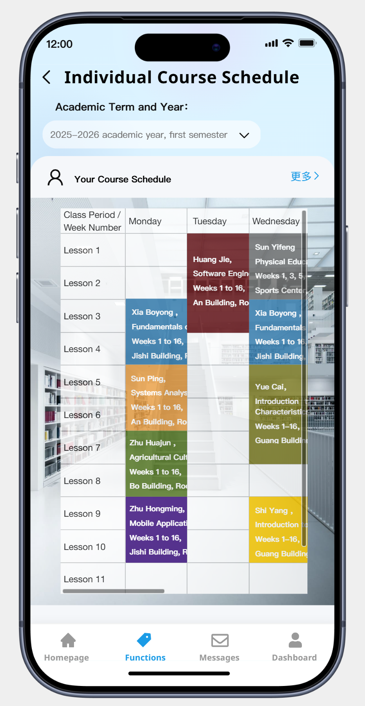
    
  • Click on the search box for academic year and semester to select the desired academic year and semester.
    
  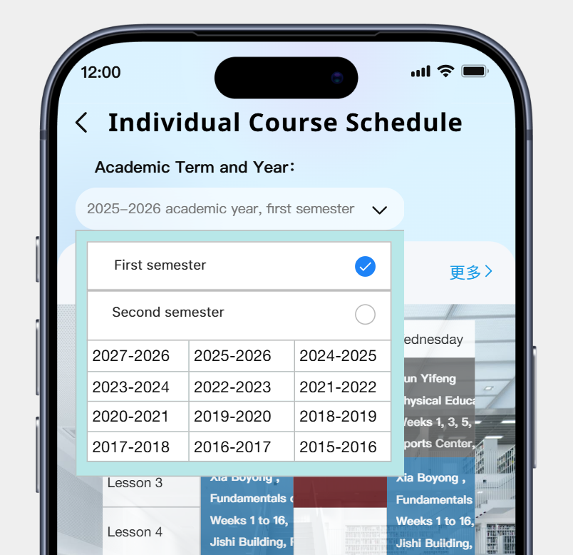
    

- Course Selection Interface Snapshot
  • By clicking on the course selection section on the homepage, students enter the Online Course Selection interface. They can search for the course types they are interested in, and add desired courses to their course selection list. The specific course schedules for selected course types will be displayed in the related courses list, showing detailed information and the current number of enrolled students. When the number of enrolled students reaches the maximum capacity, the course can no longer be selected. After selecting courses, students can view their current schedule in this interface. If there are any scheduling conflicts, a conflict warning will appear. Schedules without conflicts will be displayed in the temporary timetable, and students must click the "Save" button to finalize and save their course schedule.

  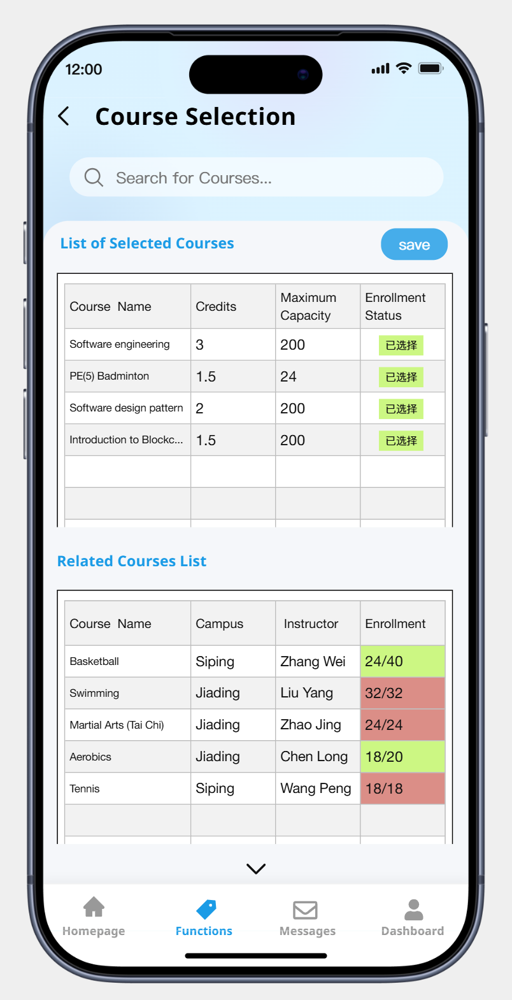
    
  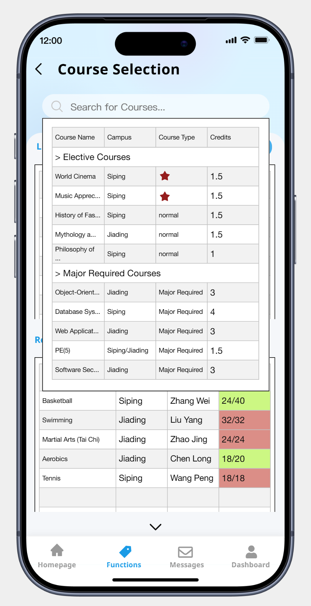
    
  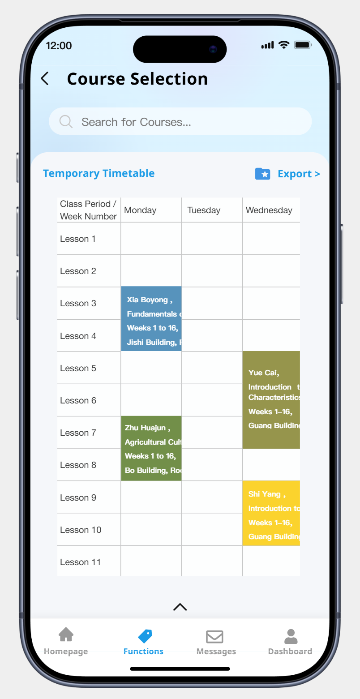

### 7.4 Life Service

- Vendor dashboard: manage menu, set hours, update stock, and process incoming orders.
- Menu view: browse items, see images, customize options, and add selections to the cart.
- Order timeline: shows order status from placement to pickup, with payment and tracking details.
- 
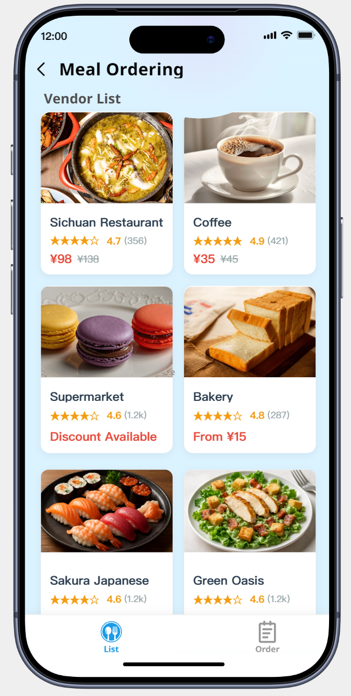
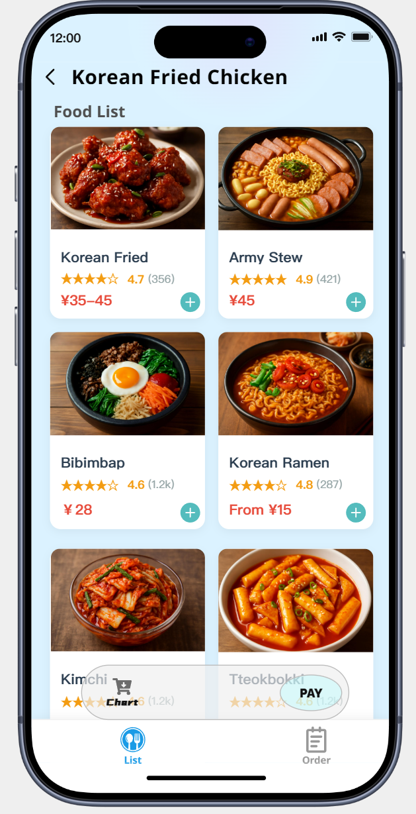
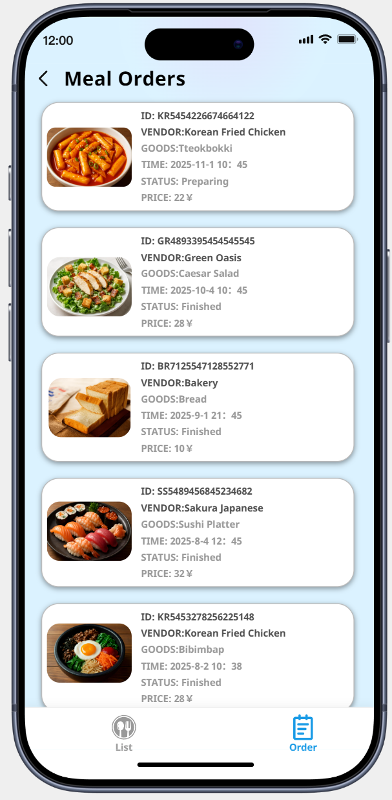

- Package notification flow: register parcels, generate pickup codes, notify students, and manage collection.
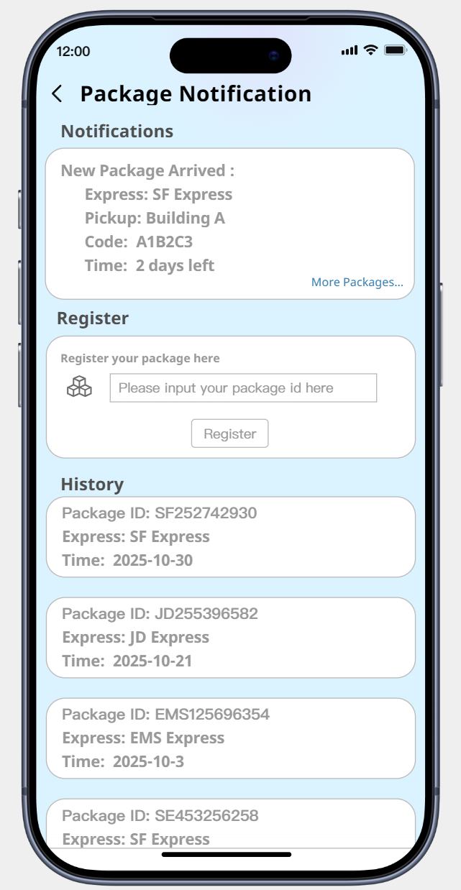

### 7.5 Dormitory Repair Request Interface

<table width="100%">
<tr>
<td align="center" width="33%">
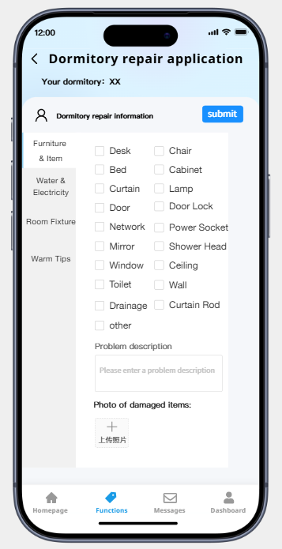
</td>
<td align="center" width="33%">
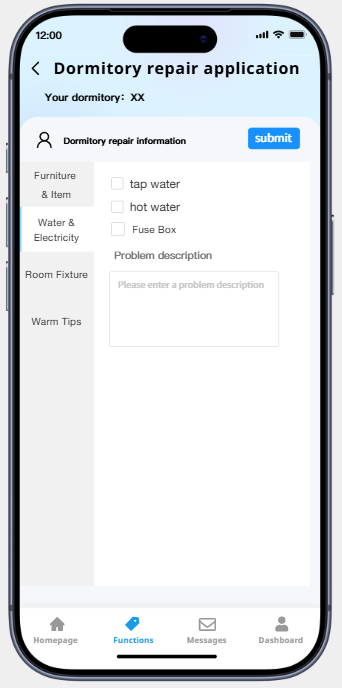
</td>
</tr>

</table>
<table width="100%">
<tr>
<td align="center" width="33%">
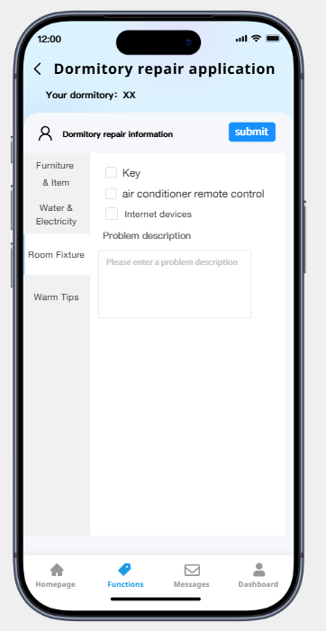
</td>
<td align="center" width="33%">
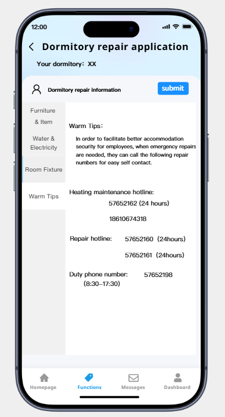
</td>
</tr>
</table>

This snapshot illustrates the main interface for submitting a dormitory maintenance request. The clean, intuitive design features a blue and white color scheme. A top navigation bar allows students to categorize their issue into: **Furniture/Item Repair**, **Water & Electricity Repair**, **Housing Fittings Repair**, and **Friendly Reminders**. The central form dynamically displays specific items based on the selected category (e.g., desk, chair, bed, light, door, network port, socket, shower, toilet, etc.), enabling users to quickly pinpoint and report the exact problem.

## 8. AI tool usage disclosure

During the completion of this SmartCampus system analysis and design project, our team utilized AI-assisted tools in a limited and responsible manner to support specific tasks. The use of AI was strictly supplementary; all core analytical thinking, architectural decisions, and final content were driven and owned by the team members.

Specifically, **OpenAI ChatGPT** was employed as a tool to aid in the following areas:

*   **Brainstorming Assistance:** In the initial project phase, the AI tool was used to help generate and organize broad ideas for all four subsystems (Academic, Library, Logistics, and Daily Life Services), which the team then critically evaluated, filtered, and developed into our final design.
*   **Documentation Drafting and Structuring:** The AI tool assisted in creating initial drafts and outlines for certain sections of the report, such as the *Supplementary Specification* and *User Stories*. These drafts served as a starting point and were substantially revised, expanded, and validated by the team to ensure accuracy and relevance to our specific project context.
*   **Language Polishing and Editing:** The primary use of the AI tool was for proofreading and refining the language of team-written content to improve clarity, consistency, and academic tone. All technical descriptions and key concepts remained the product of the team's work.

All outputs generated with AI assistance were thoroughly reviewed, edited, and corrected by the team members. The final deliverables represent the team's own understanding, analysis, and design efforts.
We uploaded an activity diagram and requested the AI to help analyze the logical structure of the UML activity diagram. During the process, I frequently asked for Chinese-to-English and English-to-Chinese translations. I also asked the AI to help find books related to the subject area, and it recommended several relevant monographs, providing information such as authors, publishers, and core content to help me further understand the topic.

We used Claude 4 Sonnet (document writing, editing, and modification suggestions) and diagrams.net/draw.io (use case and activity diagram creation). Claude 4 Sonnet was primarily used to assist with document content writing, language polishing, and providing modification suggestions for use case and activity diagram designs. All AI suggestions were reviewed and revised by the project team; final analysis and decisions are the team's responsibility. No confidential personal data was submitted to external AI services. Verbatim AI outputs or substantial paraphrases are cited in the references. For alternate citation styles or to update tool names/dates, contact the team and we will revise this statement.

## 9. References

**[1] Xiao, W., & Wang, J. (2020). Design and Implementation of a Campus Record Management Web App Based on Vue and Spring Boot. *Computer Applications and Software*, 37(4), 25-30, 88.https://d.wanfangdata.com.cn/periodical/jsjyyyrj202004006**

This study explores the development of a campus management application using modern web technologies like Vue and Spring Boot. It provides insights into overcoming challenges such as high development costs and limited functionality, offering practical reference for our project's technical stack selection and user experience design.

1. "Fundamentals of Smart Campus: Opening the Door to Smart Education" 
Author: **Li Jinsheng**  
This book provides a comprehensive introduction to the architecture of smart campuses, key technologies , and their applications in education. It covers planning, design, implementation, operation and maintenance, and evaluation systems for smart campuses. The book also offers in-depth discussions on practical explorations and future development trends of smart campuses, encompassing the underlying technological support required for one-stop service platforms.

2. Claude 4 Sonnet (AI Assistant). Document writing assistance and diagram design suggestions for SmartCampus system analysis. Anthropic. Used for document content generation, language editing, and providing modification suggestions for use case diagrams and activity diagrams in the SmartCampus project documentation.
 

| Members               | Part 1 | Part 2 | Part 3 | Part 4 | Part 5 | Part 6 | Part 7 | Part 8 | Part 9 | Percent |
| --------------------- | ------ | ------ | ------ | ------ | ------ | ------ | ------ | ------ | ------ | ------- |
| Feng Juncai  2353924  | ✓      | ✓      | ✓      |        |        |        |        |        |        |         |
| Ji Peng  2351869      |        |        | ✓      |        |        |        |        |        |        |         |
| Zhang Shikou  2353240 |        |        | ✓      |        |        |        |        |        |        |         |
| Yu Yilian  2352993    |        |        | ✓      |        |        |        |        |        |        |         |

## 11. Agile artifacts

- Persona
The primary goal of developing "SmartCampus" is to address diverse student needs effectively across our campus community. Recognizing that students have varying requirements, behaviors, and pain points in their daily campus life, we have developed detailed user personas to guide our design and development decisions. These personas capture multiple dimensions including daily challenges, functional needs, and usage contexts, helping us understand what students need, why they need it, and how they would use it in real scenarios. This persona-driven approach ensures that SmartCampus remains intuitive, accessible, and effective for all users, keeping our development process truly user-centered throughout the project lifecycle.
  

- User Personas

The primary goal of developing "SmartCampus" is to address diverse student needs effectively across our campus community. Recognizing that students have varying requirements, behaviors, and pain points in their daily campus life, we have developed detailed user personas to guide our design and development decisions. These personas capture multiple dimensions including daily challenges, functional needs, and usage contexts, helping us understand what students need, why they need it, and how they would use it in real scenarios. This persona-driven approach ensures that SmartCampus remains intuitive, accessible, and effective for all users, keeping our development process truly user-centered throughout the project lifecycle.

- User story map
Based on an in-depth understanding of user needs, we focused on the Smart Campus One-Stop Service Platform, identifying the most critical and urgent functional requirements while uncovering numerous innovative points for optimization. By evaluating the priority of these needs, we created a clear user story map. This map not only provides a blueprint for defining the platform's functional modules and facilitating team collaboration, but also ensures that the development direction is highly aligned with user expectations. Leveraging the agile development model, we were able to quickly build a prototype of the platform and, in subsequent iterations, continuously gather feedback from teachers and students to dynamically adjust features, ensuring the platform genuinely addresses pain points in campus life and delivers a convenient, efficient user experience. This development approach has also significantly improved project efficiency, enabling the team to flexibly respond to the rapid changes in educational informatization and continuously refine services that better fit the campus context.
  
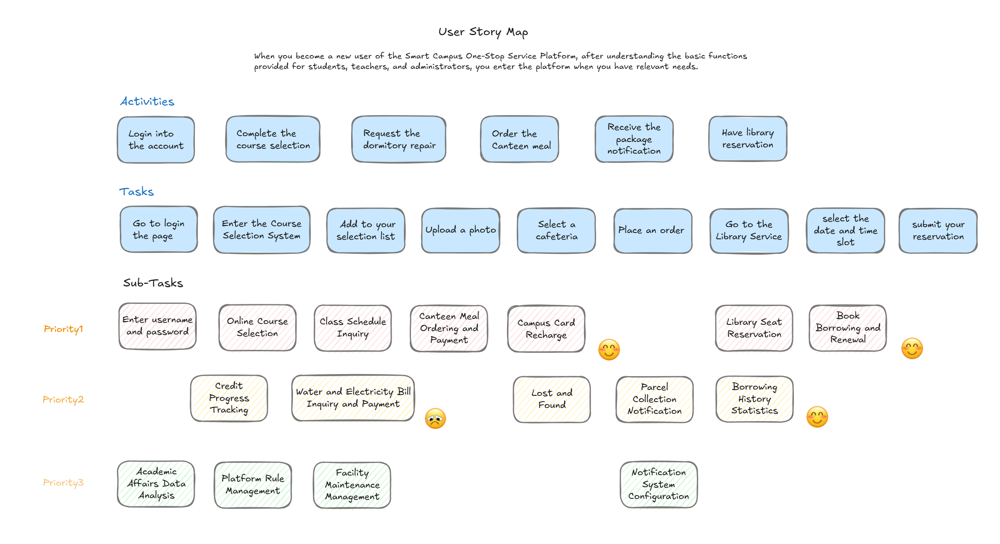
