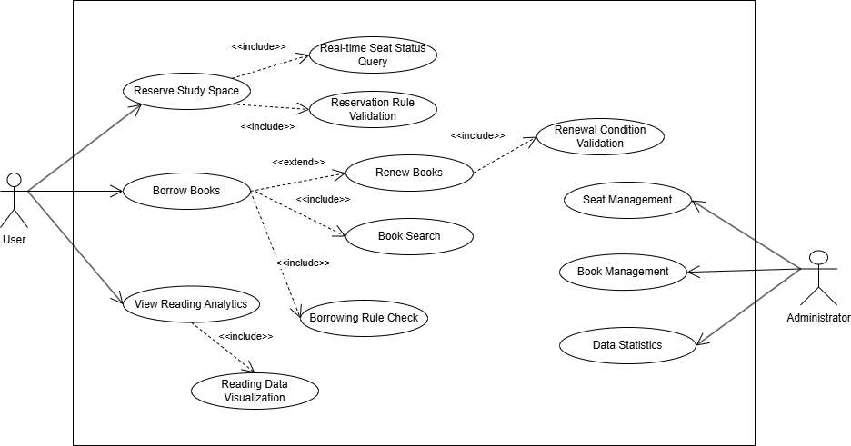
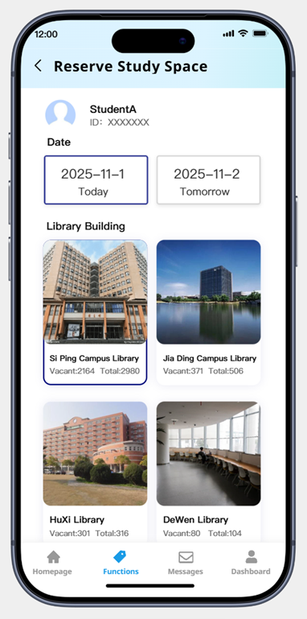

# System Analysis and Design
- [System Analysis and Design](#system-analysis-and-design)
  - [1. Introduction](#1-introduction)
    - [1.1 Background](#11-background)
    - [1.2 Motivation](#12-motivation)
    - [1.3 Scope](#13-scope)
    - [1.4 Target Users](#14-target-users)
      - [Primary Users: Students](#primary-users-students)
      - [Secondary Users: Faculty \& Staff](#secondary-users-faculty--staff)
  - [2. Strategic Analysis](#2-strategic-analysis)
    - [2.1 SWOT](#21-swot)
    - [2.2 Goals](#22-goals)
    - [2.3 Initiatives](#23-initiatives)
  - [3. Roadmap](#3-roadmap)
  - [4. Use case modelling and Business Process Modelling](#4-use-case-modelling-and-business-process-modelling)
  - [5. Glossary of terms](#5-glossary-of-terms)
  - [6. Supplementary specification](#6-supplementary-specification)
  - [7. Initial snapshots of the system's user interface](#7-initial-snapshots-of-the-systems-user-interface)
  - [8. AI tool usage disclosure](#8-ai-tool-usage-disclosure)
  - [9. References](#9-references)
  - [10. Team member contributions](#10-team-member-contributions)
  - [11. Agile artifacts](#11-agile-artifacts)

## 1. Introduction
**SmartCampus** — Your Campus Life Helper
**Team Name**：CampusCode
**Team Members**：
2353924 Feng Juncai    冯俊财
2351869 Ji Peng        纪鹏
2353240 Zhang Shikou   张诗蔻
2352993 Yu Yilian      于伊莲

### 1.1 Background

Modern universities offer various digital services (library, academic portal, dining, facility management), but these operate independently with separate interfaces, authentication systems, and data structures. Students must switch between multiple platforms daily. While many universities have developed integrated platforms to consolidate digital services, current implementations have limitations. For example, existing platforms focus primarily on academic management, with minimal integration of daily life services.

### 1.2 Motivation

SmartCampus reimagines integrated campus platforms with a student-first approach, enhancing rather than replacing existing infrastructure. Our motivation stems from recognizing that students' campus life extends beyond academics—they need to reserve library seats, check package notifications, report maintenance issues, and order meals efficiently. We aim to provide true integration encompassing both academic and daily life services, delivering proactive personalized experiences through mobile-first design.

### 1.3 Scope
SmartCampus focuses specifically on enhancing students' campus life by intelligently managing diverse services through four integrated subsystems. 

  

- The **Daily Life Service** Subsystem facilitates convenient canteen meal ordering with mobile payment integration, real-time package collection notifications linked to campus courier services, a comprehensive lost-and-found platform connecting the campus community, sports facility booking for gyms and courts, and campus shuttle schedule access with real-time location tracking.
- The **Library Service** Subsystem enables real-time seat reservation with availability tracking, book borrowing and renewal with automated due-date reminders, study space inquiry across campus locations, and personal reading analytics to help students track their academic progress. 
- The **Logistics Management** Subsystem streamlines dormitory repair requests with photo documentation and progress tracking, utility bill inquiry and convenient online payment options, campus card top-up services with transaction history, and comprehensive facility maintenance tracking across campus buildings.

- The **Academic Service** Subsystem provides intuitive online course selection, personalized schedule management with conflict detection, comprehensive grade inquiry with statistical analysis and trend visualization, exam schedule tracking with countdown reminders, and credit progress monitoring toward graduation requirements.

These four subsystems work together to create a unified, intelligent campus service ecosystem that addresses students' comprehensive needs throughout their daily campus life.
### 1.4 Target Users

#### Primary Users: Students
- **Population**: 15,000-30,000 per university
- **Needs**: Integrated access to library, academic, dining, and logistics services
- **Usage**: 80%+ mobile, high frequency during peak hours
- **Pain Points**: Multiple logins, scattered information, time-consuming tasks

#### Secondary Users: Faculty & Staff
- **Faculty**: Library access, course management, facility booking
- **Service Staff**: Administrators Staff
- **Needs**: Operational dashboards, real-time updates, reporting tools 
 

## 2. Strategic Analysis
Conduct a strategic analysis, such as a SWOT and TOWS analysis, for your team and the proposed product, and then clarify your business goals and initiatives. 

### 2.1 SWOT
Strengths:
- **Comprehensive Integration**: Unified platform for library, dining, logistics, and academic services
- **User-Centric Design**: Focus on reducing student task management time by 50%
- **Technical Expertise**: Team has strong background in system analysis and design
- **SSO Integration**: Seamless authentication across existing campus systems
- **Mobile-First Approach**: Responsive design for multi-device access

Weaknesses:
- **Resource Constraints**: Limited development team and budget
- **System Dependencies**: Relies on existing campus infrastructure and APIs
- **No Established Brand**: First-time product with no user base
- **Data Privacy Risks**: Handling sensitive student personal and academic information
- **Limited Testing Scope**: Cannot test with real users before deployment

Opportunities: 
- **High Market Demand**: 85% of surveyed students want unified campus services
- **Digital Transformation Trend**: Universities investing in smart campus initiatives
- **Market Gap**: Few comprehensive campus service platforms exist in China
- **Government Support**: National policies promoting smart education and digital campuses
- **Scalability Potential**: Can expand to other universities after successful pilot

Threats:
- **Existing Habits**: Students already use separate apps (WeChat, Alipay) for services
- **Competition**: Other universities developing similar platforms 
- **User Resistance**: Students may resist learning new platform
- **Budget Constraints**: Universities may have limited IT investment budgets
- **Technology Changes**: Rapid evolution of mobile technologies may require frequent updates
 
### 2.2 Goals

SmartCampus aims to create a comprehensive, user-friendly platform that integrates all essential campus services. Our primary objectives include implementing single sign-on authentication across all services, reducing students' daily routine task management time from 30-60 minutes to under 15 minutes through intelligent automation, and delivering personalized, proactive notifications based on individual user behavior patterns. We strive to seamlessly connect the four core subsystems while maintaining data security and user privacy.  

The platform maintains a clear focus on student-facing services to ensure optimal user experience and system efficiency. Future expansion possibilities include course evaluation systems, campus marketplace for student trading, study group matching based on courses and interests, and comprehensive event calendars, all contingent on user feedback and demonstrated demand.

### 2.3 Initiatives
To achieve our business objectives, we have identified four core strategic initiatives:

- Initiative 1: Unified Authentication & System Integration

Implement seamless single sign-on experience across all campus systems through OAuth 2.0 and a unified API gateway.

- Initiative 2: Intelligent Task Automation

Significantly reduce students' daily task management time through smart notifications, automatic renewals, and one-click workflows.

- Initiative 3: Mobile-First User Experience

Ensure optimal mobile performance and experience through responsive design and progressive web application technologies.

- Initiative 4: User Adoption & Continuous Improvement

Drive user behavior change and continuously optimize the product through interactive onboarding, campus-wide promotion, and rapid iteration.

## 3. Roadmap
Build an agile or MVP roadmap to provide a clear vision and timeline.  
| Phase | Objective | Key Features | Success Criteria |
|-------|-----------|--------------|------------------|
| **Phase 1: Foundation** | Establish core infrastructure and validate basic functionality | - Single Sign-On (SSO) - Library seat reservation & book borrowing - Basic canteen meal ordering - Course schedule inquiry - Mobile-responsive interface | - Core functionality operational - Positive pilot user feedback - System stability validated |
| **Phase 2: Expansion** | Extend service coverage based on user feedback | - Package notification system - Dormitory repair requests - Sports facility booking - Intelligent notifications - Campus shuttle tracking - Lost & Found platform | - Full system integration - Reduced task management time - High feature adoption |
| **Phase 3: Intelligence** | Enhance experience through smart features | - Personalized recommendations - Predictive notifications - Analytics dashboard - Auto-renewal for library books - Smart conflict detection - Admin management portal | - AI features operational - High user retention - Scalability demonstrated |

The development follows agile methodology with iterative sprints, continuous user feedback integration, and phased rollout to minimize risks and ensure quality delivery.

## 4. Use case modelling and Business Process Modelling
### 4.1.1 Library System Use Case Diagram

#### Use Case: Reserve Study Seat

| Attribute | Description |
|-----------|-------------|
| Use Case Name | Reserve Study Seat |
| ID | UC-01 |
| Specification | Students view real-time library seat status through the system and select appropriate areas and time slots for seat reservations |
| Actor | Student |
| Pre-condition | Student has successfully logged into the system, seat reservation function is operating normally |
| Basic Path | 1. Student enters the seat reservation interface 2. System displays real-time seat status map of various library areas 3. Student selects target area and reservation time slot 4. System verifies reservation rules (maximum reservation duration, duplicate reservation restrictions, etc.) 5. Student confirms reservation information 6. System generates reservation record and updates seat status 7. System sends reservation success notification |
| Alternative Path | 4a. If reservation rules are violated, system displays specific error message and returns to step 2 5a. Student cancels reservation operation, returns to seat selection interface 6a. System processing fails, displays "System busy, please try again later" |
| Post-condition | Seat reservation successful, seat status updated to "Reserved", student receives reservation confirmation notification |

#### Use Case: Borrow Books

| Attribute | Description |
|-----------|-------------|
| Use Case Name | Borrow Books |
| ID | UC-02 |
| Specification | Students search library collection information and select available books to complete the borrowing process |
| Actor | Student |
| Pre-condition | Student has successfully logged into the system and has valid borrowing privileges |
| Basic Path | 1. Student searches for books by ISBN, title, author, or other information 2. System displays detailed book information and collection status 3. Student selects available books for borrowing 4. System verifies borrowing eligibility (maximum book limit, outstanding fees, etc.) 5. Student confirms borrowing operation 6. System generates borrowing record and updates book status 7. System sends borrowing success notification and due date reminder |
| Alternative Path | 4a. If borrowing eligibility requirements are not met, system displays specific reasons (e.g., "Maximum borrowing limit reached") 5a. Student cancels borrowing operation, returns to book search interface 6a. Book status update fails, system rolls back operation and prompts to retry |
| Post-condition | Book borrowing successful, borrowing record updated, book status changes to "Borrowed" |

### 4.1.3 Brief Description of Other Use Cases

**Renew Books**: Students select books needing renewal from their personal borrowing records, system verifies renewal conditions (not overdue, not reached maximum renewal times), extends loan period upon success and sends confirmation notification. The entire process completes within 2 minutes.

**Query Study Spaces**: Students filter study spaces based on needs (quiet areas, group discussion rooms, multimedia rooms, etc.), system displays available space quantities, equipment configuration, and real-time occupancy status, supporting time-slot based reservation status queries.

**View Reading Analytics**: System aggregates students' borrowing history data, generates monthly/annual reading reports including reading preference analysis, reading duration statistics, subject distribution visualization charts, helping students understand reading habits.

## 5. Glossary of terms
### Use Case Modeling
A UML modeling method that describes system functional requirements through use cases, focusing on the interaction between users and the system.

### User Journey Map
A tool that visualizes the entire process of user interaction with a product, analyzing experience pain points and improvement opportunities.

### Agile Development
A development methodology characterized by iterative increments, emphasizing rapid response to requirement changes and user feedback.

## 6. Supplementary specification
### 6.2 Security and Stability
**Data Encryption**: The system employs end-to-end encryption technology, using AES-256 encryption for transmission and storage of all sensitive data (such as personal information, payment credentials), ensuring data confidentiality and integrity during transmission and storage.

**System Availability**: Through load balancing and cluster deployment, the system ensures 99.9% availability, supports tens of thousands of concurrent requests per second, and automatically scales resources under high load to ensure stable and smooth service.

**Data Backup**: Establishes daily incremental backup and weekly full backup mechanisms, combined with off-site disaster recovery solutions, achieving rapid data recovery and seamless business switching, minimizing data loss risks.

## 7. Initial snapshots of the system's user interface
### 7.1 Library Seat Reservation Interface

This clean and intuitive interface allows students to easily reserve study spaces across multiple campus libraries. Users can view real-time seat availability with clear "Vacant/Total" counts for each location. The date selection panel enables quick browsing for today and tomorrow. The design prioritizes essential information - showing current vacancy rates and total capacity - helping students make informed decisions quickly.

## 8. AI tool usage disclosure
### Use of AI Tools in This System Design Project
In this system design project, we utilized AI tools to assist in several key phases:
- Used AI tools for initial requirements research and functional ideation
- Leveraged conversational interactions to identify user pain points and scenario requirements
- Checked the structure and terminology consistency of technical documentation
- Assisted in accurate translation of technical terms between Chinese and English

## 9. References
1. "Systems Analysis and Design Methods" by Jeffrey L. Whitten & Lonnie D. Bentley
A comprehensive guide covering structured analysis, design techniques, and project management. It provides practical methodologies for developing information systems through real-world case studies and UML modeling approaches.

2. "User Stories Applied: For Agile Software Development" by Mike Cohn
Focuses on agile requirements through user stories. Offers practical techniques for writing, prioritizing, and planning stories in iterative development, bridging communication between stakeholders and development teams.

## 10. Team member contributions 
| Members  | Part 1 | Part 2 | Part 3 | Part 4 | Part 5 | Part 6 | Part 7 | Part 8 | Part 9 | Percent |
|------|---------|---------|---------|---------|---------|---------|---------|---------|---------|----------|
| Feng Juncai  2353924 | ✓ |✓ |✓ | | | | | | | |
| Ji Peng  2351869 | | |✓ | | | | | | | |
| Zhang Shikou  2353240 | | |✓ | | | | | | | |
| Yu Yilian  2352993 | | |✓ | | | | | | | |

## 11. Agile artifacts
### 11.3 User Journey Map

In the system design process, we have mapped out the complete user journey by analyzing students' interactions with SmartCampus across four critical stages: exploration, selection, participation, and feedback. This approach goes beyond simply documenting functional requirements to capture users' evolving psychological states and emotional responses throughout their experience. By examining the key questions students ask at each phase, we gain deep insights into their underlying needs and anxieties. The journey mapping reveals not only where students encounter friction but also where opportunities exist to build trust and deliver delight. This comprehensive understanding enables us to design features that proactively address user concerns, streamline complex processes, and create emotional connections that transform routine campus tasks into satisfying experiences. Through this user-centered approach, we ensure SmartCampus evolves from a mere service platform into an indispensable companion that genuinely understands and supports students' academic and daily life needs.