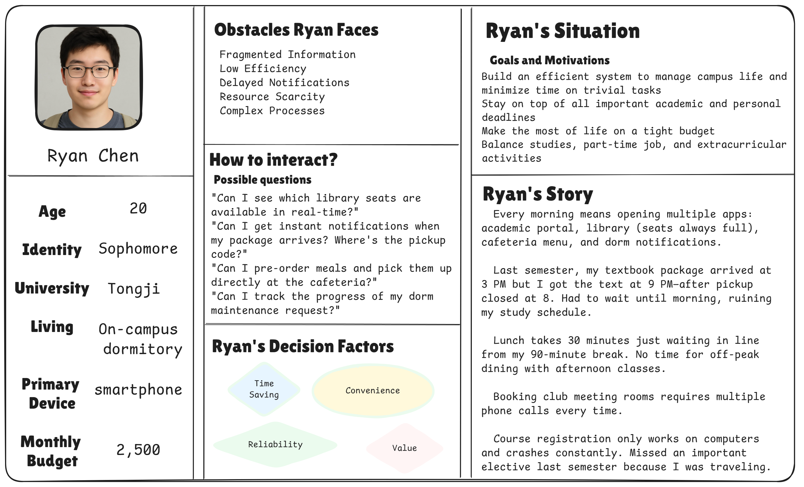

# System Analysis and Design
- [System Analysis and Design](#system-analysis-and-design)
  - [1. Introduction](#1-introduction)
    - [1.1 Background](#11-background)
    - [1.2 Motivation](#12-motivation)
    - [1.3 Scope](#13-scope)
    - [1.4 Target Users](#14-target-users)
      - [Primary Users: Students](#primary-users-students)
      - [Secondary Users: Faculty \& Staff](#secondary-users-faculty--staff)
  - [2. Strategic Analysis](#2-strategic-analysis)
    - [2.1 SWOT](#21-swot)
    - [2.2 Goals](#22-goals)
    - [2.3 Initiatives](#23-initiatives)
  - [3. Roadmap](#3-roadmap)
  - [4. Use case modelling and Business Process Modelling](#4-use-case-modelling-and-business-process-modelling)
      - [4.1.3 Life Services Subsystem](#413-life-services-subsystem)
    - [4.2 Activity Diagrams](#42-activity-diagrams)
      - [4.2.3 Life Service](#423-life-service)
  - [5. Glossary of terms](#5-glossary-of-terms)
  - [6. Supplementary specification](#6-supplementary-specification)
  - [7. Initial snapshots of the system's user interface](#7-initial-snapshots-of-the-systems-user-interface)
  - [8. AI tool usage disclosure](#8-ai-tool-usage-disclosure)
  - [9. References](#9-references)
  - [10. Team member contributions](#10-team-member-contributions)
  - [11. Agile artifacts](#11-agile-artifacts)
    - [11.1 Persona](#111-persona)

## 1. Introduction
**SmartCampus** — Your Campus Life Helper
**Team Name**：CampusCode
**Team Members**：
2353924 Feng Juncai    冯俊财
2351869 Ji Peng        纪鹏
2353240 Zhang Shikou   张诗蔻
2352993 Yu Yilian      于伊莲

### 1.1 Background

Modern universities offer various digital services (library, academic portal, dining, facility management), but these operate independently with separate interfaces, authentication systems, and data structures. Students must switch between multiple platforms daily. While many universities have developed integrated platforms to consolidate digital services, current implementations have limitations. For example, existing platforms focus primarily on academic management, with minimal integration of daily life services.

### 1.2 Motivation

SmartCampus reimagines integrated campus platforms with a student-first approach, enhancing rather than replacing existing infrastructure. Our motivation stems from recognizing that students' campus life extends beyond academics—they need to reserve library seats, check package notifications, report maintenance issues, and order meals efficiently. We aim to provide true integration encompassing both academic and daily life services, delivering proactive personalized experiences through mobile-first design.

### 1.3 Scope
SmartCampus focuses specifically on enhancing students' campus life by intelligently managing diverse services through four integrated subsystems. 

  

- The **Daily Life Service** Subsystem facilitates convenient canteen meal ordering with mobile payment integration, real-time package collection notifications linked to campus courier services, a comprehensive lost-and-found platform connecting the campus community, sports facility booking for gyms and courts, and campus shuttle schedule access with real-time location tracking.
- The **Library Service** Subsystem enables real-time seat reservation with availability tracking, book borrowing and renewal with automated due-date reminders, study space inquiry across campus locations, and personal reading analytics to help students track their academic progress. 
- The **Logistics Management** Subsystem streamlines dormitory repair requests with photo documentation and progress tracking, utility bill inquiry and convenient online payment options, campus card top-up services with transaction history, and comprehensive facility maintenance tracking across campus buildings.

- The **Academic Service** Subsystem provides intuitive online course selection, personalized schedule management with conflict detection, comprehensive grade inquiry with statistical analysis and trend visualization, exam schedule tracking with countdown reminders, and credit progress monitoring toward graduation requirements.

These four subsystems work together to create a unified, intelligent campus service ecosystem that addresses students' comprehensive needs throughout their daily campus life.
### 1.4 Target Users

#### Primary Users: Students
- **Population**: 15,000-30,000 per university
- **Needs**: Integrated access to library, academic, dining, and logistics services
- **Usage**: 80%+ mobile, high frequency during peak hours
- **Pain Points**: Multiple logins, scattered information, time-consuming tasks

#### Secondary Users: Faculty & Staff
- **Faculty**: Library access, course management, facility booking
- **Service Staff**: Administrators Staff
- **Needs**: Operational dashboards, real-time updates, reporting tools 
 

## 2. Strategic Analysis
Conduct a strategic analysis, such as a SWOT and TOWS analysis, for your team and the proposed product, and then clarify your business goals and initiatives. 

### 2.1 SWOT
Strengths:
- **Comprehensive Integration**: Unified platform for library, dining, logistics, and academic services
- **User-Centric Design**: Focus on reducing student task management time by 50%
- **Technical Expertise**: Team has strong background in system analysis and design
- **SSO Integration**: Seamless authentication across existing campus systems
- **Mobile-First Approach**: Responsive design for multi-device access

Weaknesses:
- **Resource Constraints**: Limited development team and budget
- **System Dependencies**: Relies on existing campus infrastructure and APIs
- **No Established Brand**: First-time product with no user base
- **Data Privacy Risks**: Handling sensitive student personal and academic information
- **Limited Testing Scope**: Cannot test with real users before deployment

Opportunities: 
- **High Market Demand**: 85% of surveyed students want unified campus services
- **Digital Transformation Trend**: Universities investing in smart campus initiatives
- **Market Gap**: Few comprehensive campus service platforms exist in China
- **Government Support**: National policies promoting smart education and digital campuses
- **Scalability Potential**: Can expand to other universities after successful pilot

Threats:
- **Existing Habits**: Students already use separate apps (WeChat, Alipay) for services
- **Competition**: Other universities developing similar platforms 
- **User Resistance**: Students may resist learning new platform
- **Budget Constraints**: Universities may have limited IT investment budgets
- **Technology Changes**: Rapid evolution of mobile technologies may require frequent updates
 
### 2.2 Goals

SmartCampus aims to create a comprehensive, user-friendly platform that integrates all essential campus services. Our primary objectives include implementing single sign-on authentication across all services, reducing students' daily routine task management time from 30-60 minutes to under 15 minutes through intelligent automation, and delivering personalized, proactive notifications based on individual user behavior patterns. We strive to seamlessly connect the four core subsystems while maintaining data security and user privacy.  

The platform maintains a clear focus on student-facing services to ensure optimal user experience and system efficiency. Future expansion possibilities include course evaluation systems, campus marketplace for student trading, study group matching based on courses and interests, and comprehensive event calendars, all contingent on user feedback and demonstrated demand.

### 2.3 Initiatives
To achieve our business objectives, we have identified four core strategic initiatives:

- Initiative 1: Unified Authentication & System Integration

Implement seamless single sign-on experience across all campus systems through OAuth 2.0 and a unified API gateway.

- Initiative 2: Intelligent Task Automation

Significantly reduce students' daily task management time through smart notifications, automatic renewals, and one-click workflows.

- Initiative 3: Mobile-First User Experience

Ensure optimal mobile performance and experience through responsive design and progressive web application technologies.

- Initiative 4: User Adoption & Continuous Improvement

Drive user behavior change and continuously optimize the product through interactive onboarding, campus-wide promotion, and rapid iteration.

## 3. Roadmap
Build an agile or MVP roadmap to provide a clear vision and timeline.  
| Phase | Objective | Key Features | Success Criteria |
|-------|-----------|--------------|------------------|
| **Phase 1: Foundation** | Establish core infrastructure and validate basic functionality | - Single Sign-On (SSO) - Library seat reservation & book borrowing - Basic canteen meal ordering - Course schedule inquiry - Mobile-responsive interface | - Core functionality operational - Positive pilot user feedback - System stability validated |
| **Phase 2: Expansion** | Extend service coverage based on user feedback | - Package notification system - Dormitory repair requests - Sports facility booking - Intelligent notifications - Campus shuttle tracking - Lost & Found platform | - Full system integration - Reduced task management time - High feature adoption |
| **Phase 3: Intelligence** | Enhance experience through smart features | - Personalized recommendations - Predictive notifications - Analytics dashboard - Auto-renewal for library books - Smart conflict detection - Admin management portal | - AI features operational - High user retention - Scalability demonstrated |

The development follows agile methodology with iterative sprints, continuous user feedback integration, and phased rollout to minimize risks and ensure quality delivery.

## 4. Use case modelling and Business Process Modelling
  Necessary use case diagrams
  Detailed use cases: concise text descriptions (two to four lines each) for all the above use cases, as well as detailed specifications for at least 5 use cases.
  Necessary activity diagrams or BPMN diagrams to illustrate the primary business process.

#### 4.1.3 Life Services Subsystem
User Case Diagram:

Short written summary:
1. Meal Ordering: Students can order meals via SmartCampus "Meal Ordering" function before they arrive at the canteens or other food sellers, and then they can reduce the time wasting on food waiting, helping them to have more rest time.
2. Browse Menu: Students can choose different food sellers and kinds of food on the browse food menu. The browser can offer many food photos and names directly, making it easy to explore available dining options.
3. Search Food Items: Students can also directly search for the food they would like to have, avoiding moving from the top to the bottom to find the food on the browse menu, providing quick access to specific items.
4. Add to Cart: Students can choose many kinds of food and put them into the cart, then they can pay the whole food cart together, enabling bulk ordering and convenient checkout process.
5. Customize Order: Students can choose the food type and select the spicy degree or sugar degree, and they can also choose some special accessories such as cheese, butter and other things to personalize their meals.
6. Make Payment: The students can make payment after choosing the foods on the SmartCampus. They can choose the payment method such as WeChat Pay, Alipay, or bank payment for flexible transaction options.
7. Track Order Status: The students can check the order status, such as order sending state, preparing state, finishing state, or cancellation state, providing real-time updates on their food preparation progress.
8. Package Notification: SmartCampus can send package notification to students when their packages arrive at campus, ensuring timely pickup and reducing package accumulation at delivery points.
9. Register Package: Students can register the package number on the SmartCampus app, and when the packages arrive at campus, the SmartCampus can recognize the package, then send the notification to the owner automatically.
10. Set Special Instructions: The students can set special instructions, such as the delivery method, preferred pickup time, or specific handling requirements to ensure proper package management according to their preferences.
11. Send Arrival Notification: The campus system can send arrival messages to students via SMS, email, or app notifications when their registered packages are delivered to campus pickup points.
12. Set Pickup Method: Students can choose their preferred pickup method, such as self-pickup at designated locations, delivery to dormitory, or pickup by authorized representatives for flexible package collection.
13. Generate Pickup Code: The system generates unique pickup codes for each package to ensure secure package retrieval, preventing unauthorized access and maintaining package security throughout the pickup process.
14. Set Code Expiry Time: Students can set expiry time for their pickup codes to enhance security and ensure timely package collection, with automatic code renewal options available for extended storage needs.
15. Lost & Found: SmartCampus provides a comprehensive lost and found service where students can report lost items and search for found items, facilitating the return of misplaced belongings within the campus community.
16. Report Item: Students can report lost items by providing detailed descriptions, location information, and contact details, creating searchable records to help reunite owners with their lost belongings efficiently.
17. Search Items: Students can search through the lost and found database using keywords, categories, or location filters to find their missing items or browse available found items.
18. Facility Booking: Students can book various campus facilities such as study rooms, sports courts, meeting rooms, and recreational areas through the SmartCampus platform for academic and social activities.
19. View Facilities: Students can view available campus facilities with detailed information including capacity, equipment, availability schedules, and booking policies to make informed reservation decisions.
20. Making Booking: Students can make facility reservations by selecting desired time slots, specifying group size, and confirming booking details, with instant confirmation and calendar integration for schedule management.
21. Shuttle Schedule: SmartCampus provides real-time shuttle schedule information including departure times, routes, stops, and estimated arrival times to help students plan their campus transportation efficiently.
22. View Schedule: Students can view comprehensive shuttle schedules with route maps, stop locations, and service hours, enabling them to plan their daily commute and campus travel effectively.
23. Tracking Shuttle: Students can track real-time shuttle locations and estimated arrival times at specific stops, reducing waiting time and improving transportation planning through GPS-enabled tracking features.
24. Manage System Content: System administrators can manage and update various content including menus, facility information, shuttle schedules, and system announcements to ensure accurate and current information for all users.
25. View Reports: Administrators can view comprehensive reports on system usage, popular services, user feedback, and operational statistics to make data-driven decisions for system improvements and resource allocation.

Above is a brief summary of life service use cases. Following this, we will select two main use cases,meal ordering and package notification, to develop detailed specifications.

- Meal Ordering:

 
|USE CASE|MEAL ORDERING|
| ---- | ---- |
|ID|*UC01*|
|Specification|Students can pre-order meals from campus canteens and vendor through the SmartCampus platform to reduce waiting time and improve dining efficiency.|
|Actors|Student, Vendor, Payment System|
|Pre-condition|• Student is logged into SmartCampus app • Student has valid payment method registered • Vendor have updated menus available|
|Basic Path|1. Student opens "Meal Ordering" function 2. System displays available food vendor 3. Student selects a vendor and browses menu 4. Student searches or selects food items 5. Student customizes order (spice level, accessories, etc.) 6. Student adds items to cart 7. Student reviews cart and proceeds to payment 8. Student selects payment method (WeChat Pay/Alipay/Bank) 9. System processes payment and confirms order 10. System generates order number and estimated pickup time 11. Student receives order confirmation|
|Alternative Path|3a: No vendors available • System displays "No vendors currently available" message 6a: Item out of stock • System notifies student  8a: Payment fails • System prompts student to retry or change payment method 9a: Order cancellation • Student can cancel order before preparation begins • System processes refund if applicable|
|Post condition|• Order is successfully placed and confirmed • Payment is processed • Vendor receives order details • Student can track order status • Order appears in student's order history|

- Package Notification  

 
|USE CASE|PACKAGE NOTIFICATION|
| ---- | ---- |
|ID|*UC02*|
|Specification|System automatically notifies students when their registered packages arrive at campus pickup points, ensuring timely collection and reducing package accumulation.|
|Actors|**Primary Actor:** Student **Secondary Actors:** Package Manager, Delivery Service|
|Pre-condition|• Package has been registered in the system • Delivery service integration with SmartCampus is active • Student has valid contact information in the system|
|Basic Path|1. Student registers package postal number in SmartCampus app 2. Student sets special instructions (delivery method, preferred pickup time, or specific handling requirements) 3. System monitors package delivery status 4. Package arrives at campus pickup point 5. Delivery service updates package status in system 6. System recognizes registered package 7. System generates unique pickup code for each package to ensure secure retrieval 8. System sends arrival notification via SMS, email, or app notification 9. Student receives notification with pickup details 10. Student can view pickup code and location information 11. Student can choose preferred pickup method (self-pickup at designated locations, delivery to dormitory, or pickup by authorized representatives) 12. Student can set pickup code expiry time to enhance security|
|Alternative Path|**1a:** Invalid postal number • System displays error message and prompts re-entry  **4a:** Package delivery delayed • System sends delay notification to student  **6a:** System cannot recognize package • System records unregistered package for manual processing  **7a:** Pickup code generation fails • System regenerates pickup code and notifies student  **8a:** Notification delivery fails • System attempts alternative notification methods  **10a:** Pickup code expires • Student can request new pickup code through app • System provides automatic renewal options for extended storage needs  **11a:** Preferred pickup method unavailable • System provides alternative pickup options • Student can reselect pickup method|
|Post-condition|• Student receives package arrival notification • Package location and pickup instructions are provided • Package status is updated to "Ready for Pickup" • Unique pickup code is generated to ensure secure retrieval • Notification record is logged in system • Prevents unauthorized access and maintains package security throughout pickup process|
 
### 4.2 Activity Diagrams

#### 4.2.3 Life Service

This picture is the the activity diagram of life service. It descripe the main process of the student using the life service.

And then we choose the Meal Ordering and Package Notification part to make detail description.
- Meal Ordering 

This activity diagram illustrates a meal ordering system workflow across three swimlanes (User, System, Payment System). It shows the complete process from user login verification through vendor/menu selection, order customization, payment processing, to final order confirmation, including error handling for unavailable vendors, out-of-stock items, and payment failures.

- Package Notification

This activity diagram illustrates a package notification system workflow where users register packages and set preferences, while the system verifies information, creates records, and manages package arrivals. The process includes validation checks, notification generation for registered packages, and handles both successful pickups and error scenarios through appropriate system responses.

## 5. Glossary of terms
At least 10 terms related to the problem's domain.

## 6. Supplementary specification

## 7. Initial snapshots of the system's user interface
At least 4 snapshots with brief descriptions.

## 8. AI tool usage disclosure
If you have used an AI tool or technology to generate an output which you either paraphrase or direct quote in your writing, you must cite and reference this output as a source in your reference list.

If you have used an AI tool or technology in the process of completing the above tasks (for example, brainstorming, outlining, generating examples, rendering diagrams, creating UIs, editing), an acknowledgement of how you have used AI tools or technologies is required.

## 9. References
1 domain-related book and/or 2 reference articles, with a brief description (30 to 60 words each). 

## 10. Team member contributions 
| Members  | Part 1 | Part 2 | Part 3 | Part 4 | Part 5 | Part 6 | Part 7 | Part 8 | Part 9 | Percent |
|------|---------|---------|---------|---------|---------|---------|---------|---------|---------|----------|
| Feng Juncai  2353924 | ✓ |✓ |✓ | | | | | | | |
| Ji Peng  2351869 | | |✓ | | | | | | | |
| Zhang Shikou  2353240 | | |✓ | | | | | | | |
| Yu Yilian  2352993 | | |✓ | | | | | | | |

## 11. Agile artifacts
### 11.1 Persona
The primary goal of developing "SmartCampus" is to address diverse student needs effectively across our campus community. Recognizing that students have varying requirements, behaviors, and pain points in their daily campus life, we have developed detailed user personas to guide our design and development decisions. These personas capture multiple dimensions including daily challenges, functional needs, and usage contexts, helping us understand what students need, why they need it, and how they would use it in real scenarios. This persona-driven approach ensures that SmartCampus remains intuitive, accessible, and effective for all users, keeping our development process truly user-centered throughout the project lifecycle.
  
