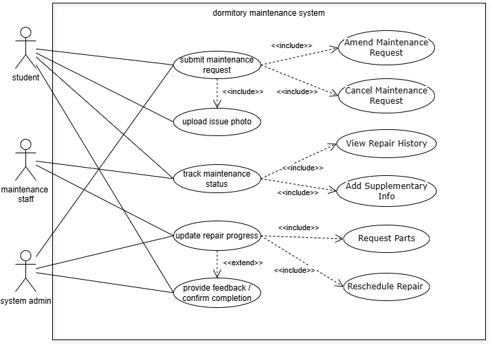
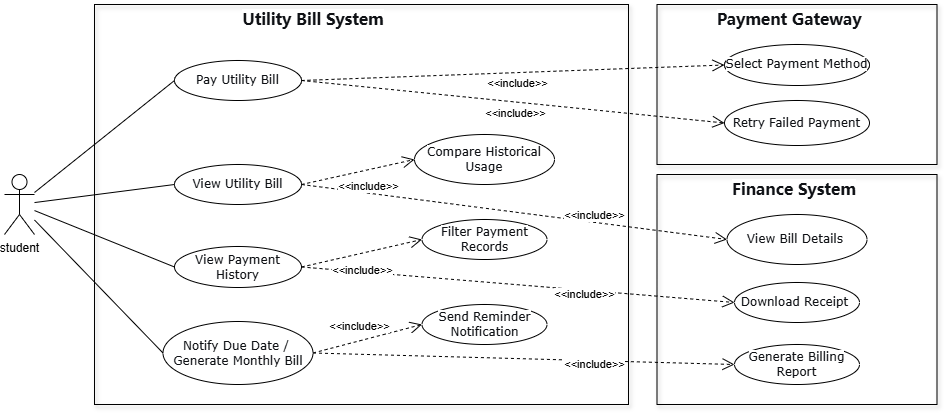
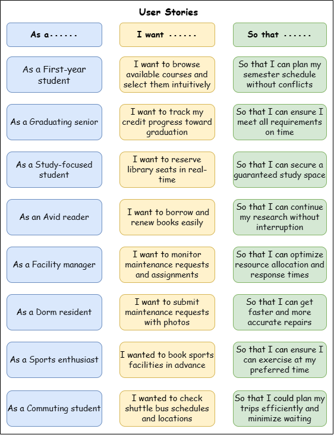

# System Analysis and Design
- [System Analysis and Design](#system-analysis-and-design)
  - [1. Introduction](#1-introduction)
    - [1.1 Background](#11-background)
    - [1.2 Motivation](#12-motivation)
    - [1.3 Scope](#13-scope)
    - [1.4 Target Users](#14-target-users)
      - [Primary Users: Students](#primary-users-students)
      - [Secondary Users: Faculty \& Staff](#secondary-users-faculty--staff)
  - [2. Strategic Analysis](#2-strategic-analysis)
    - [2.1 SWOT](#21-swot)
    - [2.2 Goals](#22-goals)
    - [2.3 Initiatives](#23-initiatives)
  - [3. Roadmap](#3-roadmap)
  - [4. Use case modelling and Business Process Modelling](#4-use-case-modelling-and-business-process-modelling)
  - [5. Glossary of terms](#5-glossary-of-terms)
  - [6. Supplementary specification](#6-supplementary-specification)
  - [7. Initial snapshots of the system's user interface](#7-initial-snapshots-of-the-systems-user-interface)
  - [8. AI tool usage disclosure](#8-ai-tool-usage-disclosure)
  - [9. References](#9-references)
  - [10. Team member contributions](#10-team-member-contributions)
  - [11. Agile artifacts](#11-agile-artifacts)

## 1. Introduction
**SmartCampus** — Your Campus Life Helper
**Team Name**：CampusCode
**Team Members**：
2353924 Feng Juncai    冯俊财
2351869 Ji Peng        纪鹏
2353240 Zhang Shikou   张诗蔻
2352993 Yu Yilian      于伊莲

### 1.1 Background

Modern universities offer various digital services (library, academic portal, dining, facility management), but these operate independently with separate interfaces, authentication systems, and data structures. Students must switch between multiple platforms daily. While many universities have developed integrated platforms to consolidate digital services, current implementations have limitations. For example, existing platforms focus primarily on academic management, with minimal integration of daily life services.

### 1.2 Motivation

SmartCampus reimagines integrated campus platforms with a student-first approach, enhancing rather than replacing existing infrastructure. Our motivation stems from recognizing that students' campus life extends beyond academics—they need to reserve library seats, check package notifications, report maintenance issues, and order meals efficiently. We aim to provide true integration encompassing both academic and daily life services, delivering proactive personalized experiences through mobile-first design.

### 1.3 Scope
SmartCampus focuses specifically on enhancing students' campus life by intelligently managing diverse services through four integrated subsystems. 

  

- The **Daily Life Service** Subsystem facilitates convenient canteen meal ordering with mobile payment integration, real-time package collection notifications linked to campus courier services, a comprehensive lost-and-found platform connecting the campus community, sports facility booking for gyms and courts, and campus shuttle schedule access with real-time location tracking.
- The **Library Service** Subsystem enables real-time seat reservation with availability tracking, book borrowing and renewal with automated due-date reminders, study space inquiry across campus locations, and personal reading analytics to help students track their academic progress. 
- The **Logistics Management** Subsystem streamlines dormitory repair requests with photo documentation and progress tracking, utility bill inquiry and convenient online payment options, campus card top-up services with transaction history, and comprehensive facility maintenance tracking across campus buildings.

- The **Academic Service** Subsystem provides intuitive online course selection, personalized schedule management with conflict detection, comprehensive grade inquiry with statistical analysis and trend visualization, exam schedule tracking with countdown reminders, and credit progress monitoring toward graduation requirements.

These four subsystems work together to create a unified, intelligent campus service ecosystem that addresses students' comprehensive needs throughout their daily campus life.
### 1.4 Target Users

#### Primary Users: Students
- **Population**: 15,000-30,000 per university
- **Needs**: Integrated access to library, academic, dining, and logistics services
- **Usage**: 80%+ mobile, high frequency during peak hours
- **Pain Points**: Multiple logins, scattered information, time-consuming tasks

#### Secondary Users: Faculty & Staff
- **Faculty**: Library access, course management, facility booking
- **Service Staff**: Administrators Staff
- **Needs**: Operational dashboards, real-time updates, reporting tools 
 

## 2. Strategic Analysis
Conduct a strategic analysis, such as a SWOT and TOWS analysis, for your team and the proposed product, and then clarify your business goals and initiatives. 

### 2.1 SWOT
Strengths:
- **Comprehensive Integration**: Unified platform for library, dining, logistics, and academic services
- **User-Centric Design**: Focus on reducing student task management time by 50%
- **Technical Expertise**: Team has strong background in system analysis and design
- **SSO Integration**: Seamless authentication across existing campus systems
- **Mobile-First Approach**: Responsive design for multi-device access

Weaknesses:
- **Resource Constraints**: Limited development team and budget
- **System Dependencies**: Relies on existing campus infrastructure and APIs
- **No Established Brand**: First-time product with no user base
- **Data Privacy Risks**: Handling sensitive student personal and academic information
- **Limited Testing Scope**: Cannot test with real users before deployment

Opportunities: 
- **High Market Demand**: 85% of surveyed students want unified campus services
- **Digital Transformation Trend**: Universities investing in smart campus initiatives
- **Market Gap**: Few comprehensive campus service platforms exist in China
- **Government Support**: National policies promoting smart education and digital campuses
- **Scalability Potential**: Can expand to other universities after successful pilot

Threats:
- **Existing Habits**: Students already use separate apps (WeChat, Alipay) for services
- **Competition**: Other universities developing similar platforms 
- **User Resistance**: Students may resist learning new platform
- **Budget Constraints**: Universities may have limited IT investment budgets
- **Technology Changes**: Rapid evolution of mobile technologies may require frequent updates
 
### 2.2 Goals

SmartCampus aims to create a comprehensive, user-friendly platform that integrates all essential campus services. Our primary objectives include implementing single sign-on authentication across all services, reducing students' daily routine task management time from 30-60 minutes to under 15 minutes through intelligent automation, and delivering personalized, proactive notifications based on individual user behavior patterns. We strive to seamlessly connect the four core subsystems while maintaining data security and user privacy.  

The platform maintains a clear focus on student-facing services to ensure optimal user experience and system efficiency. Future expansion possibilities include course evaluation systems, campus marketplace for student trading, study group matching based on courses and interests, and comprehensive event calendars, all contingent on user feedback and demonstrated demand.

### 2.3 Initiatives
To achieve our business objectives, we have identified four core strategic initiatives:

- Initiative 1: Unified Authentication & System Integration

Implement seamless single sign-on experience across all campus systems through OAuth 2.0 and a unified API gateway.

- Initiative 2: Intelligent Task Automation

Significantly reduce students' daily task management time through smart notifications, automatic renewals, and one-click workflows.

- Initiative 3: Mobile-First User Experience

Ensure optimal mobile performance and experience through responsive design and progressive web application technologies.

- Initiative 4: User Adoption & Continuous Improvement

Drive user behavior change and continuously optimize the product through interactive onboarding, campus-wide promotion, and rapid iteration.

## 3. Roadmap
Build an agile or MVP roadmap to provide a clear vision and timeline.  
| Phase | Objective | Key Features | Success Criteria |
|-------|-----------|--------------|------------------|
| **Phase 1: Foundation** | Establish core infrastructure and validate basic functionality | - Single Sign-On (SSO) - Library seat reservation & book borrowing - Basic canteen meal ordering - Course schedule inquiry - Mobile-responsive interface | - Core functionality operational - Positive pilot user feedback - System stability validated |
| **Phase 2: Expansion** | Extend service coverage based on user feedback | - Package notification system - Dormitory repair requests - Sports facility booking - Intelligent notifications - Campus shuttle tracking - Lost & Found platform | - Full system integration - Reduced task management time - High feature adoption |
| **Phase 3: Intelligence** | Enhance experience through smart features | - Personalized recommendations - Predictive notifications - Analytics dashboard - Auto-renewal for library books - Smart conflict detection - Admin management portal | - AI features operational - High user retention - Scalability demonstrated |

The development follows agile methodology with iterative sprints, continuous user feedback integration, and phased rollout to minimize risks and ensure quality delivery.

## 4. Use case modelling and Business Process Modelling
  Necessary use case diagrams
  Detailed use cases: concise text descriptions (two to four lines each) for all the above use cases, as well as detailed specifications for at least 5 use cases.
  Necessary activity diagrams or BPMN diagrams to illustrate the primary business process.

### 4.7 Dormitory Maintenance Request

**Use Case Diagram**

**Detailed Specification for Use Cases**

Use Case: **Dormitory Maintenance Request**

---

| USE CASE             | **Submit Maintenance Request**                                   |
| -------------------- | ---------------------------------------------------------------- |
| **ID**               | ***UC01***                                                       |
| **Specification**    | Student submits a dormitory maintenance request with issue details and optional photos; system creates a ticket and notifies maintenance staff/admin for assignment.|
| **Actors**           | **Student**, **System**, **System Admin**|
| **Pre-condition**    | Student authenticated via SSO; student has a registered dormitory record.|
| **Basic Path**       | 1. Student opens Maintenance module.  2. Student selects building/room and issue category.  3. Student types issue description and optionally attaches photos (may invoke UC02).  4. Student submits request.  5. System validates input and creates ticket with unique ID.  6. System attempts automatic assignment to available maintenance staff or places ticket in admin queue.  7. Student receives confirmation and ticket ID. |
| **Alternative Path** | 1. **Validation fail:** System returns form errors and requests correction.  2. **Auto-assignment fail:** Ticket routed to admin for manual assignment (triggers admin notification).  3. **Student cancels:** Submission aborted and no ticket created.|
| **Post condition**   | Ticket created and persisted; notification sent to assigned staff/admin; student can track ticket (UC03).|

---

| USE CASE             | **Upload Issue Photos**                                          |
| -------------------- | ---------------------------------------------------------------- |
| **ID**               | ***UC02***                                                       |
| **Specification**    | Student uploads one or more photos to support maintenance request; photos are stored and linked to the ticket. |
| **Actors**           | **Student**, **System**              |
| **Pre-condition**    | Student is in the Submit Maintenance Request flow or editing an existing ticket; storage service reachable.|
| **Basic Path**       | 1. Student selects file(s) to upload while composing request.  2. System performs client-side validation (file type/size).  3. System uploads file(s) to storage and returns URLs.  4. System associates uploaded photo URLs with the maintenance ticket.  5. Student completes submission. |
| **Alternative Path** | 1. **File too large/invalid type:** System rejects file and shows error.  2. **Upload network failure:** System retries upload or lets user retry manually.  3. **Storage quota exceeded:** System notifies admin and allows submission without photos.                                             |
| **Post condition**   | Photos stored and linked to ticket; thumbnails visible in student/staff dashboards.  |

---

| USE CASE             | **Track Maintenance Status**                                     |
| -------------------- | ---------------------------------------------------------------- |
| **ID**               | ***UC03***                                                       |
| **Specification**    | Student views real-time status and history of their maintenance ticket, including assigned staff, status updates, and expected completion time. |
| **Actors**           | **Student**, **Maintenance Staff**, **System**         |
| **Pre-condition**    | Ticket exists and status updates are posted by staff/admin.|
| **Basic Path**       | 1. Student opens “My Tickets” or ticket details page.  2. System displays current status, timestamps, assigned staff, and messages.  3. Student optionally adds a comment or additional info. |
| **Alternative Path** | 1. **No updates available:** System shows “No updates yet” and expected SLA.  2. **Ticket archived:** System shows closed status and read-only history.  |
| **Post condition**   | Student obtains up-to-date ticket information; any student comment is appended to ticket log.|

---

| USE CASE             | **Update Repair Progress**                                       |
| -------------------- | ---------------------------------------------------------------- |
| **ID**               | ***UC04***                                                       |
| **Specification**    | Maintenance staff updates ticket status (accepted, in-progress, completed), attaches repair notes and photos, and indicates time spent. |
| **Actors**           | **Maintenance Staff**, **System Admin**, **System**    |
| **Pre-condition**    | Staff authenticated and assigned ticket; ticket active.          |
| **Basic Path**       | 1. Staff logs into staff dashboard.  2. Staff views assigned tickets.  3. Staff opens a ticket and updates status to “In Progress”.  4. Staff performs repair, uploads completion photos and notes, and marks ticket “Completed”.  5. System notifies student of completion. |
| **Alternative Path** | 1. **Need parts/unable to complete:** Staff updates status to “Awaiting Parts” with ETA; ticket remains open.  2. **Incorrect assignment:** Staff flags admin to reassign.  |
| **Post condition**   | Ticket status and repair details updated; completion triggers student confirmation.|

---

| USE CASE             | **Provide Feedback / Confirm Completion**                        |
| -------------------- | ---------------------------------------------------------------- |
| **ID**               | ***UC05***                                                       |
| **Specification**    | Student confirms whether repair was satisfactory and may provide rating/comments; unsatisfactory reports reopen the ticket. |
| **Actors**           | **Student**, **System**, **System Admin**              |
| **Pre-condition**    | Ticket status is “Completed” by staff and student notified.      |
| **Basic Path**       | 1. Student receives completion notification.  2. Student opens ticket and confirms resolution or rates the service.  3a. If confirmed satisfactory, system closes ticket and archives record.  3b. If unsatisfactory, student selects “Reopen” and adds comment; system reassigns ticket. |
| **Alternative Path** | 1. **No response within SLA:** System auto-closes after reminder cycle (configurable).  2. **Student disputes charge/time:** System routes to admin review. |
| **Post condition**   | Ticket closed and feedback stored, or ticket reopened and returned to staff queue. |

---

### 4.8 Utility Bill Payment

**Use Case Diagram**

**Detailed Specification for Use Cases**

Use Case: **Utility Bill Payment**

---

| USE CASE             | **View Utility Bill**                                           |
| -------------------- | --------------------------------------------------------------- |
| **ID**               | ***UC06***                                                      |
| **Specification**    | Student queries current and historical water/electricity bills for their dormitory, including usage, amount due, and due date. |
| **Actors**           | **Student**, **Finance System**            |
| **Pre-condition**    | Student authenticated; finance system API accessible; student’s dorm linked to billing account. |
| **Basic Path**       | 1. Student navigates to “Utility Bills”.  2. System requests billing data from finance API.  3. System displays current outstanding bills and history entries with details. |
| **Alternative Path** | 1. **Finance API unavailable:** System shows an error and cached last-known data if available.  2. **No billing record:** System shows “No bills found for this account.”       |
| **Post condition**   | Student views accurate billing information or receives an explanatory error.|

---

| USE CASE             | **Pay Utility Bill**                                             |
| -------------------- | ---------------------------------------------------------------- |
| **ID**               | ***UC07***                                                       |
| **Specification**    | Student pays outstanding utility bill using campus card or third-party mobile payment; system coordinates with finance system to record payment.     |
| **Actors**           | **Student**, **Payment Gateway**, **Finance System** |
| **Pre-condition**    | Student authenticated; selected payment method configured; finance/payment APIs operational.   |
| **Basic Path**       | 1. Student selects bill to pay and chooses payment method.  2. Student confirms payment amount and authorizes transaction.  3. System invokes payment gateway / campus card service.  4. Upon success, system updates bill status and notifies finance system.  5. Student receives payment confirmation and transaction receipt. |
| **Alternative Path** | 1. **Insufficient balance:** System prompts for campus card recharge (could invoke separate recharge flow).  2. **Payment gateway error:** Transaction fails and student is shown error with retry option.  3. **Timeout:** Transaction marked “Pending” until confirmation.  |
| **Post condition**   | Bill state updated to “Paid” (or “Pending”); transaction recorded in payment history and finance system. |

---

| USE CASE             | **View Payment History**                                         |
| -------------------- | ---------------------------------------------------------------- |
| **ID**               | ***UC08***                                                       |
| **Specification**    | Student reviews historical payment transactions, receipts, and statuses for utility payments.|
| **Actors**           | **Student**, **System**, **Finance System**            |
| **Pre-condition**    | Student authenticated; transaction records exist.                |
| **Basic Path**       | 1. Student opens “Payment History”.  2. System retrieves transaction list from local DB (and optionally finance API).  3. System displays filtered/sortable history and links to receipts. |
| **Alternative Path** | 1. **Sync lag with finance system:** Some recent transactions may be pending; system shows pending notice.|
| **Post condition**   | Student can view/download receipts; records available for audit. |

---

| USE CASE             | **Notify Due Date / Generate Monthly Bill**                      |
| -------------------- | ---------------------------------------------------------------- |
| **ID**               | ***UC09***                                                       |
| **Specification**    | System or finance backend generates monthly bills and sends due-date reminders/notifications to students via app push/SMS/email.|
| **Actors**           | **System**, **Finance System**, **Student**|
| **Pre-condition**    | Billing cycle configured; finance data aggregated and available. |
| **Basic Path**       | 1. Finance system generates monthly bill data.  2. System receives bills via API and stores them.  3. System schedules and sends due-date reminders at configured intervals.  4. Student receives notification and link to pay. |
| **Alternative Path** | 1. **Notification delivery failure:** System retries and logs failure.  2. **Bill generation discrepancy:** System flags for admin review and holds notifications until resolved. |
| **Post condition**   | Monthly bills generated and notifications dispatched; billing records persisted.|

---

## 5. Glossary of terms
| English terms                      | Terminology interpretation                                   |
| :--------------------------------- | :----------------------------------------------------------- |
| **Facility Maintenance Management**| Refers to the process of managing the upkeep and repair of campus facilities, including dormitories, classrooms, and recreational areas. It involves tracking maintenance requests, scheduling repairs, and ensuring that facilities are operational and safe for use. |
| **Dormitory Repair Request**       | A service request initiated by students or staff to report and resolve issues within dormitory facilities, such as plumbing problems, electrical faults, or furniture damage. This process involves submitting a ticket with details about the issue, tracking its progress, and ensuring timely resolution. |
| **Campus Card Recharge**           | The process of adding funds to a student’s or staff member's campus card, which is used for transactions across various campus services, such as dining halls, vending machines, and photocopying. The recharge process typically integrates with mobile payment systems for convenience and real-time balance tracking. |
| **Utility Bill Inquiry and Payment**| A system feature allowing students to check their utility bills (such as electricity and water usage) and make online payments. This subsystem provides students with the ability to view detailed billing statements and perform payments directly through the platform, streamlining the financial management of campus services. |

## 6. Supplementary specification

### 6.3 Performance and Technical Specifications

1. **Response Time**:

   * The system should ensure that the average response time for all user interactions remains below 2 seconds to provide a smooth and efficient user experience.
   * For data-intensive operations, such as dormitory repair requests, utility bill inquiries, campus card recharges, and facility maintenance tracking, the response time should not exceed 5 seconds to ensure real-time responsiveness during peak usage times.

2. **Concurrent Users**:

   * The system must support at least 1,000 concurrent users, allowing seamless operation during periods of high demand, such as peak hours when students simultaneously submit maintenance requests or recharge campus cards.
   * Load balancing techniques will be implemented to evenly distribute traffic and maintain system availability and stability under heavy load.

3. **Technology Stack**:

   * **Frontend**: React.js / Vue.js (for building a responsive and interactive user interface that works seamlessly across devices)
   * **Backend**: Node.js / Spring Boot (to handle high volumes of requests efficiently and support microservice architecture)
   * **Database**: MySQL / PostgreSQL (for reliable data storage, including user records, request statuses, and historical data)
   * **Cache**: Redis (to cache frequently accessed data and reduce database load, improving response times)
   * **Message Queue**: Kafka / RabbitMQ (to handle asynchronous operations such as notification delivery and background task processing)
   * **API Gateway**: Nginx / Kong (to manage API requests and optimize traffic flow between services)

4. **Deployment Environment**:

   * The system will be deployed on a cloud platform (e.g., Alibaba Cloud, AWS, Azure), utilizing auto-scaling and high availability features to handle varying workloads efficiently.
   * Containerization technologies (Docker) and orchestration tools (Kubernetes) will be used for flexible deployment, automation, and scalability of system components.
   * Database and storage services will be distributed to ensure scalability and high availability, supporting large-scale data access and storage.
   * Security protocols will include SSL/TLS encryption, OAuth 2.0 for authentication, and regular security audits to protect user data and maintain system integrity.

## 7. Initial snapshots of the system's user interface
At least 4 snapshots with brief descriptions.

## 8. AI tool usage disclosure

During the completion of this SmartCampus system analysis and design project, our team utilized AI-assisted tools in a limited and responsible manner to support specific tasks. The use of AI was strictly supplementary; all core analytical thinking, architectural decisions, and final content were driven and owned by the team members.

Specifically, **OpenAI ChatGPT** was employed as a tool to aid in the following areas:

*   **Brainstorming Assistance:** In the initial project phase, the AI tool was used to help generate and organize broad ideas for all four subsystems (Academic, Library, Logistics, and Daily Life Services), which the team then critically evaluated, filtered, and developed into our final design.
*   **Documentation Drafting and Structuring:** The AI tool assisted in creating initial drafts and outlines for certain sections of the report, such as the *Supplementary Specification* and *User Stories*. These drafts served as a starting point and were substantially revised, expanded, and validated by the team to ensure accuracy and relevance to our specific project context.
*   **Language Polishing and Editing:** The primary use of the AI tool was for proofreading and refining the language of team-written content to improve clarity, consistency, and academic tone. All technical descriptions and key concepts remained the product of the team's work.

All outputs generated with AI assistance were thoroughly reviewed, edited, and corrected by the team members. The final deliverables represent the team's own understanding, analysis, and design efforts.

## 9. References

**[1] Xiao, W., & Wang, J. (2020). Design and Implementation of a Campus Record Management Web App Based on Vue and Spring Boot. *Computer Applications and Software*, 37(4), 25-30, 88.https://d.wanfangdata.com.cn/periodical/jsjyyyrj202004006**

This study explores the development of a campus management application using modern web technologies like Vue and Spring Boot. It provides insights into overcoming challenges such as high development costs and limited functionality, offering practical reference for our project's technical stack selection and user experience design.

## 10. Team member contributions 
| Members  | Part 1 | Part 2 | Part 3 | Part 4 | Part 5 | Part 6 | Part 7 | Part 8 | Part 9 | Percent |
|------|---------|---------|---------|---------|---------|---------|---------|---------|---------|----------|
| Feng Juncai  2353924 | ✓ |✓ |✓ | | | | | | | |
| Ji Peng  2351869 | | |✓ | | | | | | | |
| Zhang Shikou  2353240 | | |✓ | | | | | | | |
| Yu Yilian  2352993 | | |✓ | | | | | | | |

## 11. Agile artifacts

### 11.2 User Personas

The primary goal of developing "SmartCampus" is to address diverse student needs effectively across our campus community. Recognizing that students have varying requirements, behaviors, and pain points in their daily campus life, we have developed detailed user personas to guide our design and development decisions. These personas capture multiple dimensions including daily challenges, functional needs, and usage contexts, helping us understand what students need, why they need it, and how they would use it in real scenarios. This persona-driven approach ensures that SmartCampus remains intuitive, accessible, and effective for all users, keeping our development process truly user-centered throughout the project lifecycle.

