# System analysis 

**Team Name**: CampusCode  
**Team Members**:
- 2353924 Feng Juncai (冯俊财)
- 2351869 Ji Peng (纪鹏)  
- 2353240 Zhang Shikou (张诗蔻)
- 2352993 Yu Yilian (于伊莲)

## 0. Table of Contents
- [System analysis](#system-analysis)
  - [0. Table of Contents](#0-table-of-contents)
  - [1. Introduction](#1-introduction)
    - [1.1 Project Goals](#11-project-goals)
    - [1.2 Progress Since Requirements Modeling](#12-progress-since-requirements-modeling)
    - [1.3 Key Changes and Refinements](#13-key-changes-and-refinements)
    - [1.4 Current Project Status](#14-current-project-status)
  - [2. Architecture Analysis](#2-architecture-analysis)
    - [2.1 High-Level Architecture Overview](#21-high-level-architecture-overview)
      - [2.1.1 Architecture Pattern Selection](#211-architecture-pattern-selection)
    - [2.2 System-Level Architecture Diagram](#22-system-level-architecture-diagram)
    - [2.3 Layer Analysis](#23-layer-analysis)
      - [2.3.1 Presentation Layer](#231-presentation-layer)
      - [2.3.2 Security \& Gateway Layer](#232-security--gateway-layer)
      - [2.3.3 Business Logic Layer](#233-business-logic-layer)
      - [2.3.4 Data Access Layer](#234-data-access-layer)
      - [2.3.5 Infrastructure Services](#235-infrastructure-services)
      - [2.3.6 Data Storage Layer](#236-data-storage-layer)
    - [2.4 Technology Stack Selection Rationale](#24-technology-stack-selection-rationale)
    - [2.5 Future Evolution Considerations](#25-future-evolution-considerations)
  - [3. Analysis Model](#3-analysis-model)
    - [3.1 OrderMeal](#31-ordermeal)
      - [3.1.1 Class diagram](#311-class-diagram)
      - [3.1.2 Interaction diagrams](#312-interaction-diagrams)
    - [3.2 Recommendation Section](#32-recommendation-section)
      - [3.2.1 Class diagram](#321-class-diagram)
      - [3.2.2 Interaction diagrams](#322-interaction-diagrams)
    - [3.3 Feedback Subsystem](#33-feedback-subsystem)
      - [3.3.1 Class diagram](#331-class-diagram)
      - [3.3.2 Interaction diagram](#332-interaction-diagram)
    - [3.4 Campus Card Recharge](#34-campus-card-recharge)
      - [3.4.1 Class Diagram](#341-class-diagram)
      - [3.4.2 Interaction Diagrams](#342-interaction-diagrams)
  - [4. Updated Requirements](#4-updated-requirements)
    - [4.1 Use Case Update: Order Reservation Functionality](#41-use-case-update-order-reservation-functionality)
    - [4.2 New use case diagram: Dish recommendation and ranking module](#42-new-use-case-diagram-dish-recommendation-and-ranking-module)
    - [4.3 Feedback Subsystem Use Case](#43-feedback-subsystem-use-case)
      - [4.3.3 Feedback Subsystem Activity diagram](#433-feedback-subsystem-activity-diagram)
    - [4.4 Campus Card Recharge System](#44-campus-card-recharge-system)
  - [5. Updated Snapshots of the System's User Interface](#5-updated-snapshots-of-the-systems-user-interface)
    - [5.1 Updated Snapshots of Meal Order](#51-updated-snapshots-of-meal-order)
    - [5.2 Dishes recommendation and ranking](#52-dishes-recommendation-and-ranking)
      - [5.2.1 Online Voting Page](#521-online-voting-page)
      - [5.2.2 Dish Ranking List Page](#522-dish-ranking-list-page)
      - [5.2.3 New Dishes Recommendation Page](#523-new-dishes-recommendation-page)
    - [5.3 Feedback Subsystem](#53-feedback-subsystem)
      - [5.3.1 Feedback Subsystem Snapshot](#531-feedback-subsystem-snapshot)
    - [5.4 Comment \& Feedback Page](#54-comment--feedback-page)
    - [5.5 Campus Card Recharge](#55-campus-card-recharge)
  - [6. Open Issues](#6-open-issues)
    - [6.1 Meal Ordering Section](#61-meal-ordering-section)
    - [6.2 Recommendation Section](#62-recommendation-section)
    - [6.3 Campus Card Recharge](#63-campus-card-recharge)
  - [7. \[Optional\] AI Tool Usage Declaration](#7-optional-ai-tool-usage-declaration)
  - [8. Annotated References](#8-annotated-references)
  - [9. Contributions of Team Members](#9-contributions-of-team-members)

## 1. Introduction

### 1.1 Project Goals 

SmartCampus is a comprehensive digital platform designed to unify fragmented campus services into a single, intelligent ecosystem. Our primary goal is to reduce students' daily task management time through seamless integration of four core subsystems: Library Services, Academic Affairs, Daily Life Services, and Logistics Management. The platform adopts a student-first approach, enhancing rather than replacing existing campus infrastructure while providing unified authentication and personalized experiences.

Scope:

  

These subsystems work together to create a unified, intelligent campus service ecosystem that addresses students' comprehensive needs throughout their daily campus life.

### 1.2 Progress Since Requirements Modeling
In our previous requirements modeling document, we provided a comprehensive overview of SmartCampus functionality. Since our initial requirements modeling phase, progress has been achieved across multiple dimensions:

**Architectural Design**: We have evolved from conceptual service integration to concrete architectural decisions, selecting a microservices approach with API gateway integration to ensure scalability and maintainability.

**Technical Foundation**: The technology stack has been finalized, incorporating modern web technologies with mobile-first responsive design principles and progressive web application capabilities.

**User Research Enhancement**: User personas have been refined through detailed user journey mapping, which has identified critical touchpoints and optimization opportunities.

### 1.3 Key Changes and Refinements

**Integration Strategy Evolution**: We have adopted an enhancement strategy that leverages existing campus APIs and databases. This reduces implementation complexity and ensures compatibility with established infrastructure.

**Scope Clarification**: While maintaining our comprehensive service vision, we have identified a clear MVP path prioritizing high-impact, frequently-used features including basic meal ordering, essential academic schedule management, fundamental maintenance requests, and other life services.

**Detailed System Analysis**: Given the complexity of interactions across different systems, we have selected the Daily Life Services system for detailed analysis as a representative case study. It provides in-depth insights into interaction patterns and design principles, encompassing dining services, dormitory management, campus card services, and other representative business processes.

### 1.4 Current Project Status

This document builds upon our requirements modeling foundation to detail the progress of our analysis model and architectural design.

**Development Readiness**: The project has reached a critical milestone with all core architectural decisions finalized. We have created a layered architecture diagram that outlines the system's structural hierarchy and illustrates the components within each layer.

**Analysis Model Completion**: We have completed an in-depth analysis model composed of class diagrams to enhance system reliability and simplify development, providing a solid foundation for the upcoming implementation phase.

**System Refinements**: During the analysis phase, we identified system update requirements to enhance functionality and user experience, and refined the interface design to make it more user-friendly and powerful.

**Project Milestone**: Through comprehensive analysis modeling and architectural design, the project has established a complete technical pathway from concept to implementation, laying a solid foundation for subsequent work.

## 2. Architecture Analysis

### 2.1 High-Level Architecture Overview

SmartCampus adopts a **layered architecture** to promote separation of concerns, maintainability, and scalability. The system is designed as a distributed microservices architecture with six distinct layers.

#### 2.1.1 Architecture Pattern Selection

The reasons for choosing **layered architecture** as the primary architectural pattern are:

- **Separation of Concerns**: The platform involves multiple business domains (academic affairs, library services, campus life). Layered architecture enables each layer to focus on specific responsibilities, making the complex system easier to understand and maintain.
- **Technology Independence**: The platform supports multiple frontend technologies (WeChat Mini Programs, mobile apps, web portals) and integrates different storage technologies (MySQL, MongoDB, Redis). Each layer can adopt the most suitable technology stack independently.
- **Scalability**: With large user numbers and diverse access patterns, layers can be independently scaled based on actual load, such as scaling academic services during course selection peaks.
- **Testability**: Complex campus business logic can be independently tested for each module, improving system quality and reliability.
- **Team Organization**: Multiple professional teams can develop their respective layers in parallel, improving development efficiency.

### 2.2 System-Level Architecture Diagram

  

### 2.3 Layer Analysis

#### 2.3.1 Presentation Layer

  

**Purpose**: Provide mobile user interfaces to adapt to campus users' mobile usage habits.

**Components**: WeChat Mini Program and native mobile applications enable quick access and social sharing features.

#### 2.3.2 Security & Gateway Layer

  

**Purpose**: Centrally handle security concerns and provide unified entry point for all client requests.

**Components**: OAuth 2.0 authentication, Single Sign-On (SSO), API gateway for request routing, and load balancer for request distribution.

#### 2.3.3 Business Logic Layer

  

**Purpose**: Implement core business functions organized by domain areas.

**Components**: Academic Affairs (student registration, course management), Library Services (book resources, reservations), Campus Life Services (activities, announcements), and Logistics Services (facility management, maintenance).

#### 2.3.4 Data Access Layer

  

**Purpose**: Abstract data persistence operations and provide consistent data access patterns.

**Components**: Spring Data JPA for MySQL operations, MyBatis-Plus for complex SQL operations, MongoDB client for document storage, and Redis client for caching and session management.

#### 2.3.5 Infrastructure Services

  

**Purpose**: Provide cross-cutting concerns and operational capabilities.

**Components**: Monitoring, logging services, data analytics, file storage, message queues, and configuration center.

#### 2.3.6 Data Storage Layer

  

**Purpose**: Provide persistent storage solutions optimized for different data types and access patterns.

**Components**: MySQL for relational data, MongoDB for document storage, Redis for high-performance caching, and external APIs for third-party integration.

### 2.4 Technology Stack Selection Rationale

**Backend**: Spring Boot for rapid development, Spring Data JPA for simplified data access, MyBatis-Plus for complex queries, OAuth 2.0 for security.

**Database**: MySQL for transactional consistency, MongoDB for flexible document storage, Redis for high-performance caching.

**Infrastructure**: Docker for containerization, Kubernetes for orchestration, ELK Stack for logging and monitoring.

### 2.5 Future Evolution Considerations

**Technology Evolution**: Consider Istio service mesh, event-driven architecture, and cloud-native technologies.

**Functional Extension**: API management platforms, external system integration, and progressive web applications.

This layered architecture provides a solid foundation for the Smart Campus Platform, ensuring scalability, maintainability, and extensibility while supporting rapid development and stable operation.
 
## 3. Analysis Model
### 3.1 OrderMeal
#### 3.1.1 Class diagram

This UML class diagram represents a Campus Food Ordering System with four main classes. The Student class manages user information and authentication. The Order class handles ordering processes with status tracking and price calculations. The Dish class represents food items with availability management. The Restaurant class maintains restaurant details and dish relationships.

Key relationships include Student-Order (one-to-many), Order-Dish (many-to-many), and Restaurant-Dish (one-to-many). This architecture supports complete workflows from student registration through order creation, payment processing, and tracking, providing an efficient campus dining platform with scalable business logic.

  

#### 3.1.2 Interaction diagrams

**Meal Ordering**

This diagram describes the meal ordering process in a restaurant system. Students browse the menu, select dishes, and add them to orders. Upon confirmation, the system calculates totals and checks dish availability. If dishes are available, payment processing begins through PaymentService, which verifies account balance with UserAccount. The system handles two error scenarios: dish unavailability and insufficient balance. For successful transactions, the system deducts payment, creates order records, sets status to "Paid", updates inventory, and sends confirmation messages. This workflow ensures proper validation, payment processing, and order management.

  

**Order Status Tracking**

This diagram illustrates order status tracking from preparation to completion. Students query order status through OrderSystem, which retrieves information from StatusTracker. The system shows automated status updates: KitchenSystem updates status to "preparing" and "ready", triggering notifications to students. When ready, a pickup code is provided. Students confirm pickup, updating status to "completed" with final notification. This process demonstrates real-time order tracking with automated notifications at each stage, keeping students informed throughout the preparation and pickup process.

  

 
### 3.2 Recommendation Section
#### 3.2.1 Class diagram

The class diagram outlines a campus canteen dish evaluation and recommendation system, centering on user roles (students, merchants, administrators), dishes, canteens/restaurants, comments, replies, votes, permissions, and rankings. Students engage by voting and commenting on dishes; merchants add new dishes to the menu; administrators oversee content moderation. The system aggregates votes to compile and update rankings based on popularity, ensuring an up-to-date recommendation list that facilitates better dining experiences. This setup encourages interaction and feedback among students, merchants, and administrators for continuous improvement.

  

#### 3.2.2 Interaction diagrams
**Student Voting Interaction Diagram**

This interaction diagram illustrates the complete process of student users participating in dish voting. Users open the voting page, enter or select a dish and search, after which the system returns and displays the list of dishes. After clicking to vote, users fill in the score and comment then submit. The system checks for duplicate votes: if already voted, it shows an error message; otherwise, it saves the vote, updates the rankings, and displays a success message, with an optional navigation to the ranking page. The entire process demonstrates data validation, state control, and user experience feedback mechanisms.

  

**Student Viewing Ranking List Interaction Diagram**

This interaction diagram describes the complete process of students viewing the dish ranking list. Users open the ranking page, select sorting or filtering criteria, and click to query. The system then gathers dish information, voting statistics, and restaurant details from multiple data sources, integrates this data, and renders the ranking list. Clicking on a dish allows users to view detailed information and also provides an option to vote directly. Upon successful submission of a vote, the display returns to the list. The process clearly illustrates mechanisms for data aggregation, presentation, and interactive expansion, supporting dynamic queries and user engagement.

  

**Merchant New Dish Release Interaction Diagram**

This interaction diagram illustrates the complete process of merchants publishing dishes. After merchants fill in the dish information and submit it, the system validates the data and saves the publication record while asynchronously notifying the administrator for review. If the administrator approves, they update the status and refresh the ranking; if rejected, the reason for rejection is returned. The process demonstrates mechanisms for data validation, asynchronous notification, and state management, supporting dynamic updates and feedback after review.

  

 
### 3.3 Feedback Subsystem

#### 3.3.1 Class diagram

  

This class diagram represents the feedback subsystem. The user category includes student data management and feedback submission, providing feedback creation, submission, and status tracking functions. The Student and Feedback classes handle core feedback information, including student details, feedback content, categories, and status, while FeedbackStatus manages the lifecycle states of feedback submissions. Control classes are responsible for core business logic, such as verifying feedback input, handling feedback creation, managing review processes, and sending notifications. Boundary classes correspond to specific user interface pages, including feedback submission, feedback list display, and administrator review pages. Students can submit feedback and receive notifications, while administrators can review feedback and update status. The overall design enables an efficient and transparent feedback management system.

#### 3.3.2 Interaction diagram

  

This sequence diagram represents the feedback subsystem. The Student, Admin, and FeedbackManager classes handle core feedback operations, including feedback submission, review processing, and status management, while NotificationManager manages communication with users. Control classes orchestrate the feedback workflow, handling submission, review processes, status updates, and notifications. Boundary elements represent interaction points in the sequence flow. Students can submit feedback and receive approval/rejection notifications, while administrators can review feedback and make decisions. The system coordinates the entire feedback lifecycle and manages communication between all parties, enabling an efficient and responsive feedback management system.
 
### 3.4 Campus Card Recharge

The Campus Card Recharge subsystem in SmartCampus is designed to provide a seamless, secure, and efficient way for students to manage their campus card balance. This function plays an essential role in enabling cashless transactions on campus, including dining, printing, transportation, and access to various campus facilities. In alignment with the system’s microservice-oriented architecture, the recharge module is decomposed into boundary, control, and entity layers, each contributing to a clear separation of concerns and maintainable system structure. The analysis model focuses on describing the key abstractions and interactions that support the recharge flow, the balance inquiry flow, and the handling of exceptional cases such as payment failures. The following sections summarize the class structure and detailed message exchanges that collectively define the behavior of the subsystem.

#### 3.4.1 Class Diagram

The class diagram for the Campus Card Recharge subsystem illustrates the core abstractions and their responsibilities across the boundary, control, and entity layers. The boundary layer contains the user interface and external authentication system, serving as the primary entry points for user interaction and identity verification. The control layer orchestrates the process logic, coordinating payment initiation, transaction creation, balance updates, and notification broadcasting. The entity layer represents persistent objects within the system, including the student profile, campus card, transaction records, payment gateway, and repository services.

The following diagram visually presents the structural relationships, highlighting associations, dependencies, and the roles of key classes without embedding operational details directly on the connectors:

  

This model clearly outlines how the TopUpController coordinates actions between UI, authentication, card service, payment adapter, and notification components. The CampusCardService encapsulates core balance-related logic and interacts with the persistent store through the repository. The TopUpTransaction entity records each recharge event, ensuring traceability and enabling auditing. Overall, the diagram captures the static structure required to support the dynamic flows that occur during a campus card recharge.

#### 3.4.2 Interaction Diagrams

This sequence diagram represents the campus card top-up subsystem. The Student interacts with the TopUpUI to enter the recharge amount and select a payment method, while the TopUpController coordinates the overall workflow. After receiving the request, the controller communicates with the AuthService to verify the student’s identity, ensuring that only authenticated users can proceed. Once verified, the CampusCardService creates a top-up transaction and retrieves the corresponding campus card information from the CardRepository.

The PaymentGatewayAdapter then interfaces with the external PaymentGateway to process the payment, returning the result to the service layer. Upon successful payment, the system updates the card balance, records the transaction through the AuditLogger, and triggers the NotificationService to send a confirmation message to the student.

Control classes orchestrate the top-up process, boundary elements handle user and external interactions, and entity classes provide necessary data persistence. Together, these components enable a secure, consistent, and well-tracked campus card top-up experience.

  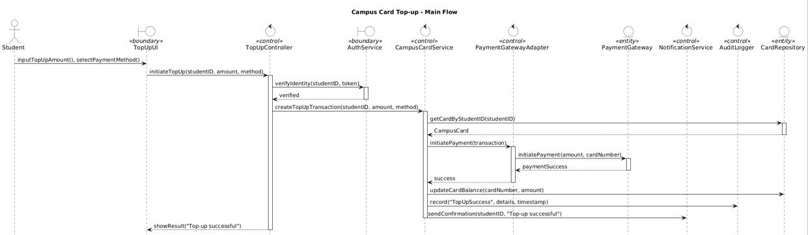

## 4. Updated Requirements

### 4.1 Use Case Update: Order Reservation Functionality

Through analysis of the current meal ordering system, we found that the existing system only supports immediate ordering (Browse Menu → Select Dishes → Place Order → Make Payment). However, students frequently encounter several issues: excessive waiting times during peak dining hours (11:30-12:30 and 17:30-18:30), popular dishes often being sold out during peak periods, and a strong desire to schedule meals in advance, particularly when they have tight class schedules.

To address these problems, we have upgraded the reservation function. Students can now make meal reservations, select specific ordering times, and manage their reservations, including cancellation when needed.

  

 

| Field | Description |
|-------|-------------|
| **Use Case ID** | UC001 |
| **Use Case Name** | Food Reservation Management |
| **Actors** | Student (Primary), Payment System |
| **Preconditions** | Student is logged into the system |
| **Trigger** | Student performs food reservation related operations |
| **Main Success Scenario** | **Create Reservation:** 1. Student selects food items 2. Student chooses reservation date and time slot 3. Student confirms order and makes payment 4. System generates reservation order  **Manage Reservation:** 5. Student enters "My Reservations" 6. Student selects order for operations:    **Update**: Change food items or time    **Cancel**: Cancel reservation 7. System processes operation and updates status |
| **Alternative Scenarios** | A1: Time slot full → Select different time A2: Payment failed → Retry payment A3: Exceed update/cancel deadline → Operation rejected |
| **Exception Scenarios** | E1: System failure → Prompt retry E2: Network interruption → Sync later |
| **Postconditions** | Reservation order status updated Time slot capacity adjusted User receives confirmation notification |

### 4.2 New use case diagram: Dish recommendation and ranking module

  

**USE CASE: Publish Dish**

| Field | Description |
|-------|-------------|
| **Use Case ID** | UC002 |
| **Use Case Name** | Publish Dish |
| **Specification** | Merchant user publishes a new dish to the system, including basic dish information, price, description, etc. |
| **Actors** | MerchantUser |
| **Preconditions** | 1. Merchant has successfully logged into the system 2. Merchant has permission to publish dishes 3. System is operating normally |
| **Basic Path** | 1. Merchant clicks the "Publish Dish" button 2. System displays the dish information form 3. Merchant fills in dish name, price, description, category and other information 4. System verifies merchant permission (include Verify Permission) 5. System views user permission level (include View User Authority) 6. System validates dish information completeness 7. System saves dish information to database 8. System returns "Dish published successfully" notification 9. System redirects to dish detail page |
| **Alternative Scenarios** | **Scenario A: Permission verification failed** - Step 4: System detects insufficient merchant permission - System displays "You do not have publishing permission" notification - Use case ends  **Scenario B: Incomplete dish information** - Step 6: System detects required fields are empty - System displays "Please fill in all required fields" notification - System highlights missing fields - Merchant supplements information and returns to Step 3  **Scenario C: Duplicate dish name** - Step 6: System detects dish name already exists - System displays "This dish already exists, please modify the name" notification - Merchant modifies dish name and returns to Step 3 |
| **Postconditions** | 1. Dish is successfully saved to system database 2. Dish status is "Pending Review" 3. Merchant can view the dish in personal dish list 4. System records publish operation log |

---

**USE CASE: Vote and Rate**

| Field | Description |
|-------|-------------|
| **Use Case ID** | UC003 |
| **Use Case Name** | Vote and Rate |
| **Specification** | Student user votes and rates a dish on a scale of 1-5 stars, with the option to add a comment |
| **Actors** | StudentUser |
| **Preconditions** | 1. Student has successfully logged into the system 2. Published dishes exist in the system 3. Dish status is "Reviewed" or "Available" 4. Student is voting for the first time on the current dish or is allowed to modify their vote |
| **Basic Path** | 1. Student browses dish list or dish detail page 2. Student clicks the "Vote and Rate" button 3. System displays rating interface (1-5 star rating) 4. Student selects rating level (1-5 stars) 5. System checks if the student has already voted (include Check Duplicate Vote) 6. System validates vote validity 7. System saves vote record to database 8. System updates dish total score and average rating 9. System returns "Vote successful" notification 10. System displays the latest rating for the current dish |
| **Alternative Scenarios** | **Scenario A: Student has already voted** - Step 5: System detects that the student has already voted - System prompts "You have already voted, do you want to modify your rating?" - If student selects "Yes", update vote record and return to Step 9 - If student selects "No", use case ends  **Scenario B: Student chooses to add a comment** - After Step 9: System prompts "Do you want to add a comment?" - Student selects "Yes", system displays comment input box (extend Comment) - Student enters comment content - System saves comment information - System returns "Comment successful" notification  **Scenario C: Dish does not exist or is offline** - Step 2: System detects dish does not exist or is offline - System displays "Dish does not exist or is offline, cannot vote" notification - Use case ends  **Scenario D: Vote timeout** - Step 6: System detects voting time exceeds the limit - System displays "Voting time has expired" notification - Use case ends |
| **Postconditions** | 1. Vote record is successfully saved to database 2. Dish total score and average rating have been updated 3. Dish ranking may change 4. Student can view the vote in personal voting history 5. System records vote operation log |

### 4.3 Feedback Subsystem Use Case

  

This use case diagram illustrates the feedback management process within a system, showcasing the interactions between users and administrators for handling feedback submission, review, and notification.

**USE CASE: Submit Feedback**

| Field | Description |
|-------|-------------|
| **Use Case ID** | UC004 |
| **Use Case Name** | Submit Feedback |
| **Specification** | The user submits feedback regarding the system or course through the feedback interface. |
| **Actors** | User |
| **Preconditions** | The user has logged into the system and accessed the feedback page. |
| **Basic Path** | 1. The user opens the feedback module. 2. The user fills in the feedback content and contact information. 3. The user clicks "Submit Feedback". 4. The system stores the feedback record and sends a notification to the administrator. 5. The system displays a confirmation message to the user. |
| **Alternative Scenarios** | 1. If the feedback content is empty, the system prompts "Feedback content cannot be empty." 2. If the network is disconnected, the submission fails and the system displays "Failed to submit feedback." |
| **Postconditions** | Feedback is saved in the database and marked as "Pending Review". |

---

**USE CASE: Receive Feedback Notification**

| Field | Description |
|-------|-------------|
| **Use Case ID** | UC005 |
| **Use Case Name** | Receive Feedback Notification |
| **Specification** | The administrator receives a notification when new feedback is submitted. |
| **Actors** | Administrator |
| **Preconditions** | Feedback has been submitted by a user. |
| **Basic Path** | 1. The system detects new feedback records. 2. The system sends a notification to the administrator. 3. The administrator opens the feedback list to review. |
| **Alternative Scenarios** | If notification delivery fails, the administrator can manually refresh the feedback list to view new items. |
| **Postconditions** | The administrator is aware of pending feedback awaiting review. |

---

**USE CASE: Review Feedback**

| Field | Description |
|-------|-------------|
| **Use Case ID** | UC006 |
| **Use Case Name** | Review Feedback |
| **Specification** | The administrator reviews the submitted feedback and decides whether it is valid or requires follow-up. |
| **Actors** | Administrator |
| **Preconditions** | The administrator has received a feedback notification. |
| **Basic Path** | 1. The administrator opens the feedback review page. 2. The system displays the feedback details. 3. The administrator checks the content and decides on an action (approve, reject, or request more info). |
| **Alternative Scenarios** | If the feedback record is missing or corrupted, the system shows "Unable to load feedback details." |
| **Postconditions** | Feedback is marked with a review result. |

---

**USE CASE: Update Feedback Status**

| Field | Description |
|-------|-------------|
| **Use Case ID** | UC007 |
| **Use Case Name** | Update Feedback Status |
| **Specification** | The administrator updates the feedback record's status after completing a review. |
| **Actors** | Administrator |
| **Preconditions** | The feedback has been reviewed and a decision made. |
| **Basic Path** | 1. The administrator selects a reviewed feedback item. 2. The system allows updating the feedback status (Approved/Rejected/Resolved). 3. The system saves the updated status in the database. |
| **Alternative Scenarios** | If saving fails, the system displays "Status update failed. Please try again." |
| **Postconditions** | The feedback status is successfully updated and stored. |

---

**USE CASE: Notify Review Result**

| Field | Description |
|-------|-------------|
| **Use Case ID** | UC008 |
| **Use Case Name** | Notify Review Result |
| **Specification** | The system notifies the user of the administrator's review result. |
| **Actors** | User |
| **Preconditions** | The administrator has updated the feedback status. |
| **Basic Path** | 1. The system detects feedback status updates. 2. The system sends a notification to the corresponding user. 3. The user views the review result through the notification or feedback page. |
| **Alternative Scenarios** | If notification delivery fails, the user can check the feedback status manually in their feedback history. |
| **Postconditions** | The user is informed of the administrator's review decision. |

#### 4.3.3 Feedback Subsystem Activity diagram

  

This activity diagram illustrates the complete workflow of the feedback management process, showing the interactions between Users, the System, and Administrators in handling feedback submission, review, and notification.

### 4.4 Campus Card Recharge System

**Use Case Diagram**

  

**USE CASE: View Campus Card Balance**

| Field                     | Description  |
|-------|-------------|
| **Use Case ID**           | UC009 |
| **Use Case Name**         | View Campus Card Balance   |
| **Specification**         | The student views the current balance of their campus card through the system.  |
| **Actors**                | Student |
| **Preconditions**         | The student has logged into the SmartCampus system. |
| **Basic Path**            | 1. The student opens the campus card module. 2. The system retrieves the current card balance. 3. The system displays the balance to the student. |
| **Alternative Scenarios** | If the system fails to retrieve the balance due to network or database issues, it displays “Unable to load card balance.”|
| **Postconditions**        | The student is aware of the current balance of their campus card.  |

---

**USE CASE: Set Low-Balance Alert**

| Field                     | Description |
|-------|-------------|
| **Use Case ID**           | UC010 |
| **Use Case Name**         | Set Low-Balance Alert |
| **Specification**         | The student sets a custom threshold for low-balance notifications. |
| **Actors**                | Student |
| **Preconditions**         | The student has access to the campus card settings page.  |
| **Basic Path**            | 1. The student opens the alert settings page. 2. The student enters a threshold value. 3. The student confirms the alert setting. 4. The system stores the alert configuration. |
| **Alternative Scenarios** | If the input amount is invalid (e.g., negative, non-numeric), the system displays “Invalid amount.”  |
| **Postconditions**        | The system saves the alert threshold and will monitor the balance accordingly.  |

---

**USE CASE: Top-up Campus Card**

| Field                     | Description |
|-------|-------------|
| **Use Case ID**           | UC011 |
| **Use Case Name**         | Top-up Campus Card  |
| **Specification**         | The student recharges their campus card using either a preset fast amount or a custom amount. |
| **Actors**                | Student, Payment System   |
| **Preconditions**         | The student has a valid payment method and is authenticated.  |
| **Basic Path**            | 1. The student accesses the top-up page. 2. The student selects a fast top-up amount or enters a custom amount. 3. The student confirms the payment. 4. The system sends the payment request to the Payment Gateway. 5. The payment gateway processes the transaction and returns the result. 6. The system updates the campus card balance if the payment succeeds. |
| **Alternative Scenarios** | 1. Payment fails, and the system notifies the student of the failure. 2. The student cancels the top-up before confirmation.  |
| **Postconditions**        | The system updates the balance if successful and records the transaction.  |

---

**USE CASE: View Transaction History**

| Field                     | Description      |
|-------|-------------|
| **Use Case ID**           | UC012  |
| **Use Case Name**         | View Transaction History  |
| **Specification**         | The student views detailed campus card transaction records, including top-ups and expenditures.  |
| **Actors**                | Student  |
| **Preconditions**         | The student is logged into the system. |
| **Basic Path**            | 1. The student opens the transaction history page. 2. The system retrieves the campus card transaction records. 3. The system displays a list of historical transactions. |
| **Alternative Scenarios** | If the system cannot retrieve records, it displays “Unable to load transaction history.”   |
| **Postconditions**        | The student reviews detailed transaction information.  |

**Campus Card Top-up Activity Diagram**

  

This activity diagram illustrates the complete workflow of the campus card top-up process, involving interactions across 3 swimlanes: Student, System, and  Payment System. The diagram shows how a student initiates a top-up by selecting or entering an amount, after which the system generates a payment request and communicates with the external payment system. Based on the payment outcome, the system either updates the card balance and records the transaction or displays an error message. Finally, students will receive a campus card recharge confirmation, ending the process.

## 5. Updated Snapshots of the System's User Interface

### 5.1 Updated Snapshots of Meal Order

The interface update includes adding positon part to the restaurant list and a shopping cart section to the meal selection interface and providing a more detailed display of order contents.

  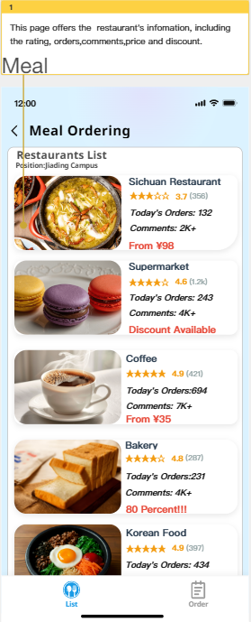
  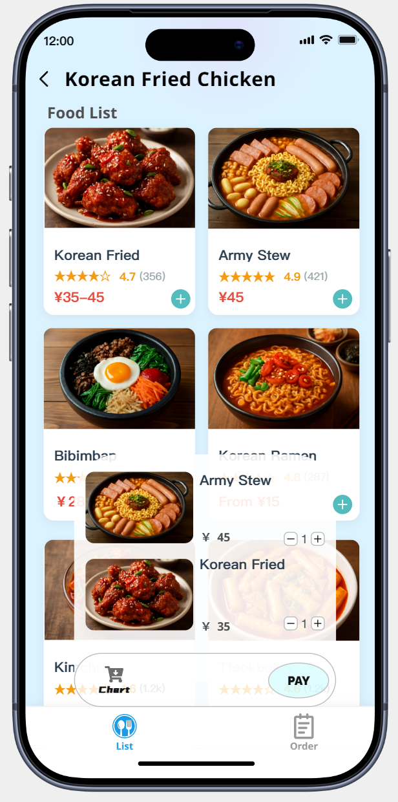
  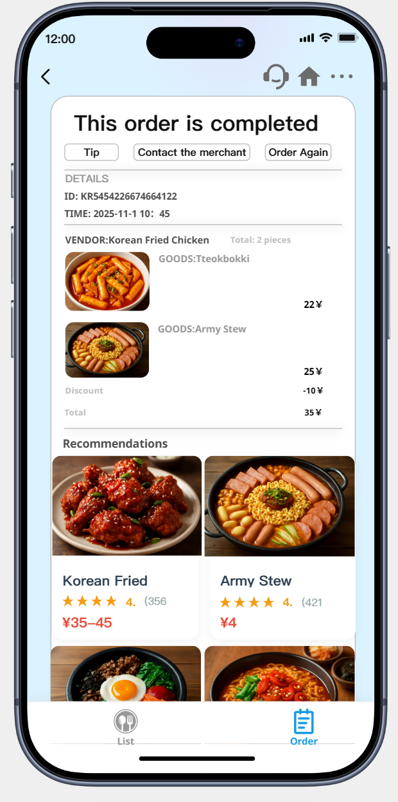

### 5.2 Dishes recommendation and ranking
#### 5.2.1 Online Voting Page

This interface is the online voting page of the "Campus Cuisine" application. The top displays the campaign title "Choose your favorite dish!" with a playful food-themed background to enhance visual appeal. The central section shows the total number of participants and the total number of dishes, giving users a clear sense of the event's scale. Below is the "Online Voting" form where users enter the restaurant name, dish name, their name, and student ID before clicking "Submit". A bottom navigation bar includes four tabs-"Vote", "Ranking List","New Dishes" and "Comment"-enabling seamless switching between core features.

  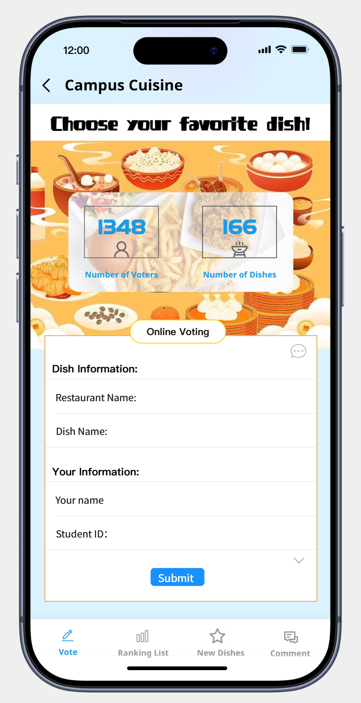

#### 5.2.2 Dish Ranking List Page

This screen presents the current popularity ranking of dishes. Decorated with an autumn-themed illustration at the top, the title reads "Dish Ranking List". The main content uses a bar chart to visually display vote counts for the top three dishes: 1st place -"KFC | Egg Tart", 2nd -"Spicy Hot Pot", and 3rd -"Lanzhou Noodles". The 4th-place entry, "Xiyuan | Fa Cai Zhu", is shown with an image and a "Go Vote" button to encourage further participation. The design is colorful and well-structured, allowing users to quickly grasp ranking information.

  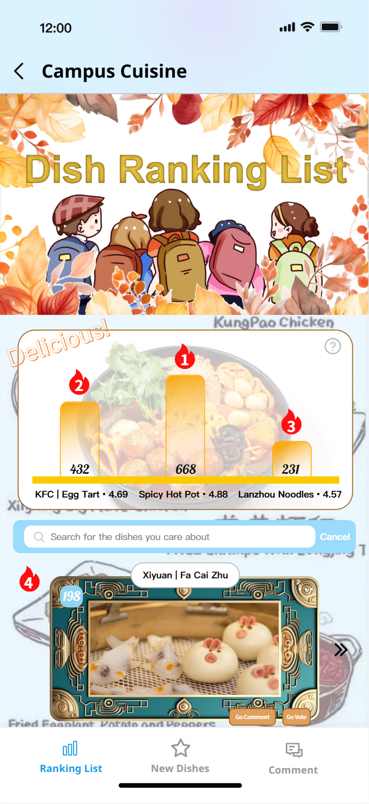

  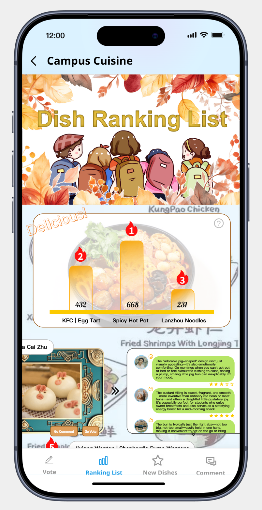

#### 5.2.3 New Dishes Recommendation Page

This page highlights monthly new dish recommendations. At the top, a cartoon chef character accompanies the heading "Monthly New Dish Recommendations" to emphasize the theme. Below, dishes are displayed in a grid layout, each featuring an image, name, price, and associated vendor. Examples include "Pea and Pumpkin Mousse" priced at $20 and "Extra-Thick Ham Sandwich" at $9.5. The layout is lively and informative, helping users discover new menu options easily.

  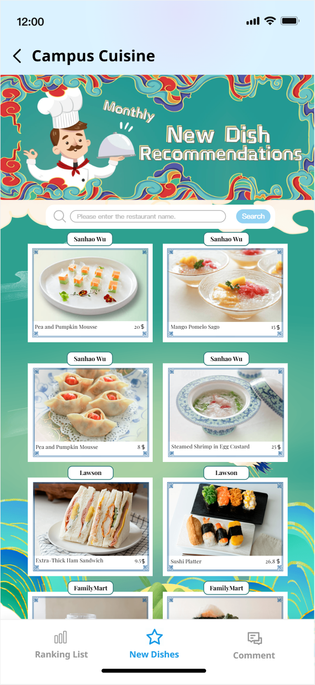

### 5.3 Feedback Subsystem
#### 5.3.1 Feedback Subsystem Snapshot

  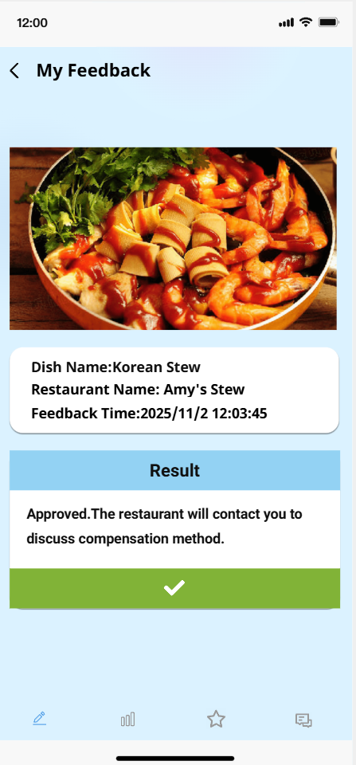

This latest UI update shows the page for users to write and submit feedback for a dish, displaying basic information about the dish including its name, rating, and sales to provide essential context as users compose their feedback. The feedback form offers a dual-mode input system, allowing users to express their opinions through both textual descriptions and visual documentation.

  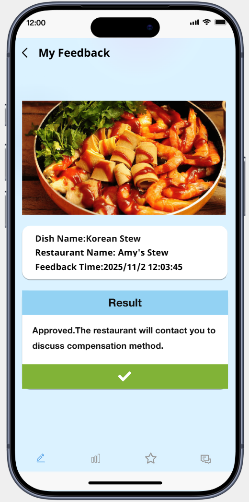

This screenshot depicts a user interface designed for viewing the status and outcome of submitted feedback. The layout is clean, modern, and user-friendly, prioritizing clear communication of the final result.

The interface is structured into three distinct sections for optimal readability. At the very top, the header "My Feedback" immediately informs the user of the screen's purpose. Just below, the specific details of the feedback are presented in a simple list format, including the Dish Name, the Restaurant Name, and the precise Feedback Time. This provides essential context for the result that follows.

The most prominent part of the screen is the "Result" section. This area delivers the final verdict on the user's submission. In this example, the result is a positive one: "Approved." This is followed by a direct message explaining the next steps, specifically that the restaurant will make contact to arrange the compensation method. The design successfully guides the user from the general purpose of the screen, through the specific details of their report, and culminates in a clear, actionable resolution, ensuring they understand both the status of their feedback and what to expect going forward.

### 5.4 Comment & Feedback Page

This interface allows users to post reviews of dishes. The header reads "Post a Comment", followed by a text input box for detailed feedback. Users can upload images to support their reviews. Three rating categories-"Taste", "Cleanliness" and "Portion Size"-each offer a 5-star scale (currently unselected). At the bottom are two submission options: "Submit Anonymously" and "Submit", accommodating different privacy preferences. The design is clean, intuitive, and user-focused.

  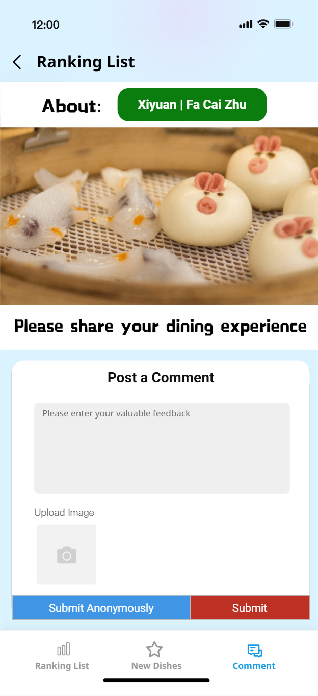

 

### 5.5 Campus Card Recharge

The first snapshot presents the main interface of the Campus Card Recharge module. At the top of the page, the system displays the student's current campus card balance in a visually prominent manner, ensuring that users can immediately understand their financial status. Below the balance section, the interface provides a quick-recharge panel containing several preset recharge amounts that allow students to perform top-ups with minimal interaction. To support more flexible use cases, the page also includes an input field where users may enter a custom recharge amount before confirming the transaction using the "Confirm Recharge" button. In addition to the recharge functionality, the page integrates two important supporting features: a button that redirects students to view their detailed transaction history, and a configuration button for enabling or adjusting low-balance alerts when the card balance falls below a user-specified threshold. This snapshot effectively combines real-time financial visibility with operational convenience.

  

The second snapshot depicts the transaction history interface, which provides a clear and organized view of the student's financial activity. This page lists recharge and spending records in reverse chronological order, presenting key information such as transaction type, amount, timestamp, and status. The layout is designed to allow students to quickly scan and verify their recent financial activities, ensuring transparency and supporting personal account management. Each entry is structured consistently to enhance readability, and the interface avoids unnecessary visual clutter to maintain focus on the financial data itself. This snapshot functions as a natural extension of the recharge interface, giving students the tools they need to track their card usage with precision.

  

## 6. Open Issues
### 6.1 Meal Ordering Section
**Real-time Data Consistency:**
Managing real-time inventory updates across multiple dining locations poses significant challenges. When students make reservations or immediate orders, the system must ensure accurate availability information and prevent overbooking scenarios during peak dining hours.

**Scalability Concerns:**
The meal ordering subsystem experiences highly concentrated traffic during specific time windows (11:30-12:30, 17:30-18:30). Our current architecture needs stress testing and optimization to handle concurrent reservation requests and payment processing without system degradation.

### 6.2 Recommendation Section

**Main Challenges**:
  **Missing Feedback Loop**: User comments and issues (such as ingredients not being fresh or insufficient portions) cannot be effectively communicated to the corresponding canteens or vendors, leading to untimely problem resolution.
  **Single-dimensional Ranking Information**: The current ranking list only displays positions, lacking multi-dimensional analysis (such as flavor trends, price-performance ratio, or time-of-day popularity), making it difficult to support deeper decision-making.
  **Inconsistent Quality of Reviews**: Anonymous reviews may lead to invalid or emotional content, affecting data credibility. Additionally, there is a lack of integrated display of structured ratings.
  **Insufficient Precision in New Product Recommendations**: Recommendation logic may be based solely on new arrival times without considering user preferences, historical behaviors, or seasonal factors, reducing recommendation effectiveness.

 **Design Tasks for the Next Stage**:
    **Refine Review and Feedback Mechanisms**:
      Add structured tags to facilitate categorized processing.
      Establish an automatic work order system to direct high-frequency issues or serious complaints to the corresponding vendor's backend and track progress.
   **Optimize Ranking Interface and Visual Analysis**:
      Introduce interactive charts (e.g., line graphs showing weekly popularity changes, radar charts comparing multidimensional scores).
      Support filtering of rankings by restaurant, cuisine type, price range, etc., to meet personalized browsing needs.
    **Enhance Recommendation Intelligence Levels:**
      Combine users' voting history, review preferences, and consumption records to build lightweight recommendation algorithms.
      Increase associated recommendations such as "You May Like" or "Users with Similar Tastes Also Chose" within new product displays.
    **Increase Data Transparency and Trust:**
      Display safety traceability information (such as ingredient sources, inspection reports) on the dish details page, drawing inspiration from Youxin Infinite's food safety supervision approach.
      Show authenticity markers for reviews (such as "Verified Diner"), improving the reliability of feedback.

 
### 6.3 Campus Card Recharge
As SmartCampus continues to evolve toward a fully integrated and intelligent campus service ecosystem, several open issues remain that require further design exploration and technical refinement. One of the primary challenges concerns the integration of heterogeneous legacy systems across different departments. Although the platform currently relies on a unified API gateway strategy, significant inconsistencies still exist in data formats, authentication standards, and service reliability across various institutional systems. Addressing these discrepancies will require coordinated efforts with administrative units and a more robust middleware layer capable of handling data normalization and fault tolerance.

In addition, the expansion of SmartCampus into more predictive and personalized services introduces challenges related to data governance and privacy protection. The platform is increasingly dependent on user behavior analytics, preference modeling, and aggregated operational data. However, the mechanisms for managing consent, anonymizing sensitive information, and meeting compliance requirements have not been fully defined. Establishing a standardized privacy and data management framework will therefore be essential as the system progresses toward intelligent automation.

Furthermore, the user experience design across subsystems still requires harmonization. While each module has undergone individual refinements, the overall look-and-feel, interaction patterns, and accessibility standards are not yet fully unified. Ensuring a consistent, inclusive, and responsive interface across web and mobile environments remains an ongoing design task that will directly influence user satisfaction and adoption.

Finally, performance optimization and system scalability represent another category of open issues. As the SmartCampus platform is expected to support a growing student population and an increasing volume of service requests, the architectural design must be evaluated for load balancing, microservice orchestration, monitoring, and recovery capabilities. Future work must explore more advanced deployment strategies such as container orchestration, service autoscaling, and distributed caching to guarantee system responsiveness during peak usage periods.

## 7. [Optional] AI Tool Usage Declaration
- If you have used an AI tool or technology to generate an output that you either paraphrase or direct quote in your writing, you must cite and reference this output as a source in your reference list
- If you have used an AI tool or technology in the process of completing the above tasks (for example, generating architectural descriptions, creating UML/SysML/C4 diagrams, exploring technical solutions, editing reports), an acknowledgment of how you have used AI tools or technologies is required

## 8. Annotated References
[1]You, Cheng. *Design and Implementation of a Digital Campus Management Platform* [D]. Shanghai Jiao Tong University, 2016.

This thesis provides an early and influential architectural model for understanding how large-scale campus management platforms can transition from traditional paper-based workflows to integrated digital ecosystems. Its relevance to the SmartCampus project lies primarily in its systematic analysis of the challenges associated with unifying heterogeneous campus services under a single digital framework. The author’s focus on leveraging database-driven records, modular hot-swappable components, workflow customization, and role-based access control offers fundamental principles that directly inform the architectural decisions of our current system. In particular, the study emphasizes the importance of consolidating fragmented legacy subsystems into a centralized identity authentication and personal portal service, which eliminates repeated logins and improves the efficiency of information access. This aligns closely with SmartCampus’s own efforts to establish a unified authentication scheme and an integrated user experience across various service modules.

Furthermore, the thesis demonstrates how digital campus platforms can be tailored to the operational characteristics of a specific institution—in this case, a police training academy—while still maintaining a scalable and generalizable system architecture. The categorization of subsystems into trainee services, teaching management, logistics support, and performance evaluation provides a useful conceptual precedent for SmartCampus’s functional decomposition across student affairs, academic services, resource management, and administrative operations. The successful deployment and real-world validation of the system described in the thesis, with over 20,000 data records processed and positive user feedback, also supply practical evidence supporting the feasibility of highly integrated campus platforms. Overall, this reference offers both theoretical grounding and implementation insights that help shape SmartCampus’s design philosophy, data integration strategy, and long-term development trajectory.

[2]https://www.edu.cn/xxh/xy/xytp/202505/t20250528_2671522.shtml

The referenced article from China Education Online  highlights an innovative campus-based digital platform developed by a university to enhance student engagement with on-campus dining services through interactive features such as real-time dish ratings, online voting for favorite meals, and dynamic food rankings. This initiative aligns closely with the core objectives of my project, which aims to design and implement a user-friendly mobile or web application that empowers students to discover, evaluate, and provide feedback on campus cuisine. Both projects emphasize participatory mechanisms-such as anonymous reviews, photo uploads, and multi-criteria scoring-to foster transparency and improve cafeteria service quality. Furthermore, the referenced system integrates data visualization to display trending dishes and monthly new offerings, a feature I also plan to incorporate to encourage culinary diversity and informed choices. The institutional context is particularly relevant: like the university featured in the article, my project targets a Chinese higher education environment where students rely heavily on campus canteens and seek more voice in food-related decisions. The success of the referenced platform demonstrates the feasibility and demand for such tools in academic settings, validating my approach. Additionally, it offers practical insights into UI/UX design, data collection ethics, and integration with existing campus infrastructure-lessons that can directly inform my system's architecture and deployment strategy. By building upon this real-world example, my project not only addresses a similar user need but also seeks to refine and expand functionality (e.g., personalized recommendations, nutritional information) to deliver greater value. Thus, this reference serves as both inspiration and a benchmark for usability, scope, and impact.

[3]优信无限校园餐智慧监管平台：让餐费可溯、食安可溯、责任落实https://www.iyouxin.com/html/news_631.html

The referenced article from iYouxin introduces the "Campus Meal Smart Supervision Platform" developed by Guangdong Youxin Infinite Network Co., Ltd., which focuses on enhancing transparency, safety, and efficiency in school canteen operations through digital technologies such as IoT devices, AI-powered image recognition, smart scales, and data-driven traceability systems. This platform enables end-to-end oversight-from ingredient sourcing and kitchen hygiene to cost accounting and inventory management-ensuring food safety and regulatory compliance. My project, while user-facing and centered on student engagement, directly complements this institutional-level infrastructure. Specifically, the data integrity and traceability features described in the reference provide a trustworthy foundation upon which my application can build consumer-facing functionalities. For instance, if students can see that a dish originates from a verified, safe supply chain-as ensured by a system like Youxin's-they may be more confident in rating or recommending it. Moreover, my project could theoretically integrate with such backend supervision platforms to display real-time indicators like "safety-certified" badges or freshness scores, thereby bridging operational transparency with user experience. The reference also validates the growing trend in Chinese educational institutions toward digitizing campus dining ecosystems, reinforcing the relevance and timeliness of my work. While Youxin's solution targets administrators and regulators, my project targets end-users (students), making our approaches symbiotic: one ensures safety and accountability from the top down, the other drives feedback and preference from the bottom up. Together, they represent a holistic vision for modern, intelligent campus food services. Thus, this reference not only contextualizes my project within an emerging industry standard but also suggests potential pathways for future integration and scalability.

## 9. Contributions of Team Members
 
| Members               | Part 1 | Part 2 | Part 3 | Part 4 | Part 5 | Part 6 | Part 7 | Part 8 | Percent |
| --------------------- | ------ | ------ | ------ | ------ | ------ | ------ | ------ | ------ |------- |
| Feng Juncai  2353924  | ✓      | ✓      |       |        |        |        |        |        |        |        |         |
| Ji Peng  2351869      |        |        |      |        |        |        |        |        |        |         |        |
| Zhang Shikou  2353240 |        |        |      |        |        |        |        |        |        |         |        |
| Yu Yilian  2352993    |        |        |      |        |        |        |        |        |        |         |        |

