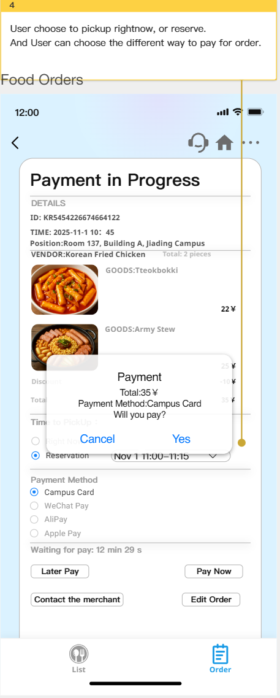
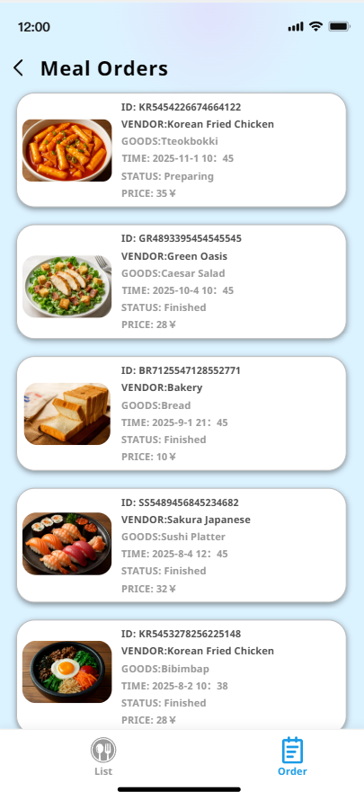
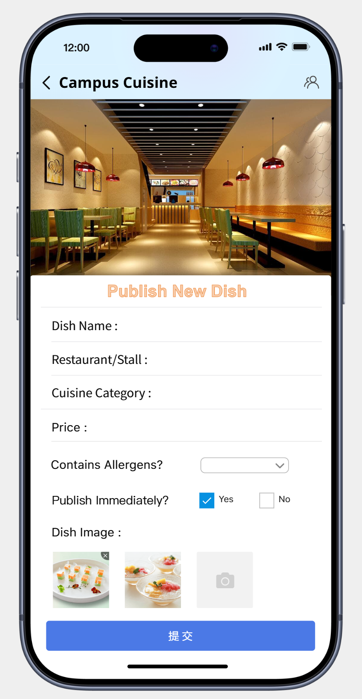
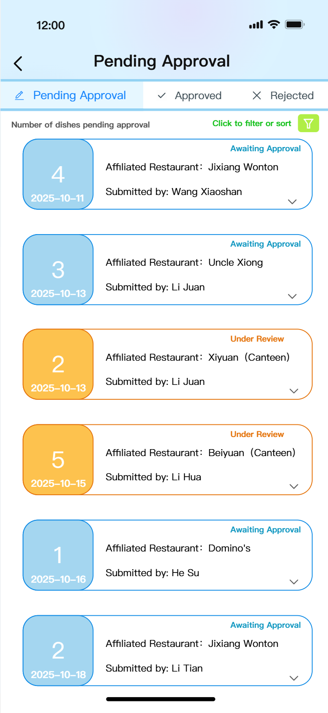

# System analysis 

**Team Name**: CampusCode  
**Team Members**:
- 2353924 Feng Juncai (冯俊财)
- 2351869 Ji Peng (纪鹏)  
- 2353240 Zhang Shikou (张诗蔻)
- 2352993 Yu Yilian (于伊莲)

## 0. Table of Contents
- [System analysis](#system-analysis)
  - [0. Table of Contents](#0-table-of-contents)
  - [1. Introduction](#1-introduction)
    - [1.1 Project Goals](#11-project-goals)
    - [1.2 Progress Since Requirements Modeling](#12-progress-since-requirements-modeling)
    - [1.3 Key Changes and Refinements](#13-key-changes-and-refinements)
    - [1.4 Current Project Status](#14-current-project-status)
  - [2. System Architecture Design](#2-system-architecture-design)
    - [2.1 Architecture Pattern Selection](#21-architecture-pattern-selection)
    - [2.2 System-Level Architecture Diagram](#22-system-level-architecture-diagram)
    - [2.3 Layer Analysis](#23-layer-analysis)
      - [2.3.1 Presentation Layer](#231-presentation-layer)
      - [2.3.2 Security and Gateway Layer](#232-security-and-gateway-layer)
      - [2.3.3 Business Logic Layer](#233-business-logic-layer)
      - [2.3.4 Data Access Layer](#234-data-access-layer)
      - [2.3.5 Infrastructure Services](#235-infrastructure-services)
      - [2.3.6 Data Storage Layer](#236-data-storage-layer)
    - [2.4 Technology Stack Selection](#24-technology-stack-selection)
  - [3. Analysis Model](#3-analysis-model)
    - [3.1 OrderMeal](#31-ordermeal)
      - [3.1.1 Class diagram](#311-class-diagram)
      - [3.1.2 Interaction diagrams](#312-interaction-diagrams)
    - [3.2 Recommendation Section](#32-recommendation-section)
      - [3.2.1 Class diagram](#321-class-diagram)
      - [3.2.2 Interaction diagrams](#322-interaction-diagrams)
    - [3.3 Feedback Subsystem](#33-feedback-subsystem)
      - [3.3.1 Class diagram](#331-class-diagram)
      - [3.3.2 Interaction diagram](#332-interaction-diagram)
    - [3.4 Campus Card Recharge](#34-campus-card-recharge)
      - [3.4.1 Class Diagram](#341-class-diagram)
      - [3.4.2 Interaction Diagrams](#342-interaction-diagrams)
  - [4. Updated Requirements](#4-updated-requirements)
    - [4.1 Use Case Update: Order Reservation Functionality](#41-use-case-update-order-reservation-functionality)
    - [4.2 New use case diagram: Dish recommendation and ranking module](#42-new-use-case-diagram-dish-recommendation-and-ranking-module)
  - [| **Postconditions** | 1. Dish is successfully saved to system database2. Dish status is "Pending Review"3. Merchant can view the dish in personal dish list4. System records publish operation log |](#-postconditions--1-dish-is-successfully-saved-to-system-database2-dish-status-is-pending-review3-merchant-can-view-the-dish-in-personal-dish-list4-system-records-publish-operation-log-)
  - [| **Postconditions** | 1. The dish status has been updated.2. The review operation has been recorded in the system log.3. The merchant has received the review result notification.4. The dish's visibility on the platform has changed accordingly: - "Published" → visible to students for browsing and voting. - "Rejected" → no longer displayed in any public listing. |](#-postconditions--1-the-dish-status-has-been-updated2-the-review-operation-has-been-recorded-in-the-system-log3-the-merchant-has-received-the-review-result-notification4-the-dishs-visibility-on-the-platform-has-changed-accordingly---published--visible-to-students-for-browsing-and-voting---rejected--no-longer-displayed-in-any-public-listing-)
    - [4.3 Feedback Subsystem Use Case](#43-feedback-subsystem-use-case)
    - [4.4 Campus Card Recharge System](#44-campus-card-recharge-system)
  - [5. Updated Snapshots of the System's User Interface](#5-updated-snapshots-of-the-systems-user-interface)
    - [5.1 Meal Order](#51-meal-order)
      - [5.1.1 Dishes Page](#511-dishes-page)
      - [5.1.2 Order Page](#512-order-page)
    - [5.2 Dishes recommendation and ranking](#52-dishes-recommendation-and-ranking)
      - [5.2.1 Online Voting Page](#521-online-voting-page)
      - [5.2.2 Dish Ranking List Page](#522-dish-ranking-list-page)
      - [5.2.3 Comment Page](#523-comment-page)
      - [5.2.4 New Dishes Recommendation Page](#524-new-dishes-recommendation-page)
      - [5.2.5 Merchant New Dish Submission Review Interface](#525-merchant-new-dish-submission-review-interface)
      - [5.2.6 Admin Dish Approval List Interface](#526-admin-dish-approval-list-interface)
    - [5.3 Feedback Subsystem](#53-feedback-subsystem)
      - [5.3.1 Feedback Subsystem Snapshot](#531-feedback-subsystem-snapshot)
    - [5.4 Comment \& Feedback Page](#54-comment--feedback-page)
    - [5.5 Campus Card Recharge](#55-campus-card-recharge)
  - [6. Open Issues](#6-open-issues)
    - [6.1 Meal Ordering Section](#61-meal-ordering-section)
    - [6.2 Recommendation Section](#62-recommendation-section)
  - [7. AI Tool Usage Declaration](#7-ai-tool-usage-declaration)
  - [8. Annotated References](#8-annotated-references)
  - [9. Contributions of Team Members](#9-contributions-of-team-members)

## 1. Introduction

### 1.1 Project Goals 
SmartCampus is a comprehensive digital platform designed to unify fragmented campus services into a single, intelligent ecosystem. Our strategic business objectives focus on delivering measurable value across four dimensions: 
(1) Operational Efficiency - reducing service delivery time by 40% through automated workflows, decreasing administrative overhead by 30% through system integration, and improving resource utilization to 85%+ via intelligent scheduling; 
(2) User Engagement - achieving 90%+ student adoption rate within the first academic year, reducing average daily task management time from 45 minutes to 15 minutes per student, and maintaining user satisfaction above 4.5/5.0; 
(3) Financial Impact - generating ROI of 150%+ within 3 years through operational cost savings, reducing paper-based process costs by 60% via digitalization, and creating new revenue streams through premium features and third-party service integration; 
(4) Strategic Positioning - establishing SmartCampus as the market leader in university digital transformation, enabling data-driven decision making for institutional planning, and building scalable architecture supporting 50,000+ concurrent users.

Scope:

  

The platform integrates four core subsystems—Library Services, Academic Affairs, Daily Life Services, and Logistics Management—with unified authentication and personalized experiences. These subsystems work together to create an intelligent campus service ecosystem that addresses students' comprehensive needs throughout their daily campus life while delivering quantifiable business value to all stakeholders including students, faculty, administrators, and institutional leadership.
### 1.2 Progress Since Requirements Modeling
In our previous requirements modeling document, we provided a comprehensive overview of SmartCampus functionality. Since our initial requirements modeling phase, progress has been achieved across multiple dimensions:

**Architectural Design**: We have evolved from conceptual service integration to concrete architectural decisions, selecting a microservices approach with API gateway integration to ensure scalability and maintainability.

**Technical Foundation**: The technology stack has been finalized, incorporating modern web technologies with mobile-first responsive design principles and progressive web application capabilities.

**User Research Enhancement**: User personas have been refined through detailed user journey mapping, which has identified critical touchpoints and optimization opportunities.

### 1.3 Key Changes and Refinements

**Integration Strategy Evolution**: We have adopted an enhancement strategy that leverages existing campus APIs and databases. This reduces implementation complexity and ensures compatibility with established infrastructure.

**Scope Clarification**: While maintaining our comprehensive service vision, we have identified a clear MVP path prioritizing high-impact, frequently-used features including basic meal ordering, essential academic schedule management, fundamental maintenance requests, and other life services.

**Detailed System Analysis**: Given the complexity of interactions across different systems, we have selected the Daily Life Services system for detailed analysis as a representative case study. This system provides in-depth insights into system interaction patterns and design principles. This system encompasses multiple aspects including dining services, dormitory management, campus card services, and other areas, featuring representative user interaction Path and business processes.

### 1.4 Current Project Status

This document builds upon our requirements modeling foundation to detail the progress of our analysis model and architectural design.

**Development Readiness**: The project has reached a critical milestone with all core architectural decisions finalized. We have created a layered architecture diagram that outlines the system's structural hierarchy and illustrates the components within each layer.

**Analysis Model Completion**: We have completed an in-depth analysis model composed of class diagrams to enhance system reliability and simplify development, providing a solid foundation for the upcoming implementation phase.

**System Refinements**: During the analysis phase, we identified system update requirements to enhance functionality and user experience, and refined the interface design to make it more user-friendly and powerful.

**Project Milestone**: Through comprehensive analysis modeling and architectural design, the project has established a complete technical pathway from concept to implementation, laying a solid foundation for subsequent work.

## 2. System Architecture Design

### 2.1 Architecture Pattern Selection

The Smart Campus Platform adopts a layered architecture pattern for the following reasons:
1. Separation of Concerns: Multiple business domains require focused responsibilities at each layer
2. Technology Independence: Each layer can independently select optimal technologies
3. Scalability: Layers can be independently scaled based on load demands
4. Testability: Complex business logic can be tested modularly
5. Team Organization: Multiple teams can develop layers in parallel

### 2.2 System-Level Architecture Diagram

  

### 2.3 Layer Analysis

#### 2.3.1 Presentation Layer

  

 
Purpose: Provide mobile user interfaces for campus users.
Components: WeChat Mini Program and native mobile applications enable quick access and social sharing features.

#### 2.3.2 Security and Gateway Layer

  

 
Purpose: Handle authentication, authorization, and provide unified entry point for requests.
Components: OAuth 2.0 authentication, Single Sign-On (SSO), and API gateway for request routing and protocol conversion. 

#### 2.3.3 Business Logic Layer

  

 
Purpose: Implement core business functions organized by domain.
Components: Academic Affairs, Library Services, Campus Life Services, and Logistics Services handle domain-specific business logic and workflows.
#### 2.3.4 Data Access Layer

  

 
Purpose: Abstract data persistence operations and provide consistent data access patterns.
Components: Spring Data JPA for MySQL operations, MyBatis-Plus for complex SQL queries, and MongoDB client for document storage.
Note: Redis caching is managed by infrastructure services, not this layer.

#### 2.3.5 Infrastructure Services

  

 
Purpose: Provide cross-cutting capabilities supporting all layers.
Components: Monitoring, logging, data analytics, file storage, message queues, and configuration center serve system-wide operational needs.

#### 2.3.6 Data Storage Layer

  

 
Purpose: Provide persistent storage optimized for different data types.
Components: MySQL for relational data, MongoDB for document storage, and Redis for caching.

### 2.4 Technology Stack Selection

Backend: Spring Boot 3.x, Spring Data JPA 3.x, MyBatis-Plus 3.5.x, Spring Security with OAuth 2.0.
Database: MySQL 8.0 for transactional consistency, MongoDB 6.0 for flexible document storage, Redis 7.0 for caching.
Infrastructure: Docker 24.x for containerization, Kubernetes 1.28 for orchestration, Prometheus and Grafana for monitoring, ELK Stack for log analysis.
This architecture provides a solid foundation for the Smart Campus Platform, ensuring scalability, maintainability, and extensibility.
 

## 3. Analysis Model
### 3.1 OrderMeal
#### 3.1.1 Class diagram

This UML class diagram represents a Campus Food Ordering System with nine classes. Four entity classes (Student, Order, Dish, Restaurant, Reservation) manage core business data. Two boundary classes (SystemInterface, OrderingInterface) handle user interactions. Two control classes (OrderController, MenuController) orchestrate business logic. Solid lines connect entities showing business relationships. Dashed lines connect boundaries/controllers to entities showing system dependencies. The architecture supports complete workflows: student authentication → restaurant browsing → order creation → payment processing → order tracking, providing an efficient campus dining platform.

  

#### 3.1.2 Interaction diagrams

This is a UML sequence diagram of a student food ordering system. The diagram shows interactions among eight participants including student, menu controller, restaurant, dish, order, reservation, payment service, and user account. The process includes browsing the menu, selecting dishes, adding items to the order and calculating the total, confirming the order and checking dish availability, choosing reservation or direct payment through ALT branches, processing payment and verifying balance, updating inventory, and obtaining order confirmation. The entire sequence diagram demonstrates a complete system workflow with multiple decision points and error handling mechanisms.

  

 
### 3.2 Recommendation Section
#### 3.2.1 Class diagram

The class diagram outlines a campus canteen dish evaluation and recommendation system, centering on user roles (students, merchants, administrators), dishes, canteens/restaurants, comments, replies, votes, permissions, and rankings. Students engage by voting and commenting on dishes; merchants add new dishes to the menu; administrators oversee content moderation. The system aggregates votes to compile and update rankings based on popularity, ensuring an up-to-date recommendation list that facilitates better dining experiences. This setup encourages interaction and feedback among students, merchants, and administrators for continuous improvement.

  

#### 3.2.2 Interaction diagrams
**Student Voting Interaction Diagram**

This interaction diagram illustrates the complete process of student users participating in dish voting. Users open the voting page, enter or select a dish and search, after which the system returns and displays the list of dishes. After clicking to vote, users fill in the score and comment then submit. The system checks for duplicate votes: if already voted, it shows an error message; otherwise, it saves the vote, updates the rankings, and displays a success message, with an optional navigation to the ranking page. The entire process demonstrates data validation, state control, and user experience feedback mechanisms.

  

**Student Viewing Ranking List Interaction Diagram**

This interaction diagram describes the complete process of students viewing the dish ranking list. Users open the ranking page, select sorting or filtering criteria, and click to query. The system then gathers dish information, voting statistics, and restaurant details from multiple data sources, integrates this data, and renders the ranking list. Clicking on a dish allows users to view detailed information and also provides an option to vote directly. Upon successful submission of a vote, the display returns to the list. The process clearly illustrates mechanisms for data aggregation, presentation, and interactive expansion, supporting dynamic queries and user engagement.

  

**Merchant New Dish Release Interaction Diagram**

This interaction diagram illustrates the complete process of merchants publishing dishes. After merchants fill in the dish information and submit it, the system validates the data and saves the publication record while asynchronously notifying the administrator for review. If the administrator approves, they update the status and refresh the ranking; if rejected, the reason for rejection is returned. The process demonstrates mechanisms for data validation, asynchronous notification, and state management, supporting dynamic updates and feedback after review.

  

 
### 3.3 Feedback Subsystem
#### 3.3.1 Class diagram

  

This class diagram outlines a structured campus feedback system, centering on user roles (students, administrators), core business entities (Feedback, FeedbackStatus), and functional modules (feedback submission, content review, status updates, and notifications).

Students, as the primary users, submit opinions and suggestions through the feedback interface; the system validates the content's legitimacy via the submission controller before the Feedback entity records the complete information. Administrators access pending content through the feedback list interface, with the review controller coordinating status updates and result logging. Throughout the process, the notification controller is responsible for sending processing results back to students, while the FeedbackStatus entity ensures the traceability and closed-loop management of the business workflow.

#### 3.3.2 Interaction diagram

  

This interaction diagram sequentially illustrates the complete workflow of the campus feedback subsystem, from submission to resolution, with its core interactions revolving around three main actors: the Student, the FeedbackManager, and the Admin.

The process begins with the student submitting feedback content. The FeedbackManager subsequently creates a feedback record, logs the submission, and notifies the administrator of the new feedback. The administrator makes a decision based on their review, prompting the system to update the feedback's status. In the alternative flows, if the feedback is approved, the system sends an approval notice to the student; if rejected, the corresponding result is communicated.

### 3.4 Campus Card Recharge

The Campus Card Recharge subsystem in SmartCampus is designed to provide a seamless, secure, and efficient way for students to manage their campus card balance. This function plays an essential role in enabling cashless transactions on campus, including dining, printing, transportation, and access to various campus facilities. In alignment with the system’s microservice-oriented architecture, the recharge module is decomposed into boundary, control, and entity layers, each contributing to a clear separation of concerns and maintainable system structure. The analysis model focuses on describing the key abstractions and interactions that support the recharge flow, the balance inquiry flow, and the handling of exceptional cases such as payment failures. The following sections summarize the class structure and detailed message exchanges that collectively define the behavior of the subsystem.

#### 3.4.1 Class Diagram

The class diagram for the Campus Card Recharge subsystem illustrates the core abstractions and their responsibilities across the boundary, control, and entity layers. The boundary layer contains the user interface and external authentication system, serving as the primary entry points for user interaction and identity verification. The control layer orchestrates the process logic, coordinating payment initiation, transaction creation, balance updates, and notification broadcasting. The entity layer represents persistent objects within the system, including the student profile, campus card, transaction records, payment gateway, and repository services.

The following diagram visually presents the structural relationships, highlighting associations, dependencies, and the roles of key classes without embedding operational details directly on the connectors:

  

This model clearly outlines how the TopUpController coordinates actions between UI, authentication, card service, payment adapter, and notification components. The CampusCardService encapsulates core balance-related logic and interacts with the persistent store through the repository. The TopUpTransaction entity records each recharge event, ensuring traceability and enabling auditing. Overall, the diagram captures the static structure required to support the dynamic flows that occur during a campus card recharge.

#### 3.4.2 Interaction Diagrams

This sequence diagram represents the campus card top-up subsystem. The Student interacts with the TopUpUI to enter the recharge amount and select a payment method, while the TopUpController coordinates the overall workflow. After receiving the request, the controller communicates with the AuthService to verify the student’s identity, ensuring that only authenticated users can proceed. Once verified, the CampusCardService creates a top-up transaction and retrieves the corresponding campus card information from the CardRepository.

The PaymentGatewayAdapter then interfaces with the external PaymentGateway to process the payment, returning the result to the service layer. Upon successful payment, the system updates the card balance, records the transaction through the AuditLogger, and triggers the NotificationService to send a confirmation message to the student.

Control classes orchestrate the top-up process, boundary elements handle user and external interactions, and entity classes provide necessary data persistence. Together, these components enable a secure, consistent, and well-tracked campus card top-up experience.

  

## 4. Updated Requirements
### 4.1 Use Case Update: Order Reservation Functionality
Through analysis of the current meal ordering system, we found that the existing system only supports immediate ordering (Browse Menu → Select Dishes → Place Order → Make Payment). In practice, students frequently encounter issues such as excessive waiting times during peak dining hours (11:30-12:30 and 17:30-18:30), popular dishes being sold out, and difficulty in planning meals in advance. To address these problems, we have simultaneously upgraded the reservation function, allowing students to make meal reservations in advance, select specific ordering times, and manage their reservation information, while optimizing the use case diagram design.
Specifically, the original diagram had an overly complex structure due to too many use cases and confusing extend relationships. The current version simplifies the design by removing redundant use cases (Search, Customize, Track), retaining only core functionalities, and clearly distinguishing the roles of Students, Merchants, and Administrators. This makes the structure more concise and clear, improving readability and maintainability while better reflecting the system's fundamental features.

  

 
 
| Item | Content |
|------|---------|
| **Use Case ID** | UC-001 |
| **Use Case Name** | Food Reservation Management |
| **Actors** | Student (Primary), Merchant (Secondary), Payment System |
| **Preconditions** | Student is logged into the system; Menu items are available |
| **Trigger** | Student initiates food reservation operation |
| **Basic Path** | 1. Student browses menu and selects food items 2. Student chooses reservation date and time slot 3. Student confirms order details 4. Student makes payment 5. System generates and confirms reservation order 6. Student accesses "My Reservations" page 7. Student performs reservation management:    - **Update**: Modify food items or time slot    - **Cancel**: Cancel reservation 8. System processes operation and updates reservation status |
| **Alternative Path** | 2a: Time slot unavailable → System suggests alternative slots 4a: Payment failed → System prompts retry 7a: Exceed deadline → System rejects operation with reason |
| **Postconditions** | Reservation status updated; Time slot capacity adjusted; Confirmation notification sent to student |
 

### 4.2 New use case diagram: Dish recommendation and ranking module

  

**USE CASE: Publish Dish**

| Item | Content|
|-------|--------------|
| **Use Case ID** | UC-002 |
| **Use Case Name** | Publish Dish |
| **Actors** | MerchantUser |
| **Preconditions** | 1. Merchant has successfully logged into the system 2. Merchant has permission to publish dishes 3. System is operating normally |
|**Trigger**  |Merchant intends to add a new dish to the platform and clicks the "Publish Dish" button .
| **Basic Path** | 1. Merchant clicks the "Publish Dish" button 2. System displays the dish information form 3. Merchant fills in dish name, price, description, category and other information 4. System verifies merchant permission (include Verify Permission) 5. System views user permission level (include View User Authority) 6. System validates dish information completeness 7. System saves dish information to database 8. System returns "Dish published successfully" notification 9. System redirects to dish detail page |
| **Alternative Path** | 4a: Permission verification failed → System displays "You do not have publishing permission" notification 6a: Incomplete dish information → System displays "Please fill in all required fields" notification,highlights missing fields. Merchant supplements information and returns to Step 3 6b: Duplicate dish name → System displays "This dish already exists, please modify the name" notification.Merchant modifies dish name and returns to Step 3 |
| **Postconditions** | 1. Dish is successfully saved to system database 2. Dish status is "Pending Review" 3. Merchant can view the dish in personal dish list 4. System records publish operation log |
---
**USE CASE: Approve Dish**

| Item | Content|
|-------|--------------|
| **Use Case ID** | UC-003 |
| **Use Case Name** | Approve Dish |
| **Actors** | Adminstrator |
| **Preconditions** | 1. The administrator has successfully logged into the system. 2. The administrator has permission to approve dishes. 3. There exists at least one dish in the system with status "Pending Approval". 4. The system is operating normally. |
| **Trigger** | The administrator views the list of dishes pending approval in the admin backend and clicks the "Waiting Approve" button for a specific dish. |
| **Basic Path** | 1. The administrator clicks the "Waiting Approve" button. 2. The system displays detailed information about the dish (including name, price, image, description, merchant information, etc.). 3. The administrator reviews the dish content and decides whether to approve it. 4. The administrator selects either "Approve" or "Reject" and submits the review result. 5. The system verifies the administrator's permissions. 6. The system updates the dish status based on the selection:  - If "Approve" is selected → the dish status is updated to "Published".  - If "Reject" is selected → the dish status is updated to "Rejected", and the administrator may provide a rejection reason. 7. The system saves the review record to the database. 8. The system sends a notification of the review result to the merchant. 9. The system displays a "Review completed" message and redirects back to the pending approval list page. |
| **Alternative Paths** | 4a: Administrator does not select a review outcome → System prompts "Please select a review decision"; administrator reselects and returns to Step 4. 5a: Permission verification fails → System displays "You are not authorized to perform this action"; the flow terminates. 6a: Dish information is found non-compliant during review (e.g., contains prohibited content) → System prompts "Please reject and provide a reason"; administrator enters a rejection reason and continues. 8a: Notification delivery fails → System logs the error but proceeds with the review process unaffected. |
| **Postconditions** | 1. The dish status has been updated. 2. The review operation has been recorded in the system log. 3. The merchant has received the review result notification. 4. The dish's visibility on the platform has changed accordingly:  - "Published" → visible to students for browsing and voting.  - "Rejected" → no longer displayed in any public listing. |
---
**USE CASE: Vote and Rate**

| Item | Content |
|-------|-------------|
| **Use Case ID** | UC-004 |
| **Use Case Name** | Vote and Rate |
| **Actors** | StudentUser |
| **Preconditions** | 1. Student has successfully logged into the system 2. Published dishes exist in the system 3. Dish status is "Reviewed" or "Available" 4. Student is voting for the first time on the current dish or is allowed to modify their vote |
|**Trigger**  |Student wishes to rate or vote for a dish they have tried and clicks the "Go Vote" button on the dish list .
| **Basic Path** | 1. Student browses dish list or dish detail page 2. Student clicks the "Go Vote" button 3. System displays rating interface (1-5 star rating) 4. Student selects rating level (1-5 stars) 5. System checks if the student has already voted  6. System validates vote validity 7. System saves vote record to database 8. System updates dish total score and average rating 9. System returns "Vote successful" notification 10. System displays the latest rating for the current dish |
| **Alternative Path** | 5a: Student has already voted → System prompts "You have already voted, do you want to modify your rating?" If student selects "Yes", update vote record and return to Step 9. If student selects "No", use case ends  |
| **Postconditions** | 1. Vote record is successfully saved to database 2. Dish total score and average rating have been updated 3. Dish ranking may change 4. Student can view the vote in personal voting history 5. System records vote operation log |

### 4.3 Feedback Subsystem Use Case

  

This use case diagram illustrates the feedback management process within a system, showcasing the interactions between users and administrators for handling feedback submission, review, and notification.

**USE CASE: Submit Feedback**

| Item | Content |
|-------|-------------|
| **Use Case ID** | UC-005 |
| **Use Case Name** | Submit Feedback |
| **Specification** | The user submits feedback regarding the system or course through the feedback interface. |
| **Actors** | User |
| **Preconditions** | The user has logged into the system and accessed the feedback page. |
| **Basic Path** | 1. The user opens the feedback module. 2. The user fills in the feedback content and contact information. 3. The user clicks "Submit Feedback". 4. The system stores the feedback record and sends a notification to the administrator. 5. The system displays a confirmation message to the user. |
| **Alternative Path** | 3a. If the feedback content is empty, the system prompts "Feedback content cannot be empty." 4a. If the network is disconnected, the submission fails and the system displays "Failed to submit feedback." |
| **Post-condition** | Feedback is saved in the database and marked as "Pending Review". |

---

**USE CASE: Review Feedback**

| Item | Content |
|-------|-------------|
| **ID** | UC-006 |
| **Specification** | The administrator reviews the submitted feedback and decides whether it is valid or requires follow-up. |
| **Actors** | Administrator |
| **Preconditions** | The administrator has received a feedback notification. |
| **Basic Path** | 1. The administrator opens the feedback review page. 2. The system displays the feedback details. 3. The administrator checks the content and decides on an action (approve, reject, or request more info). |
| **Alternative Path** | 1a.If the feedback record is missing or corrupted, the system shows "Unable to load feedback details." |
| **Post-condition** | Feedback is marked with a review result. |

---

### 4.4 Campus Card Recharge System 

**Use Case Diagram**

  

**USE CASE: View Campus Card Balance**

| Item                     | Content  |
|-------|-------------|
| **Use Case ID**           | UC-007 |
| **Use Case Name**         | View Campus Card Balance   |
| **Specification**         | The student views the current balance of their campus card through the system.  |
| **Actors**                | Student |
| **Preconditions**         | The student has logged into the SmartCampus system. |
| **Basic Path**            | 1. The student opens the campus card module. 2. The system retrieves the current card balance. 3. The system displays the balance to the student. |
| **Alternative Scenarios** | If the system fails to retrieve the balance due to network or database issues, it displays “Unable to load card balance.”|
| **Postconditions**        | The student is aware of the current balance of their campus card.  |

---

**USE CASE: Set Low-Balance Alert**

| Item                     | Content |
|-------|-------------|
| **Use Case ID**           | UC-008 |
| **Use Case Name**         | Set Low-Balance Alert |
| **Specification**         | The student sets a custom threshold for low-balance notifications. |
| **Actors**                | Student |
| **Preconditions**         | The student has access to the campus card settings page.  |
| **Basic Path**            | 1. The student opens the alert settings page. 2. The student enters a threshold value. 3. The student confirms the alert setting. 4. The system stores the alert configuration. |
| **Alternative Scenarios** | If the input amount is invalid (e.g., negative, non-numeric), the system displays “Invalid amount.”  |
| **Postconditions**        | The system saves the alert threshold and will monitor the balance accordingly.  |

---

**USE CASE: Top-up Campus Card**

| Item                     | Content |
|-------|-------------|
| **Use Case ID**           | UC-009 |
| **Use Case Name**         | Top-up Campus Card  |
| **Specification**         | The student recharges their campus card using either a preset fast amount or a custom amount. |
| **Actors**                | Student, Payment System   |
| **Preconditions**         | The student has a valid payment method and is authenticated.  |
| **Basic Path**            | 1. The student accesses the top-up page. 2. The student selects a fast top-up amount or enters a custom amount. 3. The student confirms the payment. 4. The system sends the payment request to the Payment Gateway. 5. The payment gateway processes the transaction and returns the result. 6. The system updates the campus card balance if the payment succeeds. |
| **Alternative Scenarios** | 1. Payment fails, and the system notifies the student of the failure. 2. The student cancels the top-up before confirmation.  |
| **Postconditions**        | The system updates the balance if successful and records the transaction.  |

---

**USE CASE: View Transaction History**

| Item                     | Content      |
|-------|-------------|
| **Use Case ID**           | UC-010  |
| **Use Case Name**         | View Transaction History  |
| **Specification**         | The student views detailed campus card transaction records, including top-ups and expenditures.  |
| **Actors**                | Student  |
| **Preconditions**         | The student is logged into the system. |
| **Basic Path**            | 1. The student opens the transaction history page. 2. The system retrieves the campus card transaction records. 3. The system displays a list of historical transactions. |
| **Alternative Scenarios** | If the system cannot retrieve records, it displays “Unable to load transaction history.”   |
| **Postconditions**        | The student reviews detailed transaction information.  |

**Campus Card Top-up Activity Diagram**

  

This activity diagram illustrates the complete workflow of the campus card top-up process, involving interactions across 3 swimlanes: Student, System, and  Payment System. The diagram shows how a student initiates a top-up by selecting or entering an amount, after which the system generates a payment request and communicates with the external payment system. Based on the payment outcome, the system either updates the card balance and records the transaction or displays an error message. Finally, students will receive a campus card recharge confirmation, ending the process.

## 5. Updated Snapshots of the System's User Interface

### 5.1 Meal Order
#### 5.1.1 Dishes Page
The interface update includes adding a shopping cart section on the meal selection interface and providing more detailed display of merchant.

  
  

  

#### 5.1.2 Order Page

The interface update includes three key pages: Payment Progress, Order Details, and Completed Orders. The Payment Progress page displays real-time order information with itemized dishes, prices, and discounts. Users can select flexible pickup times and multiple payment methods (Campus Card, WeChat Pay, Alipay, Apple Pay) with a confirmation dialog for security. A countdown timer and action buttons enable immediate or deferred payment. The Meal Orders page lists all historical orders with status tracking, showing vendor names, dish details, timestamps, and prices through a card-based layout for easy review.

    
  
  

  

### 5.2 Dishes recommendation and ranking
#### 5.2.1 Online Voting Page

This interface is the Dish Voting page, which users reach by tapping the "Go Vote" button in the bottom-right corner of a dish entry on the "Ranking List" page.At the top, the campaign title "Choose Your Favorite Dish!" is displayed against a playful, food-themed background to enhance visual appeal. The central section shows the total number of participants and the total number of dishes, giving users a clear sense of the event's scale.On this voting page, the restaurant name and dish name are automatically populated by the system, so users do not need to enter them manually. Additionally, if a student has already submitted their personal information during their first vote, this information will be auto-filled in subsequent votes. If not, the system will prompt the user to enter these details once, after which they will be saved automatically for future use-eliminating the need for repeated input.

  

#### 5.2.2 Dish Ranking List Page

This interface displays the current popularity ranking of dishes and is structured into three main sections.The first section features a bar chart that visually presents the top three dishes by vote count.The image of the #1 dish is displayed as the background, and its average rating is also shown.The second section includes a search bar where users can look up any dish of interest. After clicking "Search", the corresponding dish's image and details appear below.The third section showcases dishes ranked from 4th to the and. Each dish entry includes a "Go Vote" button in the bottom-right corner to encourage further participation, as well as a "Go Comment" button to leave a review. Users can swipe left on a dish to view comments posted by other students about that dish.

  
  

#### 5.2.3 Comment Page

The comment page allows you to share your dining experience for dishes you're interested in.

You can access it in two ways:
1. From the Ranking List page, tap the "Go Comment" button located at the bottom-right corner of a dish's image. The system will then automatically display the dish's image, restaurant name, and dish name on the comment page;
2. Alternatively, tap the "Comment" tab in the bottom navigation bar to enter the comment page directly. In this case, you'll need to manually search for the dish you wish to review before proceeding to the comment page.

On the comment page, you can submit feedback using both text and images.

  

#### 5.2.4 New Dishes Recommendation Page

This page highlights monthly new dish recommendations. At the top, a cartoon chef character accompanies the heading "Monthly New Dish Recommendations" to emphasize the theme. Below the heading is a search bar that allows users to check whether a specific restaurant has recently launched any new dishes. After searching, all new dishes released by that restaurant this month are displayed below.The dishes are presented in a grid layout, each featuring an image, name, price, and vendor information. For example, "Pea and Pumpkin Mousse" is priced at $20, and the "Extra-Thick Ham Sandwich" costs $9.5. Users can tap the downward arrow in the bottom-right corner of a dish card to view more detailed information about that dish.

  

#### 5.2.5 Merchant New Dish Submission Review Interface
This interface allows merchants to submit new dish information, including dish name, stall/restaurant, cuisine category, price, allergen indicators, and more, with support for dish image uploads. Users can choose to publish immediately or save for later submission. Designed to be clean and intuitive, it enables merchants to complete the publishing process efficiently while ensuring data completeness and a smooth user experience.

  

 
#### 5.2.6 Admin Dish Approval List Interface

This interface displays all dish submissions awaiting review, categorized by status as "Pending Approval" or "Under Review". Each entry shows the affiliated restaurant, submitter, number of dishes, and submission date. Administrators can quickly browse and click to access the detailed review page. The interface supports filtering and sorting to enhance approval efficiency and ensure new dishes go live promptly.
 

  

### 5.3 Feedback Subsystem
#### 5.3.1 Feedback Subsystem Snapshot

  

This latest UI update shows the page for users to write and submit feedback of a certain dish,displaying basic information of the dish,including its name, rating,sales, providing essential context for users as they compose their feedback.The feedback form offers a dual-mode input system, allowing users to express their opinions through both textual descriptions and visual documentation. 

  

This screenshot depicts a user interface designed for viewing the status and outcome of submitted feedback. The interface is structured into three distinct sections for optimal readability. The feedback are presented in a simple list format, including the Dish Name, the Restaurant Name, and the precise Feedback Time. This provides essential context for the result that follows.The most prominent part of the screen is the "Result" section. This area delivers the final verdict on the user's submission. In this example, the result is a positive one: "Approved." This is followed by a direct message explaining the next steps, specifically that the restaurant will make contact to arrange the compensation method.

### 5.4 Comment & Feedback Page

This interface allows users to post reviews of dishes. The header reads "Post a Comment", followed by a text input box for detailed feedback. Users can upload images to support their reviews. Three rating categories-"Taste", "Cleanliness" and "Portion Size"-each offer a 5-star scale (currently unselected). At the bottom are two submission options: "Submit Anonymously" and "Submit", accommodating different privacy preferences. The design is clean, intuitive, and user-focused.

  

 

### 5.5 Campus Card Recharge

The first snapshot presents the main interface of the Campus Card Recharge module. At the top of the page, the system displays the student's current campus card balance in a visually prominent manner, ensuring that users can immediately understand their financial status. Below the balance section, the interface provides a quick-recharge panel containing several preset recharge amounts that allow students to perform top-ups with minimal interaction. To support more flexible use cases, the page also includes an input field where users may enter a custom recharge amount before confirming the transaction using the "Confirm Recharge" button. In addition to the recharge functionality, the page integrates two important supporting features: a button that redirects students to view their detailed transaction history, and a configuration button for enabling or adjusting low-balance alerts when the card balance falls below a user-specified threshold. This snapshot effectively combines real-time financial visibility with operational convenience.

  

The second snapshot depicts the transaction history interface, which provides a clear and organized view of the student's financial activity. This page lists recharge and spending records in reverse chronological order, presenting key information such as transaction type, amount, timestamp, and status. The layout is designed to allow students to quickly scan and verify their recent financial activities, ensuring transparency and supporting personal account management. Each entry is structured consistently to enhance readability, and the interface avoids unnecessary visual clutter to maintain focus on the financial data itself. This snapshot functions as a natural extension of the recharge interface, giving students the tools they need to track their card usage with precision.

  

## 6. Open Issues
### 6.1 Meal Ordering Section
**Real-time Data Consistency:**
Managing real-time inventory updates across multiple dining locations poses significant challenges. When students make reservations or immediate orders, the system must ensure accurate availability information and prevent overbooking Path during peak dining hours.

**Scalability Concerns:**
The meal ordering subsystem experiences highly concentrated traffic during specific time windows (11:30-12:30, 17:30-18:30). Our current architecture needs stress testing and optimization to handle concurrent reservation requests and payment processing without system degradation.

### 6.2 Recommendation Section

* **Main Challenges**:
  * **Missing Feedback Loop**: User comments and issues (such as ingredients not being fresh, insufficient portions) cannot be effectively communicated to the corresponding canteens or merchant users, leading to problems not being resolved in a timely manner.
  * **Single-dimensional Ranking Information**: The current ranking list only displays positions, lacking multi-dimensional analysis (such as flavor trends, price-performance ratio, time-of-day popularity), making it difficult to support deeper decision-making.
  * **Inconsistent Quality of Reviews**: Anonymous reviews may lead to invalid or emotional content, affecting the credibility of the data. Additionally, there is a lack of integrated display of structured ratings .
  * **Insufficient Precision in New Product Recommendations**: Recommendation logic may solely be based on new arrival times without considering user preferences, historical behaviors, or seasonal factors, reducing the effectiveness of recommendations.

*  **Design Tasks for the Next Stage**:
    * **Refine Review and Feedback Mechanisms**:
      * Add structured tags to facilitate categorized processing.
      * Establish an automatic work order system to direct high-frequency issues or serious complaints to the corresponding merchant user's backend and track progress.
   * **Optimize Ranking Interface and Visual Analysis**:
      * Introduce interactive charts (e.g., line graphs showing weekly popularity changes, radar charts comparing multidimensional scores).
      * Support filtering of rankings by restaurant, cuisine type, price range, etc., to meet personalized browsing needs.
    * **Enhance Recommendation Intelligence Levels:**
      * Combine users' voting history, review preferences, and consumption records to build lightweight recommendation algorithms.
      * Increase associated recommendations such as "You May Like" or "Users with Similar Tastes Also Chose" within new product displays.
    * **Increase Data Transparency and Trust:**
      * Display safety traceability information (such as ingredient sources, inspection reports) on the dish details page, drawing inspiration from Youxin Infinite's food safety supervision approach.
      * Show authenticity markers for reviews (such as "Verified Diner"), improving the reliability of feedback.

 

## 7. AI Tool Usage Declaration
Scope and Method of Use: During the completion of the task, AI tools were used for assistance, including but not limited to: generating and polishing Chinese translations, optimizing academic expressions, organizing the structure and elements of UML/SysML/C4 diagrams, searching for and comparing technical solutions, and editing the language and format of the report.

Human Intervention: The AI outputs were reviewed item by item, fact-checked, and contextually adapted to ensure consistent terminology, coherent logic, and compliance with project/course specifications and academic integrity requirements; all final content was confirmed by the user, who takes responsibility for its quality.

## 8. Annotated References
[1]You, Cheng. *Design and Implementation of a Digital Campus Management Platform* [D]. Shanghai Jiao Tong University, 2016.

This thesis provides an early and influential architectural model for understanding how large-scale campus management platforms can transition from traditional paper-based workflows to integrated digital ecosystems. Its relevance to the SmartCampus project lies primarily in its systematic analysis of the challenges associated with unifying heterogeneous campus services under a single digital framework. The author’s focus on leveraging database-driven records, modular hot-swappable components, workflow customization, and role-based access control offers fundamental principles that directly inform the architectural decisions of our current system. In particular, the study emphasizes the importance of consolidating fragmented legacy subsystems into a centralized identity authentication and personal portal service, which eliminates repeated logins and improves the efficiency of information access. This aligns closely with SmartCampus’s own efforts to establish a unified authentication scheme and an integrated user experience across various service modules.

Furthermore, the thesis demonstrates how digital campus platforms can be tailored to the operational characteristics of a specific institution—in this case, a police training academy—while still maintaining a scalable and generalizable system architecture. The categorization of subsystems into trainee services, teaching management, logistics support, and performance evaluation provides a useful conceptual precedent for SmartCampus’s functional decomposition across student affairs, academic services, resource management, and administrative operations. The successful deployment and real-world validation of the system described in the thesis, with over 20,000 data records processed and positive user feedback, also supply practical evidence supporting the feasibility of highly integrated campus platforms. Overall, this reference offers both theoretical grounding and implementation insights that help shape SmartCampus’s design philosophy, data integration strategy, and long-term development trajectory.

[2]王磊, 洪军, 彭政. 高校智慧餐饮建设实践与规划思考[J]. 中国教育和科研计算机网CERNET, 2025-05-28. https://www.edu.cn/xxh/yaowen/202505/t20250528_246xxxx.shtml

The referenced article from China Education Online  highlights an innovative campus-based digital platform developed by a university to enhance student engagement with on-campus dining services through interactive features such as real-time dish ratings, online voting for favorite meals, and dynamic food rankings. This initiative aligns closely with the core objectives of my project, which aims to design and implement a user-friendly mobile or web application that empowers students to discover, evaluate, and provide feedback on campus cuisine. Both projects emphasize participatory mechanisms-such as anonymous reviews, photo uploads, and multi-criteria scoring-to foster transparency and improve cafeteria service quality. Furthermore, the referenced system integrates data visualization to display trending dishes and monthly new offerings, a feature I also plan to incorporate to encourage culinary diversity and informed choices. The institutional context is particularly relevant: like the university featured in the article, my project targets a Chinese higher education environment where students rely heavily on campus canteens and seek more voice in food-related decisions. The success of the referenced platform demonstrates the feasibility and demand for such tools in academic settings, validating my approach. Additionally, it offers practical insights into UI/UX design, data collection ethics, and integration with existing campus infrastructure-lessons that can directly inform my system's architecture and deployment strategy. By building upon this real-world example, my project not only addresses a similar user need but also seeks to refine and expand functionality (e.g., personalized recommendations, nutritional information) to deliver greater value. Thus, this reference serves as both inspiration and a benchmark for usability, scope, and impact.

[3]优信无限. 优信无限校园餐智慧监管平台：让餐费可溯、食安可溯、责任落实[EB/OL]. 2025-11-10. https://www.iyouxin.com/html/news_631.html

The referenced article from iYouxin introduces the "Campus Meal Smart Supervision Platform" developed by Guangdong Youxin Infinite Network Co., Ltd., which focuses on enhancing transparency, safety, and efficiency in school canteen operations through digital technologies such as IoT devices, AI-powered image recognition, smart scales, and data-driven traceability systems. This platform enables end-to-end oversight-from ingredient sourcing and kitchen hygiene to cost accounting and inventory management-ensuring food safety and regulatory compliance. My project, while user-facing and centered on student engagement, directly complements this institutional-level infrastructure. Specifically, the data integrity and traceability features described in the reference provide a trustworthy foundation upon which my application can build consumer-facing functionalities. For instance, if students can see that a dish originates from a verified, safe supply chain-as ensured by a system like Youxin's-they may be more confident in rating or recommending it. Moreover, my project could theoretically integrate with such backend supervision platforms to display real-time indicators like "safety-certified" badges or freshness scores, thereby bridging operational transparency with user experience. The reference also validates the growing trend in Chinese educational institutions toward digitizing campus dining ecosystems, reinforcing the relevance and timeliness of my work. While Youxin's solution targets administrators and regulators, my project targets end-users (students), making our approaches symbiotic: one ensures safety and accountability from the top down, the other drives feedback and preference from the bottom up. Together, they represent a holistic vision for modern, intelligent campus food services. Thus, this reference not only contextualizes my project within an emerging industry standard but also suggests potential pathways for future integration and scalability.
 

[4]Claude 4 Sonnet (AI Assistant). Anthropic. Used for document content generation, language editing, and providing modification suggestions for use case diagrams and activity diagrams in the SmartCampus project documentation.

## 9. Contributions of Team Members
 
| Members     | Works  | Percent |
| --------------------- | ----- |------- |
| Feng Juncai  2353924  |   |    25%    |
| Ji Peng  2351869      |   |    25%    |
| Zhang Shikou  2353240 |   |    25%    |
| Yu Yilian  2352993    |   |    25%    |

