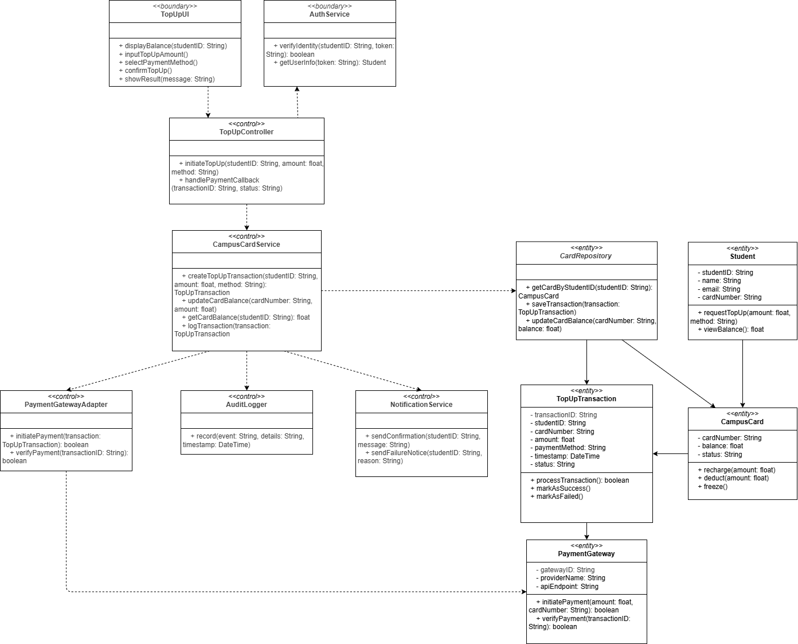
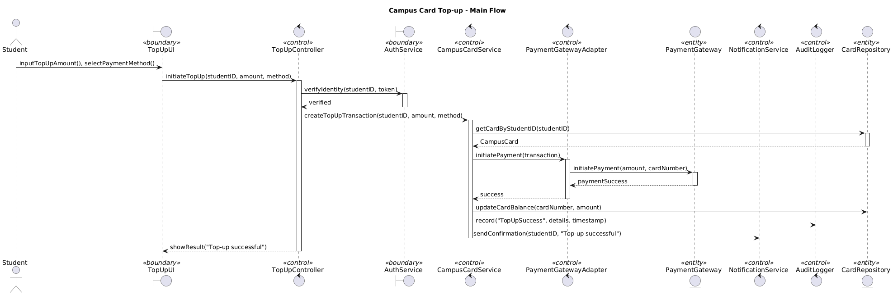
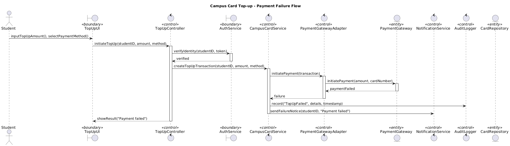
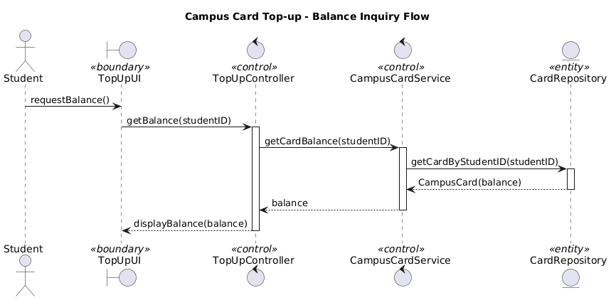
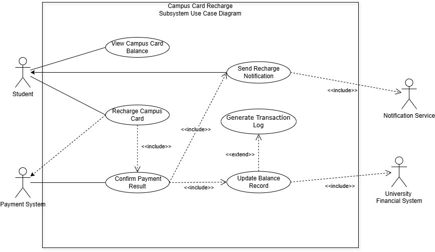
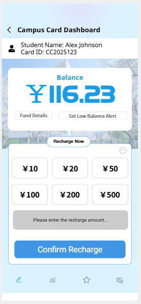
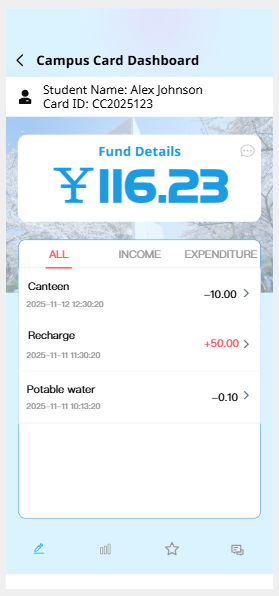

# System analysis 

**Team Name**: CampusCode  
**Team Members**:
- 2353924 Feng Juncai (冯俊财)
- 2351869 Ji Peng (纪鹏)  
- 2353240 Zhang Shikou (张诗蔻)
- 2352993 Yu Yilian (于伊莲)

## 0. Table of Contents
- [System analysis](#system-analysis)
  - [0. Table of Contents](#0-table-of-contents)
  - [1. Introduction](#1-introduction)
    - [1.1 Project Goals](#11-project-goals)
    - [1.2 Progress Since Requirements Modeling](#12-progress-since-requirements-modeling)
    - [1.3 Key Changes and Refinements](#13-key-changes-and-refinements)
    - [1.4 Current Project Status](#14-current-project-status)
  - [2. Architecture Analysis](#2-architecture-analysis)
    - [2.1 High-Level Architecture Overview](#21-high-level-architecture-overview)
      - [2.1.1 Architecture Pattern Selection](#211-architecture-pattern-selection)
    - [2.2 System-Level Architecture Diagram](#22-system-level-architecture-diagram)
    - [2.3 Layer Analysis](#23-layer-analysis)
      - [2.3.1 Presentation Layer](#231-presentation-layer)
      - [2.3.2 Security \& Gateway Layer](#232-security--gateway-layer)
      - [2.3.3 Business Logic Layer](#233-business-logic-layer)
      - [2.3.4 Data Access Layer](#234-data-access-layer)
      - [2.3.5 Infrastructure Services](#235-infrastructure-services)
      - [2.3.6 Data Storage Layer](#236-data-storage-layer)
    - [2.4 Technology Stack Selection Rationale](#24-technology-stack-selection-rationale)
    - [2.5 Future Evolution Considerations](#25-future-evolution-considerations)
  - [3. Analysis Model (Domain Model and Interaction Analysis)](#3-analysis-model-domain-model-and-interaction-analysis)
  - [4. Updated Requirements](#4-updated-requirements)
  - [5. Updated Snapshots of the System's User Interface](#5-updated-snapshots-of-the-systems-user-interface)
  - [6. Open Issues](#6-open-issues)
  - [7. \[Optional\] AI Tool Usage Declaration](#7-optional-ai-tool-usage-declaration)
  - [8. Annotated References](#8-annotated-references)
  - [9. Contributions of Team Members](#9-contributions-of-team-members)
  - [Presentation Requirements](#presentation-requirements)
  - [Submission Note](#submission-note)

## 1. Introduction

### 1.1 Project Goals 

SmartCampus is a comprehensive digital platform designed to unify fragmented campus services into a single, intelligent ecosystem. Our primary goal is to reduce students' daily task management time through seamless integration of four core subsystems: Library Services, Academic Affairs, Daily Life Services, and Logistics Management. The platform adopts a student-first approach, enhancing rather than replacing existing campus infrastructure while providing unified authentication and personalized experiences.

Scope:

  

These subsystems work together to create a unified, intelligent campus service ecosystem that addresses students' comprehensive needs throughout their daily campus life.
### 1.2 Progress Since Requirements Modeling
In our previous requirements modeling document, we provided readers with a comprehensive overview of SmartCampus functionality. Since our initial requirements modeling phase, progress has been achieved across multiple dimensions:

**Architectural Design**: We have evolved from conceptual service integration to concrete architectural decisions, selecting a microservices approach with API gateway integration to ensure scalability and maintainability.

**Technical Foundation**: The technology stack has been finalized, incorporating modern web technologies with mobile-first responsive design principles and progressive web application capabilities.

**User Research Enhancement**: User personas have been refined, and detailed user journey mapping has identified critical touchpoints and optimization opportunities.

### 1.3 Key Changes and Refinements

**Integration Strategy Evolution**: We have adopted an enhancement strategy that leverages existing campus APIs and databases. This reduces implementation complexity and ensures compatibility with established infrastructure.

**Scope Clarification**: While maintaining our comprehensive service vision, we have identified a clear MVP path prioritizing high-impact, frequently-used features including basic meal ordering, essential academic schedule management, fundamental maintenance requests, and other life services.

**Detailed System Analysis**: Given the complexity of interactions across different systems, we have selected the Daily Life Services system for detailed analysis as a representative case study. This system provides in-depth insights into system interaction patterns and design principles. This system encompasses multiple aspects including dining services, dormitory management, campus card services, and other areas, featuring representative user interaction scenarios and business processes.

### 1.4 Current Project Status

This document builds upon our requirements modeling foundation to detail the progress of our analysis model and architectural design.

**Development Readiness**: The project has reached a critical milestone with all core architectural decisions finalized. We have created a layered architecture diagram that outlines the system's structural hierarchy and illustrates the components within each layer.

**Analysis Model Completion**: To enhance system reliability and simplify development, we have completed an in-depth analysis model composed of class diagrams. This provides a solid foundation for the upcoming implementation phase.

**System Refinements**: During the analysis phase, we identified system update requirements to enhance functionality and user experience. We have refined the system interface design to reflect these improvements, making the interface more user-friendly and powerful.

**Project Milestone**: Through comprehensive analysis modeling and architectural design, the project has established a complete technical pathway from concept to implementation, laying a solid foundation for subsequent work.

## 2. Architecture Analysis

### 2.1 High-Level Architecture Overview

The Smart Campus Platform adopts a **layered architecture pattern** to promote separation of concerns, maintainability, and scalability. The system is designed as a distributed microservices architecture with six distinct layers.

#### 2.1.1 Architecture Pattern Selection

The reasons for choosing **layered architecture** as the primary architectural pattern are:

- **Separation of Concerns**: The platform involves multiple business domains (academic affairs, library services, campus life). Layered architecture enables each layer to focus on specific responsibilities, making the complex system easier to understand and maintain.
- **Technology Independence**: The platform supports multiple frontend technologies (WeChat Mini Programs, mobile apps, web portals) and integrates different storage technologies (MySQL, MongoDB, Redis). Each layer can adopt the most suitable technology stack independently.
- **Scalability**: With large user numbers and diverse access patterns, layers can be independently scaled based on actual load, such as scaling academic services during course selection peaks.
- **Testability**: Complex campus business logic can be independently tested for each module, improving system quality and reliability.
- **Team Organization**: Multiple professional teams can develop their respective layers in parallel, improving development efficiency.

### 2.2 System-Level Architecture Diagram

### 2.3 Layer Analysis

#### 2.3.1 Presentation Layer

**Purpose**: Provide mobile user interfaces to adapt to campus users' mobile usage habits.

**Components**: WeChat Mini Program and native mobile applications enable quick access and social sharing features.

#### 2.3.2 Security & Gateway Layer

**Purpose**: Centrally handle security concerns and provide unified entry point for all client requests.

**Components**: OAuth 2.0 authentication, Single Sign-On (SSO), API gateway for request routing, and load balancer for request distribution.

#### 2.3.3 Business Logic Layer

**Purpose**: Implement core business functions organized by domain areas.

**Components**: Academic Affairs (student registration, course management), Library Services (book resources, reservations), Campus Life Services (activities, announcements), and Logistics Services (facility management, maintenance).

#### 2.3.4 Data Access Layer

**Purpose**: Abstract data persistence operations and provide consistent data access patterns.

**Components**: Spring Data JPA for MySQL operations, MyBatis-Plus for complex SQL operations, MongoDB client for document storage, and Redis client for caching and session management.

#### 2.3.5 Infrastructure Services

**Purpose**: Provide cross-cutting concerns and operational capabilities.

**Components**: Monitoring, logging services, data analytics, file storage, message queues, and configuration center.

#### 2.3.6 Data Storage Layer

**Purpose**: Provide persistent storage solutions optimized for different data types and access patterns.

**Components**: MySQL for relational data, MongoDB for document storage, Redis for high-performance caching, and external APIs for third-party integration.

### 2.4 Technology Stack Selection Rationale

**Backend**: Spring Boot for rapid development, Spring Data JPA for simplified data access, MyBatis-Plus for complex queries, OAuth 2.0 for security.

**Database**: MySQL for transactional consistency, MongoDB for flexible document storage, Redis for high-performance caching.

**Infrastructure**: Docker for containerization, Kubernetes for orchestration, ELK Stack for logging and monitoring.

### 2.5 Future Evolution Considerations

**Technology Evolution**: Consider Istio service mesh, event-driven architecture, and cloud-native technologies.

**Functional Extension**: API management platforms, external system integration, and progressive web applications.

This layered architecture provides a solid foundation for the Smart Campus Platform, ensuring scalability, maintainability, and extensibility while supporting rapid development and stable operation.

## 3. Analysis Model (Domain Model and Interaction Analysis)
Analyze the critical features of your proposed system based on the initial architecture your team has determined, and document your current design with UML, SysML, or any other appropriate approach. Please use the following diagrams, organized in use case realization where appropriate:

**i Class diagram(s)**
- Each key class (key abstraction) having primary responsibilities and important attributes in most cases

**ii Interaction diagram(s)**

### 3.4 Campus Card Recharge

The Campus Card Recharge subsystem in SmartCampus is designed to provide a seamless, secure, and efficient way for students to manage their campus card balance. This function plays an essential role in enabling cashless transactions on campus, including dining, printing, transportation, and access to various campus facilities. In alignment with the system’s microservice-oriented architecture, the recharge module is decomposed into boundary, control, and entity layers, each contributing to a clear separation of concerns and maintainable system structure. The analysis model focuses on describing the key abstractions and interactions that support the recharge flow, the balance inquiry flow, and the handling of exceptional cases such as payment failures. The following sections summarize the class structure and detailed message exchanges that collectively define the behavior of the subsystem.

#### 3.4.1 Class Diagram

The class diagram for the Campus Card Recharge subsystem illustrates the core abstractions and their responsibilities across the boundary, control, and entity layers. The boundary layer contains the user interface and external authentication system, serving as the primary entry points for user interaction and identity verification. The control layer orchestrates the process logic, coordinating payment initiation, transaction creation, balance updates, and notification broadcasting. The entity layer represents persistent objects within the system, including the student profile, campus card, transaction records, payment gateway, and repository services.

The following diagram visually presents the structural relationships, highlighting associations, dependencies, and the roles of key classes without embedding operational details directly on the connectors:

 

 

This model clearly outlines how the `TopUpController` coordinates actions between UI, authentication, card service, payment adapter, and notification components. The `CampusCardService` encapsulates core balance-related logic and interacts with the persistent store through the repository. The `TopUpTransaction` entity records each recharge event, ensuring traceability and enabling auditing. Overall, the diagram captures the static structure required to support the dynamic flows that occur during a campus card recharge.

#### 3.4.2 Interaction Diagrams

The interaction diagrams describe the dynamic behavior of the system by illustrating message exchanges among actors and system components. Three scenarios are modeled: the main recharge flow, the failure flow triggered by unsuccessful payment, and the balance inquiry flow. These diagrams collectively present the complete runtime behavior of the Campus Card Recharge subsystem.

a) Main Recharge Flow

The main interaction scenario begins when a student enters a recharge amount and selects a payment method. The UI passes the request to the controller, which validates the user's identity and requests the card service to create a recharge transaction. The payment adapter initiates a payment request through the external payment gateway. Upon success, the system updates the balance, records an audit log, and sends a confirmation message. The UI then receives a success response.

 

 

b) Payment Failure Flow

This diagram captures how the system responds when a payment attempt fails. Although the initial steps resemble the main flow, the payment gateway returns a failure response, leading the system to log the failure event and notify the student accordingly. No balance update occurs in this scenario. The UI communicates the failure result to the student to ensure transparency.

 

 

c) Balance Inquiry Flow

The balance inquiry flow is simpler and linear, involving only the UI, controller, card service, and repository. When the student requests their balance, the system retrieves the associated campus card information and returns the current balance to the UI for display. This interaction emphasizes a lightweight and efficient process design, ensuring students can quickly view their account status at any time.

 

 

## 4. Updated Requirements
- You are not allowed to change your project domain at this stage
- However, you can still refine and update the scope of your project
- You should explain why, where, and what has been changed in your requirements in this submission

### 4.4 Campus Card Recharge System

**Use Case Diagram**

#### Use Case: **View Campus Card Balance**

| USE CASE             | VIEW CAMPUS CARD BALANCE                                                                                                                                                                                                                                                                                       |
| -------------------- | -------------------------------------------------------------------------------------------------------------------------------------------------------------------------------------------------------------------------------------------------------------------------------------------------------------- |
| **ID**               | ***UC01***                                                                                                                                                                                                                                                                                                     |
| **Specification**    | Students view their current campus card balance through the SmartCampus platform. The system retrieves the data from the campus card database and displays the balance on the user interface.                                                                                                                  |
| **Actors**           | **Student**                                                                                                                                                                                                                                                                                                    |
| **Pre-condition**    | The student has logged in to the SmartCampus system with valid credentials.                                                                                                                                                                                                                                    |
| **Basic Path**       | 1. The student opens the SmartCampus application. 2. The student navigates to the “Campus Card” section. 3. The student selects “View Balance.” 4. The system retrieves the balance information from the **CardRepository**. 5. The system displays the current balance on the user interface. |
| **Alternative Path** | 4a. Database connection timeout → System shows “Unable to fetch balance, please try again later.” 4b. Session expired → System prompts “Please re-login to continue.”                                                                                                                                      |
| **Post condition**   | The student successfully views the current balance of the campus card.                                                                                                                                                                                                                                         |

---

#### Use Case: **Recharge Campus Card**

| USE CASE             | RECHARGE CAMPUS CARD                                                                                                                                                                                                                                                                                                                                                                                                                                                                                                                    |
| -------------------- | --------------------------------------------------------------------------------------------------------------------------------------------------------------------------------------------------------------------------------------------------------------------------------------------------------------------------------------------------------------------------------------------------------------------------------------------------------------------------------------------------------------------------------------- |
| **ID**               | ***UC02***                                                                                                                                                                                                                                                                                                                                                                                                                                                                                                                              |
| **Specification**    | The student initiates a recharge operation for the campus card by specifying an amount and payment method. The system interacts with the external payment system to process the transaction and then updates the card balance.                                                                                                                                                                                                                                                                                                          |
| **Actors**           | **Student**, **Payment System**                                                                                                                                                                                                                                                                                                                                                                                                                                                                                                         |
| **Pre-condition**    | The student has a valid and active campus card account and is logged into SmartCampus.                                                                                                                                                                                                                                                                                                                                                                                                                                                  |
| **Basic Path**       | 1. The student selects the “Recharge” function in the Campus Card section. 2. The system prompts the student to input a recharge amount and choose a payment method. 3. The student confirms the details and submits the request. 4. The system creates a transaction record and sends a payment request to the **Payment System**. 5. The payment system processes the payment and returns the result to SmartCampus. 6. Upon success, the system updates the balance and triggers subsequent actions (UC03–UC05). |
| **Alternative Path** | 4a. Payment fails → The system records the failed transaction and displays “Payment unsuccessful.” 4b. Payment timeout → The system retries once; if still failed, marks as pending. 5a. Student cancels before payment confirmation → The transaction is aborted, and no balance update occurs.                                                                                                                                                                                                                                |
| **Post condition**   | The campus card balance increases by the recharge amount, and the transaction is recorded successfully.                                                                                                                                                                                                                                                                                                                                                                                                                                 |

---

#### Use Case: **Confirm Payment Result**

| USE CASE             | CONFIRM PAYMENT RESULT                                                                                                                                                                                                                                                                                          |
| -------------------- | --------------------------------------------------------------------------------------------------------------------------------------------------------------------------------------------------------------------------------------------------------------------------------------------------------------- |
| **ID**               | ***UC03***                                                                                                                                                                                                                                                                                                      |
| **Specification**    | The system confirms whether the payment request was successful by receiving a callback or polling result from the external payment system.                                                                                                                                                                      |
| **Actors**           | **Payment System**                                                                                                                                                                                                                                                                                              |
| **Pre-condition**    | A recharge request has been initiated (UC02).                                                                                                                                                                                                                                                                   |
| **Basic Path**       | 1. The payment system sends a callback to SmartCampus indicating the payment result. 2. The system validates the payment signature and authenticity. 3. The system records the transaction result. 4. If successful, the system proceeds to update the balance (UC04) and send notification (UC05). |
| **Alternative Path** | 1a. Invalid signature → The system rejects the callback and flags as suspicious. 2a. No callback received → The system periodically queries the payment gateway for status.                                                                                                                                 |
| **Post condition**   | The system successfully verifies the payment outcome and updates transaction records.                                                                                                                                                                                                                           |

---

#### Use Case: **Update Balance Record**

| USE CASE             | UPDATE BALANCE RECORD                                                                                                                                                                                                                                                       |
| -------------------- | --------------------------------------------------------------------------------------------------------------------------------------------------------------------------------------------------------------------------------------------------------------------------- |
| **ID**               | ***UC04***                                                                                                                                                                                                                                                                  |
| **Specification**    | The system updates the student’s campus card balance and synchronizes this change to the university’s financial system for reconciliation.                                                                                                                                  |
| **Actors**           | **University Financial System**                                                                                                                                                                                                                                             |
| **Pre-condition**    | The payment confirmation (UC03) has been successfully completed.                                                                                                                                                                                                            |
| **Basic Path**       | 1. The system updates the student’s balance in the campus card database. 2. The system generates a summary transaction record. 3. The system sends updated financial data to the **University Financial System**. 4. The financial system acknowledges receipt. |
| **Alternative Path** | 3a. Network failure between SmartCampus and Financial System → System retries later and logs the issue. 4a. Data mismatch error → System rolls back the update and alerts the admin.                                                                                    |
| **Post condition**   | The balance data in both systems are synchronized successfully, and the student’s balance is up to date.                                                                                                                                                                    |

---

#### Use Case: **Send Recharge Notification**

| USE CASE             | SEND RECHARGE NOTIFICATION                                                                                                                                                                                                                                                                       |
| -------------------- | ------------------------------------------------------------------------------------------------------------------------------------------------------------------------------------------------------------------------------------------------------------------------------------------------ |
| **ID**               | ***UC05***                                                                                                                                                                                                                                                                                       |
| **Specification**    | After the recharge process is completed, the system sends a notification message to the student through the SmartCampus notification service.                                                                                                                                                    |
| **Actors**           | **Notification Service**, **Student**                                                                                                                                                                                                                                                            |
| **Pre-condition**    | Recharge transaction has been successfully processed.                                                                                                                                                                                                                                            |
| **Basic Path**       | 1. The system composes a message with recharge details (amount, time, and new balance). 2. The message is sent to the **Notification Service**. 3. The Notification Service pushes the message to the student’s SmartCampus app. 4. The student receives and reads the notification. |
| **Alternative Path** | 3a. Network delay or service down → Notification is queued and retried later. 4a. Student app offline → Notification will be resent when the app reconnects.                                                                                                                                 |
| **Post condition**   | The student receives confirmation of the recharge completion.                                                                                                                                                                                                                                    |

---

#### Use Case: **Generate Transaction Log**

| USE CASE             | GENERATE TRANSACTION LOG                                                                                                                                                                                                            |
| -------------------- | ----------------------------------------------------------------------------------------------------------------------------------------------------------------------------------------------------------------------------------- |
| **ID**               | ***UC06***                                                                                                                                                                                                                          |
| **Specification**    | The system generates and stores logs for every recharge transaction for audit and traceability purposes.                                                                                                                            |
| **Actors**           | *(Internal system process, no external actor)*                                                                                                                                                                                      |
| **Pre-condition**    | A recharge operation has been successfully completed.                                                                                                                                                                               |
| **Basic Path**       | 1. The system collects transaction details (amount, time, status, user ID). 2. The system writes these records to the transaction log repository. 3. The log can be accessed later by authorized administrators for review. |
| **Alternative Path** | 2a. Log writing failure → System retries and reports error to system admin. 2b. Disk space full → System triggers cleanup of old logs.                                                                                          |
| **Post condition**   | The recharge transaction is fully recorded in the log system for future reference.                                                                                                                                                  |

## 5. Updated Snapshots of the System's User Interface
Provide at least five (5) updated snapshots of system UIs with accompanying descriptions:
- If your system provides business reports or statistical analytics in a visual format to its users, then the visual format and any specialized visualization design (if applicable) should be provided
- If your system frequently needs to communicate with the end user through notifications, you should also attach samples of those messages

### 5.4 Campus Card Recharge – Snapshot Descriptions

The first snapshot presents the main interface of the Campus Card Recharge module. At the top of the page, the system displays the student’s current campus card balance in a visually prominent manner, ensuring that users can immediately understand their financial status. Below the balance section, the interface provides a quick-recharge panel containing several preset recharge amounts that allow students to perform top-ups with minimal interaction. To support more flexible use cases, the page also includes an input field where users may enter a custom recharge amount before confirming the transaction using the “Confirm Recharge” button. In addition to the recharge functionality, the page integrates two important supporting features: a button that redirects students to view their detailed transaction history, and a configuration button for enabling or adjusting low-balance alerts when the card balance falls below a user-specified threshold. This snapshot effectively combines real-time financial visibility with operational convenience.

  

The second snapshot depicts the transaction history interface, which provides a clear and organized view of the student’s financial activity. This page lists recharge and spending records in reverse chronological order, presenting key information such as transaction type, amount, timestamp, and status. The layout is designed to allow students to quickly scan and verify their recent financial activities, ensuring transparency and supporting personal account management. Each entry is structured consistently to enhance readability, and the interface avoids unnecessary visual clutter to maintain focus on the financial data itself. This snapshot functions as a natural extension of the recharge interface, giving students the tools they need to track their card usage with precision.

  

## 6. Open Issues
List the challenges and design tasks to explore in the next stage

## 7. [Optional] AI Tool Usage Declaration
- If you have used an AI tool or technology to generate an output that you either paraphrase or direct quote in your writing, you must cite and reference this output as a source in your reference list
- If you have used an AI tool or technology in the process of completing the above tasks (for example, generating architectural descriptions, creating UML/SysML/C4 diagrams, exploring technical solutions, editing reports), an acknowledgment of how you have used AI tools or technologies is required

## 8. Annotated References
Describe how the project references (for instance, the project domain book and reference articles) relate to your project. The description for a reference should be between 200 and 300 words.

## 9. Contributions of Team Members

---

## Presentation Requirements
Before submitting the final version of this document, each team must prepare a **10-minute presentation** in class (2025-11-17 and 2025-11-24) to explain your current solution.

---

## Submission Note
You must submit both:
- The document 
- The corresponding UML, SysML, or C4 model (models can be included in the document)