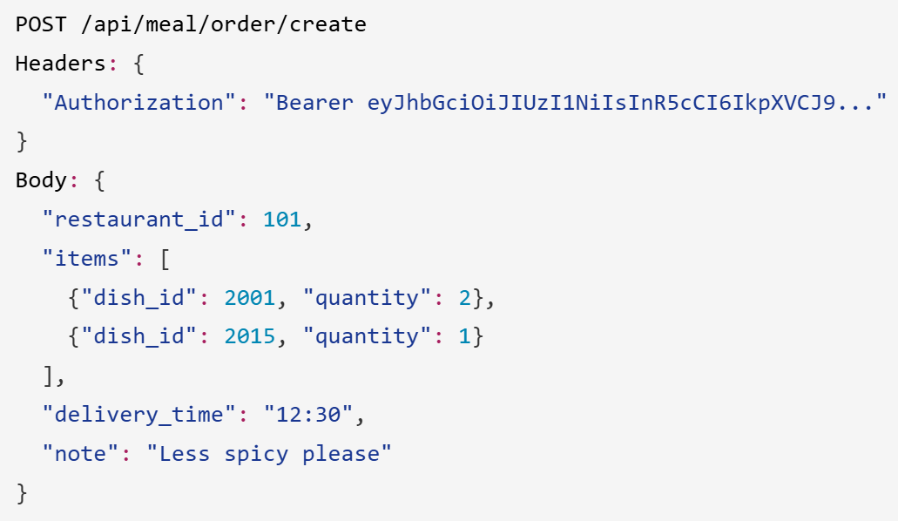
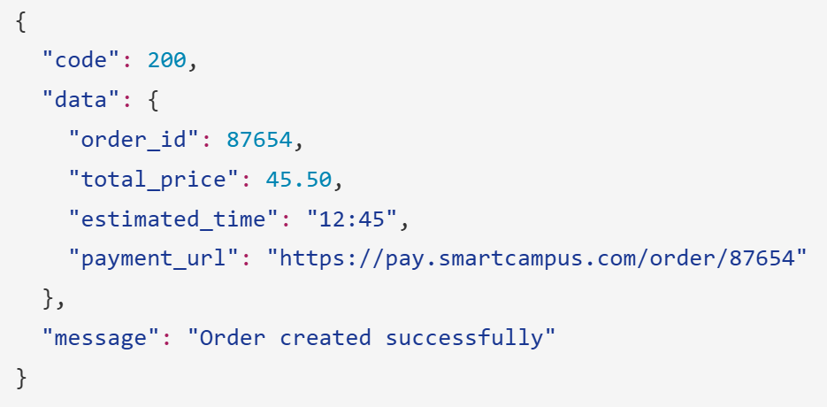
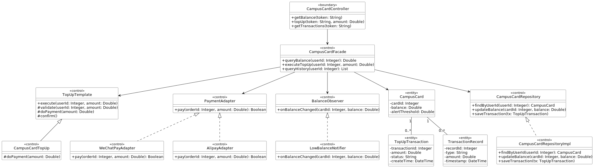
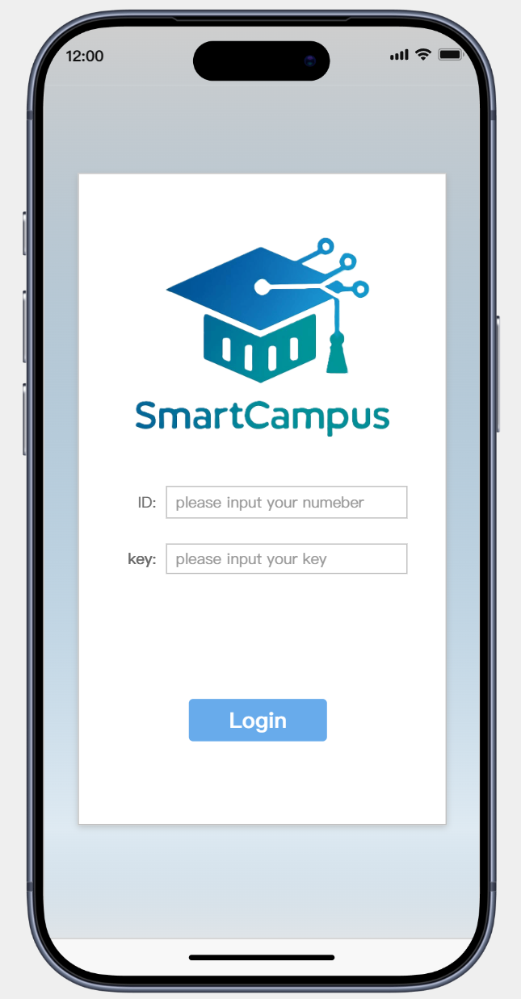
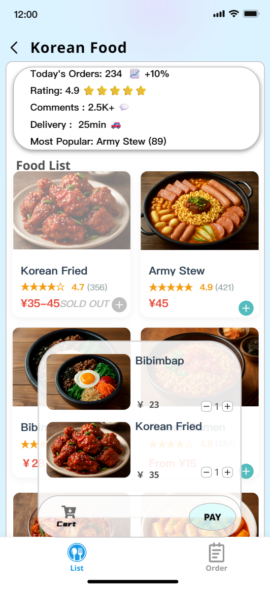
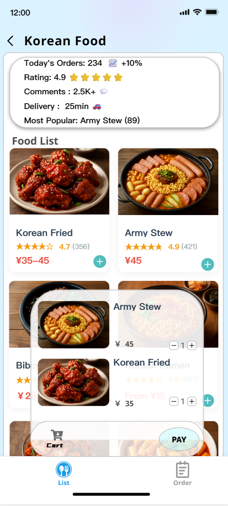
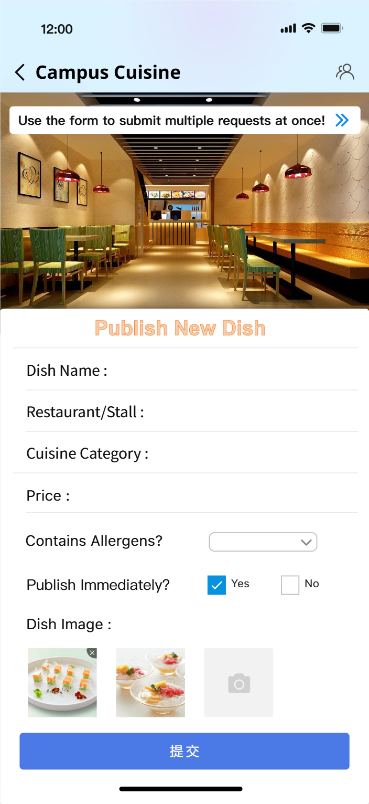
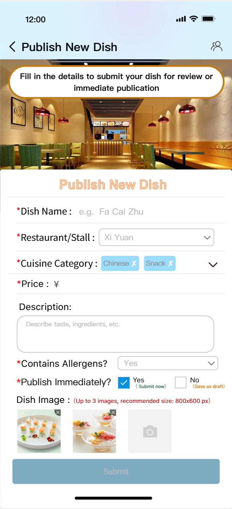
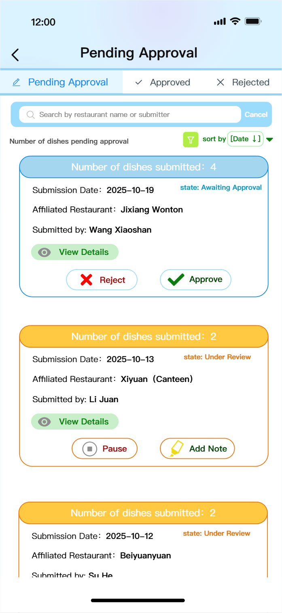

### System Analysis and Design

**Team Name**: CampusCode  
**Team Members**:
- 2353924 Feng Juncai (冯俊财)
- 2351869 Ji Peng (纪鹏)  
- 2353240 Zhang Shikou (张诗蔻)
- 2352993 Yu Yilian (于伊莲)

#### 0. Table of Contents

- [0. Table of Contents](#0-table-of-contents)
- [1. Overview](#1-overview)
  - [1.1 Overview of Design Progress](#11-overview-of-design-progress)
  - [1.2 Implementation Platforms and Frameworks](#12-implementation-platforms-and-frameworks)
- [2. Architecture Refinement](#2-architecture-refinement)
  - [2.1 Platform-dependent architecture with a refined overall structure](#21-platform-dependent-architecture-with-a-refined-overall-structure)
  - [2.2 List of subsystems and interfaces](#22-list-of-subsystems-and-interfaces)
  - [2.3 Demonstrate Interface Specification in Detail with External Systems](#23-demonstrate-interface-specification-in-detail-with-external-systems)
  - [2.4 Meal Ordering Subsystem - Class Design and Interface Specification](#24-meal-ordering-subsystem---class-design-and-interface-specification)
- [3. Two Selected Analysis Mechanisms and Their Design Mechanisms](#3-two-selected-analysis-mechanisms-and-their-design-mechanisms)
  - [3.1 Data Persistence Mechanism](#31-data-persistence-mechanism)
  - [3.2 Security Mechanism](#32-security-mechanism)
- [4. Two Use Case Realizations](#4-two-use-case-realizations)
  - [4.1 Place Order Use Case](#41-place-order-use-case)
  - [4.2 Campus Card Service Use Case](#42-campus-card-service-use-case)
- [5. Architectural Styles and Design Decisions](#5-architectural-styles-and-design-decisions)
  - [5.1 Architectural Styles](#51-architectural-styles)
  - [5.2 Critical Design Decisions](#52-critical-design-decisions)
- [6. Non-Functional Requirements](#6-non-functional-requirements)
  - [6.1 Security Requirements](#61-security-requirements)
  - [6.2 Usability Requirements](#62-usability-requirements)
  - [6.3 Performance and Scalability Requirements](#63-performance-and-scalability-requirements)
  - [6.4 Maintainability and Extensibility Requirements](#64-maintainability-and-extensibility-requirements)
- [7. Progress on prototyping](#7-progress-on-prototyping)
  - [7.1 Login Page Progress](#71-login-page-progress)
  - [7.2 Meal Ordering Subsystem Progress](#72-meal-ordering-subsystem-progress)
  - [7.3 Dishes recommendation and ranking Subsystem progress](#73-dishes-recommendation-and-ranking-subsystem-progress)
- [8. Open Issues in the Design Model](#8-open-issues-in-the-design-model)
  - [8.1. Data Consistency Assurance Mechanism Across Distributed Services](#81-data-consistency-assurance-mechanism-across-distributed-services)
  - [8.2. System Performance Optimization Under Real-Time High-Concurrency Scenarios](#82-system-performance-optimization-under-real-time-high-concurrency-scenarios)
  - [8.3. Evolution of Security Governance in a Growing Microservices Ecosystem](#83-evolution-of-security-governance-in-a-growing-microservices-ecosystem)
  - [8.4. Data Model Evolution and Backward Compatibility](#84-data-model-evolution-and-backward-compatibility)
- [9. Acknowledgment of AI Tool Usage](#9-acknowledgment-of-ai-tool-usage)
- [10. Project self-reflection](#10-project-self-reflection)
- [11. Contributions of team members](#11-contributions-of-team-members)

#### 1. Overview  

##### 1.1 Overview of Design Progress

Building upon the solid foundation laid during the requirements analysis and initial modeling phases, the SmartCampus project has now advanced into the detailed System Design stage. Our primary focus has shifted from defining the functional requirements—what the system should do—to specifying the technical implementation details—how the system will be built.

In this phase, we have successfully transformed the logical analysis model into a platform-specific design architecture. This involved refining the system boundaries and defining the specific RESTful API contracts that facilitate communication between our mobile clients and the backend services. In parallel, we have moved from conceptual data modeling to concrete database schema design, ensuring that our data structures in MySQL and MongoDB are optimized for performance and integrity. 

##### 1.2 Implementation Platforms and Frameworks

To align with our user-centric strategy, the SmartCampus system is engineered as a "Mobile-First" application supported by a robust, cloud-native backend infrastructure.

Frontend Strategy Given that our primary user base consists of students who rely heavily on mobile devices, the system’s presentation layer prioritizes mobile accessibility. We have selected the WeChat Mini Program as our primary client platform due to its instant accessibility and high penetration rate among the student demographic. This is complemented by native mobile applications (iOS/Android) to leverage system-level capabilities where necessary. For administrative purposes, a web-based management dashboard built with Vue.js provides merchants and staff with a comprehensive interface for data management and operational monitoring.

Backend and Infrastructure Supporting the mobile frontend is a scalable microservices architecture built on the Spring Boot 3.x framework. This choice ensures rapid development cycles while maintaining the stability required for a campus-wide system. Security is managed through JWT, providing a secure and seamless authentication experience for mobile users.

Data Storage and Management Our data strategy employs a hybrid approach to optimize performance for different types of information. We utilize MySQL 8.0 as the primary relational database to handle transactional data requiring strict consistency, such as user accounts and financial records. For unstructured data, such as user reviews and system logs, MongoDB 6.0 offers the necessary flexibility. To ensure a smooth and responsive user experience on mobile devices, Redis 7.0 is implemented as a high-speed caching layer for frequently accessed data, such as daily menus and session tokens. The entire backend ecosystem is containerized using Docker and orchestrated via Kubernetes, ensuring consistent deployment across development and production environments.

#### 2. Architecture Refinement  

##### 2.1 Platform-dependent architecture with a refined overall structure

This section refines the logical layered architecture from Assignment 2 into a **platform-specific layered implementation**, mapping abstract components to concrete technologies as illustrated in Figure 2.1.

  

**Figure 2.1: SmartCampus Platform-Dependent Architecture**

###### 2.1.1 Five-Layer Architecture Overview

| Layer | Key Technologies | Core Components | Primary Responsibilities |
|-------|------------------|-----------------|-------------------------|
| **Layer 1: Client** | WeChat Mini Program (uni-app, Vue 3) Native Apps (iOS/Android) Web Dashboard (Vue.js) | - WeChat Mini Program (primary client) - Admin dashboard | - UI rendering - User interaction - API requests with JWT |
| **Layer 2: Gateway & Security** | Nginx + Spring Security JWT (HS256, 2h TTL) | - Reverse proxy - Authentication filter - Rate limiter | - HTTPS (TLS 1.3) - JWT validation - Request routing |
| **Layer 3: Microservices** | Spring Boot 3.3 (JDK 17+) Spring MVC + RESTful | - recommendation-service (8081) - meal-service (8082) - card-service (8083) - feedback-service (8084) | - Business logic execution - Service-to-service calls (HTTP/REST) - Database operations |
| **Layer 4: Data Access** | Spring Data JPA + MyBatis-Plus MongoDB Driver + Redis Client | - ORM mappers - Connection pools - Cache managers | - CRUD operations - Transaction management - Cache operations (1-2h TTL) |
| **Layer 5: Infrastructure** | **Databases:** MySQL 8.0 + MongoDB 6.0 + Redis 7.0 **Orchestration:** Docker + Kubernetes | - MySQL (transactional data) - MongoDB (reviews, logs) - Redis (cache, rankings) - K8s (3+ nodes, auto-scaling) | - Persistent storage - High-speed caching - Container orchestration - Service discovery |

###### 2.1.2 Key Architectural Decisions

**Microservices Design:**

1. **recommendation-service** : Dish recommendations, daily rankings 
2. **meal-service** : Order management, menu browsing, reviews 
3. **card-service** : Campus card balance, top-up operations 
4. **feedback-service** : Feedback collection, admin review 

**Inter-Service Communication:**
- **Protocol**: Internal HTTP/REST APIs with JSON payloads
- **Service Discovery**: Kubernetes DNS-based discovery (e.g., `http://meal-service:8082`)
- **Authentication**: JWT tokens validated at API Gateway, propagated to downstream services via headers

**Hybrid Data Storage Strategy:**
- **MySQL (InnoDB)**: Transactional data (`users`, `orders`, `dishes`, `campus_cards`) with ACID guarantees
- **MongoDB (WiredTiger)**: Flexible schemas for reviews, feedback, and logs with rich query support
- **Redis (In-Memory)**: Cache layer (menu: 1h TTL, rankings: daily updates, sessions: 2h)

**Deployment & Scaling:**
- **Development**: Docker Compose with local databases
- **Production**: Kubernetes cluster (3+ nodes, 2-3 replicas/service, HPA enabled)

###### 2.1.3 Cross-Layer Data Flow Example: Order Creation

When a student places an order, the request flows sequentially through all five layers: the Client submits via HTTPS with JWT authentication, the Gateway validates and routes to the appropriate microservice, the Service layer executes business logic, the Data Access layer coordinates persistence across MySQL/Redis/MongoDB, and the Infrastructure layer ensures container orchestration and transaction integrity—demonstrating clear separation of concerns and independent scalability.

##### 2.2 List of subsystems and interfaces  

###### 2.2.1 Meal Ordering Service Subsystem

Based on Assignment 2's analysis model, the Meal Ordering subsystem comprises 9 core classes: 5 entity classes (Student, Order, Dish, Restaurant, Reservation) for business data modeling, 2 boundary classes (SystemInterface, OrderingInterface) for user interaction handling, and 2 control classes (OrderController, MenuController) for business logic coordination. Inter-subsystem interactions include: Meal Service validating user identity via JWT token (validated at API Gateway layer), calling Payment Service for campus card deduction (Order_id + Amount → Payment result), utilizing Notification Service for order status updates (Order_id + Status → Push message), and receiving payment callbacks (Transaction_id + Status → Order update).

| API Interface                | Method | Parameters                                          | Description                               |
| ---------------------------- | ------ | --------------------------------------------------- | ----------------------------------------- |
| /api/meal/restaurants        | GET    | token, location                                     | Get restaurant list by location           |
| /api/meal/menu               | GET    | token, restaurant_id                                | Get menu items for specific restaurant    |
| /api/meal/dish/detail        | GET    | token, dish_id                                      | Get detailed dish information             |
| /api/meal/order/create       | POST   | token, dish_ids, quantities, restaurant_id          | Create new meal order                     |
| /api/meal/order/status       | GET    | token, order_id                                     | Query order status                        |
| /api/meal/order/cancel       | POST   | token, order_id                                     | Cancel pending order                      |
| /api/meal/order/history      | GET    | token, page, size                                   | Get user's order history                  |
| /api/meal/reservation/create | POST   | token, dish_ids, quantities, restaurant_id, reserved_time | Create meal reservation            |
| /api/meal/reservation/list   | GET    | token, status                                       | Get user's reservation list               |
| /api/meal/reservation/cancel | POST   | token, reservation_id                               | Cancel reservation                        |

###### 2.2.2 Dishes recommendation and ranking Service Subsystem

This subsystem manages dish recommendation, rating, and review workflows across three user roles: students (voting/commenting), merchants (dish submission), and administrators (approval). The design ensures permission isolation, automatic vote updates, and content governance throughout the dish lifecycle.

| API Interface | Method | Parameters | Description |
|--------------|--------|------------|-------------|
| /api/dishes/rankings | GET | sortType, category, restaurantId | Get ranked dish list by popularity or rating |
| /api/dishes/{dishId}/vote | POST | userId, rating, comment | Rate and comment on dish (updates if already voted) |
| /api/dishes/{dishId} | GET | - | Get detailed dish information with ratings |
| /api/dishes/search | GET | keyword | Search dishes by keyword (fuzzy matching) |
| /api/dishes/new | GET | month | Get newly recommended dishes for specified month |
| /api/merchants/{merchantId}/dishes | POST | name, price, description, category, allergens, image | Submit new dish for review (status: pending) |
| /api/admin/dishes/pending | GET | - | Get all dishes pending administrator approval |
| /api/admin/dishes/{dishId}/review | PUT | status, rejectionReason | Approve or reject dish submission |
| /api/dishes/{dishId}/comments | GET | page, size | Get paginated user comments for dish |
| /api/dishes/{dishId}/comments | POST | userId, content, images | Submit text and image comment for dish |

###### 2.2.3 Feedback Service Subsystem

The Feedback Service Subsystem is responsible for collecting, managing, and processing feedback related to campus dining services. It provides a standardized and traceable mechanism for students to submit dining-related feedback and for administrators to review, process, and respond to these submissions. This subsystem plays a critical role in improving food quality, service efficiency, and management transparency.

| API Interface                   | Method | Parameters                                           | Description                                                                    |
| ------------------------------- | ------ | ---------------------------------------------------- | ------------------------------------------------------------------------------ |
| `/api/feedback/submit`        | POST   | `token`, `content`, `category`                 | Submit a new dining feedback record by a student.                              |
| `/api/feedback/list`          | GET    | `token`, `status`                                | Retrieve a list of feedback records based on status (e.g., pending, reviewed). |
| `/api/feedback/detail`        | GET    | `token`, `feedbackId`                            | Query detailed information of a specific feedback record.                      |
| `/api/feedback/review`        | POST   | `token`, `feedbackId`, `decision`, `comment` | Administrator reviews feedback and submits a decision.                         |
| `/api/feedback/status/update` | POST   | `token`, `feedbackId`, `status`                | Update the status of a feedback record after review.                           |
| `/api/feedback/notify`        | POST   | `feedbackId`                                       | Notify the student of the feedback review result.                              |

###### 2.2.4 Campus Card Service Subsystem

The Campus Card Service Subsystem is responsible for managing all digital campus card–related functionalities, including balance inquiry, recharge processing, low-balance alert configuration, and transaction history management. As a core component of the Life Services domain, this subsystem provides secure, real-time financial interactions between students and campus infrastructure. It integrates closely with the authentication service for identity verification, with external payment gateways for recharge operations, and with the notification mechanism to deliver balance alerts and transaction feedback. The subsystem emphasizes transactional consistency, high availability, and low-latency responses, given its high-frequency usage in daily campus life.

From a functional perspective, the subsystem is designed based on Assignment 2 use cases (UC-007 to UC-010) and refined here into concrete, platform-dependent API interfaces. Balance queries and transaction records rely on MySQL to ensure ACID-compliant financial data consistency, while Redis is employed to cache frequently accessed balance information and alert thresholds, reducing database load and improving responsiveness. Recharge operations follow a strict two-phase process involving payment request initiation and asynchronous payment result callbacks to guarantee correctness under distributed conditions.

| API Interface | Method | Parameters | Description |
|--------|--------|------------|------------------|
| /api/card/balance | GET | token | Retrieves the current campus card balance of the authenticated student.  |
| /api/card/alert/set | POST | token, threshold | Sets or updates a custom low-balance alert threshold for the student.  |
| /api/card/alert/get | GET | token | Retrieves the currently configured low-balance alert threshold. |
| /api/card/topup/create | POST   | token, amount | Initiates a campus card top-up request with a specified recharge amount. |
| /api/card/topup/confirm | POST   | transactionId, paymentStatus | Receives payment gateway callback and confirms the top-up result.  |
| /api/card/transactions | GET    | token, page, size | Retrieves a paginated list of campus card transaction records.  |
| /api/card/transaction/detail | GET    | token, transactionId | Retrieves detailed information of a specific transaction.                       |
| /api/card/notify/low-balance | POST   | userId, currentBalance | Triggers a low-balance notification when the balance falls below the threshold. |

Through this design, the Campus Card Service Subsystem translates abstract use cases into a secure, scalable, and implementation-ready service interface. The same architectural pattern—JWT-based authentication, RESTful APIs, hybrid storage, and external service integration—can be directly extended to other financial or identity-related campus services within the SmartCampus platform.

##### 2.3 Demonstrate Interface Specification in Detail with External Systems

This section demonstrates detailed interface specifications between the SmartCampus system and representative external systems, focusing on how internal subsystems interact with third-party platforms through clearly defined, secure, and reusable interfaces. To ensure architectural consistency with subsequent internal API specifications (Section 2.4), this section emphasizes interface responsibility boundaries and payment capability reuse rather than isolated subsystem design.

Two critical external integrations are selected as representative examples: the External Payment Gateway and the WeChat Authentication Platform. These integrations support multiple internal subsystems, including Meal Ordering and Campus Card services, and illustrate the system’s approach to secure communication, asynchronous processing, and platform abstraction.

###### 2.3.1 Interface with External Payment Gateway (Unified Payment Capability)

The SmartCampus system integrates with third-party payment platforms (e.g., WeChat Pay) through a unified payment interface, which is reused by multiple internal subsystems such as Meal Ordering and Campus Card Recharge. Internally, payment interactions are encapsulated within backend services, while the client only interacts with SmartCampus-managed payment URLs.

**Business Context:**

This interface supports financial use cases including UC-009 (Top-up Campus Card) and meal order payment confirmation. The SmartCampus system is responsible for order creation, transaction tracking, and balance updates, while the external payment gateway handles fund authorization and settlement.

**Interface Type:** RESTful HTTPS API

**Security Mechanism:** HTTPS, merchant signature verification, transaction ID validation

**Integration Pattern:** Asynchronous two-phase payment model

**Phase 1: Payment Order Creation (SmartCampus → External Payment Gateway)**

| Item                | Specification  |
| ------------------- | -------------------------------------------------------------------------------------- |
| Endpoint            | /pay/api/v1/createOrder |
| Method              | POST               |
| Request Parameters  | merchantId, orderId, amount, currency, callbackUrl, timestamp, signature |
| Response Parameters | gatewayTransactionId, gatewayPaymentUrl, status                                  |
| Description         | Creates a payment order within the external payment platform                           |

**Processing Logic:**
When a payment is required (either from a meal order or a campus card top-up), the corresponding backend service generates a unique internal orderId and records a pending transaction in MySQL. The service then sends a signed request to the external payment gateway. The returned gatewayPaymentUrl is not exposed directly to the client; instead, it is bound to an internal SmartCampus payment entry.

The client-facing API (e.g., /api/meal/order/create) returns a SmartCampus-managed payment_url (such as https://pay.smartcampus.com/order/{orderId}), ensuring a consistent and controlled payment entry point, as shown in Section 2.4.

**Phase 2: Payment Result Callback (External Payment Gateway → SmartCampus)**

| Item                | Specification   |
| ------------------- | ------------------------------------------------------------------------- |
| Endpoint            | /api/payment/callback   |
| Method              | POST         |
| Callback Parameters | gatewayTransactionId, orderId, paymentStatus, amount, signature |
| Description         | Notifies SmartCampus of the final payment result                          |

**Processing Logic:**
Upon receiving the callback, the SmartCampus backend verifies the signature and matches the orderId with the internal transaction record. If the payment is successful, the system atomically updates the related business state—such as campus card balance or meal order status—within a single database transaction. Failed or delayed callbacks are handled through idempotent retry mechanisms to prevent duplicate processing.

This unified payment design guarantees transactional consistency, interface reuse, and clear separation between internal and external responsibilities.

###### 2.3.2 Interface with WeChat Authentication Platform (User Login)

To support seamless mobile access, the SmartCampus system integrates with the WeChat Mini Program authentication service. This external interface provides trusted identity verification while allowing the platform to maintain full control over authorization and session management.

**Business Context:**
This interface underpins all authenticated operations across subsystems, including Meal Ordering, Campus Card services, and Feedback management.

**Interface Type:** RESTful HTTPS API

**Security Mechanism:** AppID/AppSecret + temporary login code exchange

| Item                | Specification      |
| ------------------- | -------------------------------------------------------------------- |
| Endpoint            | https://api.weixin.qq.com/sns/jscode2session |
| Method              | GET   |
| Request Parameters  | appid, secret, js_code, grant_type                           |
| Response Parameters | openid, session_key, expires_in                                |
| Description         | Exchanges a temporary login code for a unique WeChat user identifier |

**Processing Logic:**
After the client obtains a temporary js_code from WeChat, it forwards the code to the API Gateway's authentication module. The authentication module exchanges the code for an openid via WeChat API, which is then mapped to an internal user record. Upon successful mapping, the system issues a JWT token containing the internal userId and role claims. This token is subsequently used in all internal API calls, as demonstrated in Section 2.4.

##### 2.4 Meal Ordering Subsystem - Class Design and Interface Specification

This section demonstrates the detailed class design for the Meal Ordering subsystem, decomposing it into atomic elements (entity classes, boundary classes, and control classes) with their attributes, methods, and responsibilities, followed by concrete API interface specifications. This decomposition follows the platform-dependent architecture defined in Section 2.1 and provides the foundation for the use case realization in Section 4.

###### 2.4.1 Subsystem Overview and Class Diagram

The Meal Ordering subsystem is responsible for managing the complete meal ordering lifecycle, from user authentication and restaurant browsing to placing orders, processing payments, making reservations, and tracking order status. Based on the analysis model from Assignment 2, this subsystem is decomposed into **9 core classes** organized into three categories following the **ECB (Entity-Control-Boundary)** pattern.

  
   

###### 2.4.2 Class Categories and Relationships

| Class Category | Class Name | Count | Responsibility |
|----------------|------------|-------|----------------|
| **Entity Classes** | Student, Order, Dish, Restaurant, Reservation | 5 | Represent core business domain objects with persistent state and business rules |
| **Boundary Classes** | SystemInterface, OrderingInterface | 2 | Handle user interaction, authentication, and presentation logic |
| **Control Classes** | OrderController, MenuController | 2 | Coordinate business logic, orchestrate interactions, and manage workflows |

**Key Relationships:**
- **Student ↔ Order**: One-to-many (1..\*) - A student can place multiple orders
- **Order ↔ Dish**: Many-to-many (\*..\*) - An order contains multiple dishes, each dish can be in multiple orders
- **Restaurant ↔ Dish**: One-to-many (\*..1) - A restaurant offers multiple dishes
- **Student ↔ Reservation**: One-to-one (1..1) - Each reservation is linked to one student
- **Boundary → Control → Entity**: Dependencies flow from interface layer through control layer to entity layer

This decomposition ensures clear separation of concerns between domain logic, user interface, and business process coordination.

###### 2.4.3 Entity Classes - Domain Model Design

| Entity | Key Attributes | Persistence | Core Responsibility |
|--------|---------------|-------------|---------------------|
| **Student** | studentId, name, password, balance | MySQL | User authentication and account management |
| **Order** | orderId, studentId, dishes, totalAmount, status | MySQL | Order lifecycle (PENDING→PAID→PREPARING→READY→COMPLETED) |
| **Dish** | dishId, restaurantId, name, price, isAvailable | MySQL + Redis | Menu item data with availability control |
| **Restaurant** | restaurantId, name, location, rating | MySQL + Redis | Restaurant information and operating status |
| **Reservation** | reservationId, orderId, reservationTime, status | MySQL | Advance meal ordering with time constraints |

**Design Decisions:** All entities stored in MySQL for ACID guarantees; hot data (Dish, Restaurant) cached in Redis; Order and Reservation implement state machines for workflow control.

###### 2.4.4 Boundary Classes - User Interface Layer

| Boundary Class | Key Methods | Technology | Responsibility |
|----------------|-------------|------------|----------------|
| **SystemInterface** | login(), logout(), showLoginForm() | WeChat Mini Program | User authentication, session management |
| **OrderingInterface** | showRestaurants(), showMenu(), showCart(), showPayment() | WeChat Mini Program (uni-app, Vue 3) | Order workflow UI, shopping cart, payment flow |

**Interaction Flow**: SystemInterface handles login → OrderingInterface manages ordering → delegates to Control layer

###### 2.4.5 Control Classes - Business Logic Orchestration

| Control Class | Key Methods | Technology | Responsibility |
|---------------|-------------|------------|----------------|
| **OrderController** | createOrder(), submitOrder(), cancelOrder(), getOrderHistory() | Spring Boot (@Service) | Order processing workflow and state management |
| **MenuController** | getAllRestaurants(), getDishById(), getDishesByRestaurant() | Spring Boot + Redis Cache | Menu & restaurant data retrieval with caching |

**Design Pattern**: Controllers implement the **Facade Pattern**, providing simplified interfaces to complex subsystem operations.

###### 2.4.6 RESTful API Interface Specifications

This section demonstrates how boundary and control classes expose system functionality through RESTful APIs. Core interfaces are detailed below; supporting interfaces are summarized in the overview table.

**API Interface Overview**

| API Interface | Method | Parameters | Description | Controller Method |
|--------------|--------|------------|-------------|-------------------|
| /api/meal/restaurants | GET | token, location | Get restaurant list by location | MenuController.getRestaurantList() |
| /api/meal/menu | GET | token, restaurant_id | Get menu for specific restaurant | MenuController.getRestaurantMenu() |
| /api/meal/dish/detail | GET | token, dish_id | Get detailed dish information | MenuController.getDishDetails() |
| /api/meal/order/create | POST | token, dish_ids, quantities, restaurant_id | **[Core] Create new meal order** | OrderController.createOrder() |
| /api/meal/order/status | GET | token, order_id | **[Core] Query order status** | OrderController.trackOrderStatus() |
| /api/meal/order/cancel | POST | token, order_id | Cancel pending order | OrderController.cancelOrder() |
| /api/meal/order/history | GET | token, page, size | Get user's order history | OrderController.getOrderHistory() |
| /api/meal/reservation/create | POST | token, dish_ids, reserved_time | Create meal reservation | OrderController.createReservation() |
| /api/meal/reservation/list | GET | token, status | Get user's reservation list | OrderController.getReservationList() |
| /api/meal/reservation/cancel | POST | token, reservation_id | Cancel reservation | OrderController.cancelReservation() |

**Interface 1: GET /api/meal/restaurants** - Get Restaurant List by Location
**Mapped Class Elements:** OrderAPIController → MenuController → Restaurant entities (with Redis cache)
**Request Parameters:**
- `token` (String, Header): JWT authentication token
- `location` (String, Query): Student location or campus zone
- `cuisine_type` (String, Query, Optional): Filter by cuisine type
- `is_open` (Boolean, Query, Optional): Filter by current opening status
**Response:**
- Success (200): Returns array of restaurants with basic info
- Error (401): Token expired or invalid

**Interface 2: GET /api/meal/dish/detail** - Get Detailed Dish Information
**Mapped Class Elements:** OrderAPIController → MenuController → Dish entity (with Redis cache)
**Request Parameters:**
- `token` (String, Header): JWT authentication token
- `dish_id` (Integer, Query): Dish identifier
**Response:**
- Success (200): Returns detailed dish information
- Error (404): Dish not found

**Interface 3: POST /api/meal/order/create** - Create New Meal Order
**Mapped Class Elements:** OrderAPIController → OrderController → Order, OrderItem entities
**Request Parameters:**
- `token` (String, Header): JWT authentication token
- `restaurant_id` (Integer, Body): Target restaurant identifier
- `items` (Array, Body): Order items list
  - `dish_id` (Integer): Dish identifier
  - `quantity` (Integer): Order quantity
- `delivery_time` (String, Body, Optional): Expected pickup time (format: "HH:mm")
- `note` (String, Body, Optional): Special instructions (max 200 chars)
**Response:**
- Success (200): Returns `order_id`, `total_price`, `estimated_time`, `payment_url`
- Error (400): Invalid dish_id or insufficient stock
- Error (401): Token expired or invalid
- Error (403): Restaurant closed or user blacklisted
  
**Example:**

  
  

**Interface 4: GET /api/meal/order/status** - Query Order Status
**Mapped Class Elements:** OrderAPIController → OrderController → Order entity (with associated OrderItem, Restaurant, Dish)
**Request Parameters:**
- `token` (String, Header): JWT authentication token
- `order_id` (Integer, Query): Order identifier
**Response:**
- Success (200): Returns `order_id`, `status` (PENDING/PREPARING/READY/COMPLETED/CANCELLED), `items`, `total_price`, `restaurant_info`, `create_time`, `update_time`
- Error (404): Order not found
- Error (403): Order belongs to different user

**Interface 5: POST /api/meal/order/cancel** - Cancel Pending Order
**Mapped Class Elements:** OrderAPIController → OrderController → Order entity (status update, Dish stock restoration)
**Request Parameters:**
- `token` (String, Header): JWT authentication token
- `order_id` (Integer, Body): Order identifier to cancel
- `cancel_reason` (String, Body, Optional): Reason for cancellation
**Response:**
- Success (200): Returns cancellation confirmation
- Error (400): Order cannot be cancelled (already preparing)
- Error (403): Not authorized to cancel this order
- Error (404): Order not found

**Interface 6: GET /api/meal/order/history** - Get User's Order History
**Mapped Class Elements:** OrderAPIController → OrderController → Order entities (with pagination)
**Request Parameters:**
- `token` (String, Header): JWT authentication token
- `page` (Integer, Query): Page number (default: 1)
- `size` (Integer, Query): Page size (default: 10, max: 50)
- `status` (String, Query, Optional): Filter by order status
**Response:**
- Success (200): Returns paginated order history
- Error (401): Token expired or invalid

**Interface 7: POST /api/meal/reservation/create** - Create Meal Reservation
**Mapped Class Elements:** OrderAPIController → OrderController → Reservation entity (with Dish stock reservation)
**Request Parameters:**
- `token` (String, Header): JWT authentication token
- `restaurant_id` (Integer, Body): Target restaurant identifier
- `items` (Array, Body): Reservation items list
  - `dish_id` (Integer): Dish identifier
  - `quantity` (Integer): Reserved quantity
- `reserved_time` (String, Body): Pickup date and time (format: "YYYY-MM-DD HH:mm")
- `note` (String, Body, Optional): Special instructions (max 200 chars)
**Response:**
- Success (201): Returns `reservation_id`, `reserved_time`, `confirmation_code`, `expiry_time`
- Error (400): Invalid time slot or dish unavailable
- Error (401): Token expired or invalid
- Error (403): Restaurant closed or reservation capacity full

**Interface 8: GET /api/meal/reservation/list** - Get User's Reservation List
**Mapped Class Elements:** OrderAPIController → OrderController → Reservation entities (with filtering)
**Request Parameters:**
- `token` (String, Header): JWT authentication token
- `status` (String, Query, Optional): Filter by reservation status (PENDING/CONFIRMED/CANCELLED)
- `date` (String, Query, Optional): Filter by reservation date (YYYY-MM-DD)
**Response:**
- Success (200): Returns list of reservations
- Error (401): Token expired or invalid

**Interface 9: POST /api/meal/reservation/cancel** - Cancel Reservation
**Mapped Class Elements:** OrderAPIController → OrderController → Reservation entity (status update, stock restoration)
**Request Parameters:**
- `token` (String, Header): JWT authentication token
- `reservation_id` (Integer, Body): Reservation identifier to cancel
- `cancel_reason` (String, Body, Optional): Reason for cancellation
**Response:**
- Success (200): Returns cancellation confirmation
- Error (400): Reservation cannot be cancelled (too close to reserved time)
- Error (403): Not authorized to cancel this reservation
- Error (404): Reservation not found

**Interface 10: GET /api/meal/menu** - Get Menu for Specific Restaurant
**Mapped Class Elements:** OrderAPIController → MenuController → Restaurant, Dish entities (with Redis cache)
**Request Parameters:**
- `token` (String, Header): JWT authentication token
- `restaurant_id` (Integer, Query): Restaurant identifier
- `category` (String, Query, Optional): Filter by category (e.g., "staple", "beverage")
- `sort_by` (String, Query, Optional): Sort criteria ("price", "sales", "rating")
**Response:**
- Success (200): Returns array of dishes with details
- Error (404): Restaurant not found

#### 3. Two Selected Analysis Mechanisms and Their Design Mechanisms 

##### 3.1 Data Persistence Mechanism

In the SmartCampus platform, data persistence serves as the core infrastructure that enables efficient and reliable campus lifestyle services. As the platform integrates multiple services—including dining, feedback submission, and campus card top-ups—it must handle highly heterogeneous data types: ranging from strongly consistent transactional data (e.g., user identities, order records, and top-up transactions) to highly flexible unstructured content (e.g., dish comments, feedback messages, and system logs). To meet diverse requirements for performance, consistency, and scalability across different scenarios, we adopt a hybrid persistence strategy that combines relational databases, document stores, and in-memory caching to build a layered and high-performance data storage architecture.

###### 3.1.1 Data Persistence Requirements

Data in SmartCampus exhibits significant diversity:

- **Structured transactional data**: such as student accounts, campus card balances, order statuses, and payment records-requiring ACID properties and strong consistency;
- **Semi-structured/unstructured data**: such as rich-media comments on dishes (text + images), user feedback content, and system operation logs-characterized by flexible schemas and high write frequency;
- **High-frequency read hotspots**: such as daily menus, restaurant information, session tokens, and dish ranking lists-demanding ultra-low latency responses.

To manage this data efficiently and securely, we abandon a single-database approach in favor of a multi-engine, collaborative hybrid persistence architecture, ensuring each data type is handled by the storage technology best suited to its characteristics.

###### 3.1.2 Persistence Architecture and Multi-Modal Storage Technologies

Our persistence architecture is built upon a three-tier data storage model:

1. MySQL 8.0 (Relational Core Database) Serves as the primary transactional database, storing all business entities requiring strong consistency, including `Student`, `CampusCard`, `Order`, and `TopUpTransaction`. The InnoDB engine guarantees ACID compliance and supports complex joins and foreign key constraints, making it ideal for critical operations such as order creation, balance deduction, and top-up confirmation.
2. MongoDB 6.0 (Document-Oriented Extension Store)Handles schema-flexible, write-intensive unstructured data, such as `Comment` documents (containing text and image URLs), `Feedback` submissions, and system audit logs. Its dynamic schema greatly simplifies the storage and evolution of rich-media comments and variable feedback forms.
3. Redis 7.0 (In-Memory Caching Layer)Deployed at the front of the data access path to cache frequently accessed data, including:

   - Today's dish menu (`Dish` list)
   - Real-time dish rankings and aggregated ratings
   - User session tokens
   - Low-balance alert thresholds
     With automatic TTL expiration and protection against cache penetration, Redis significantly reduces backend database load and delivers millisecond-level response times for mobile clients.

The entire backend data service stack is containerized using Docker and orchestrated by Kubernetes, ensuring consistent deployment and elastic scalability across development, testing, and production environments.

###### 3.1.3 Persistence Layer Design and Framework Integration

  

 

At the software architecture level, the persistence layer sits between the business logic layer and physical storage, providing a unified data access abstraction. We implement this layer using the Spring Boot 3.x + Spring Data ecosystem:

- **Relational data access**: Spring Data JPA is used to interact with MySQL, automatically generating CRUD methods via Repository interfaces; for complex queries (e.g., multi-condition order filtering), **MyBatis-Plus** is employed to provide fine-grained control over native SQL.
- **Document data access**: Spring Data MongoDB enables automatic mapping between POJOs and BSON documents, supporting annotation-based index definitions and aggregation pipelines.
- **Caching integration**: Leveraging Spring Cache Abstraction together with the Redisson client, caching logic is declaratively managed at the Service layer using annotations such as `@Cacheable` and `@CacheEvict`, effectively decoupling business logic from caching strategies.

###### 3.1.4 Typical Data Persistence Scenarios

1. **Campus Card Top-Up and Balance Management**A user's top-up request triggers the creation of a `TopUpTransaction` entity, which is persisted to MySQL to ensure an immutable financial audit trail. Simultaneously, the updated `CampusCard.balance` value is refreshed in Redis, allowing subsequent balance queries to bypass the database entirely.
2. **Dish Comments and Feedback Submission**User-submitted rich-media comments are stored as JSON documents in MongoDB, preserving their original structure (including embedded images). Meanwhile, associated metadata-such as dish ID and user ID-remains in MySQL to facilitate cross-system relational analysis.
3. **Real-Time Dish Rankings**
   Based on voting statistics stored in MySQL, a background scheduled task (or event-driven processor) computes the latest rankings and writes the result set (including `dishId`, `score`, and `rank`) into a Redis Sorted Set. The frontend retrieves the full leaderboard with a single `ZRANGE` operation, achieving response times under 10ms.

##### 3.2 Security Mechanism

In the SmartCampus platform, security serves as the critical foundation that enables trustworthy and reliable campus lifestyle services. As the platform integrates multiple sensitive functions—including financial transactions, personal data management, and multi-role interactions—it must handle diverse security requirements: ranging from user authentication and authorization to data protection and attack prevention. To meet these requirements across different scenarios, we adopt a comprehensive security strategy that combines authentication, authorization, encryption, and monitoring to build a multi-layered and robust security architecture.

###### 3.2.1 Security Requirements

Security in SmartCampus encompasses multiple dimensions:

- **Authentication requirements**: Student, merchant, and administrator identities require secure verification with support for mobile access and stateless sessions;
- **Authorization requirements**: Fine-grained access control across different roles and data isolation between entities;
- **Data protection requirements**: Sensitive information such as passwords, payment details, and personal data needing encryption at rest and in transit;
- **Attack prevention requirements**: Protection against common threats including SQL injection, XSS, CSRF, and replay attacks;
- **Audit and compliance requirements**: Complete logging of sensitive operations and adherence to data protection regulations.

To address these diverse requirements effectively, we implement a defense-in-depth security architecture with multiple protective layers and specialized security components.

###### 3.2.2 Security Architecture and Multi-Layer Protection

  

 
Our security architecture is built upon a five-layer defense model:

1. **Infrastructure Security Layer**Serves as the foundation, implementing security configurations, vulnerability scanning, and the principle of least privilege for all system components. Container security hardening and network segmentation ensure basic protection at the infrastructure level.
2. **Network Security Layer**Provides transport-level protection with mandatory HTTPS/TLS encryption, Web Application Firewall (WAF) deployment, and proper network isolation between different service tiers. This layer prevents eavesdropping and unauthorized network access.
3. **Session and Access Control Layer**Manages user authentication, authorization checks, and session security. JWT-based stateless authentication supports mobile clients while maintaining security. Role-based and attribute-based access control ensures proper permission management across the platform.
4. **Application Protection Layer**Implements input validation, output encoding, and business logic security checks. This layer prevents application-level attacks such as injection and cross-site scripting while ensuring data integrity throughout business processes.
5. **Monitoring and Response Layer**
   Provides real-time security monitoring, anomaly detection, and emergency response procedures. Security event correlation and automated alerting enable rapid response to potential threats.

###### 3.2.3 Security Component Design and Framework Integration

At the implementation level, security components are integrated throughout the application stack using Spring Security and complementary technologies:

- **Authentication implementation**: JWT-based stateless authentication using Spring Security filters and custom token services, supporting multiple client types including WeChat Mini Programs;
- **Authorization implementation**: Three-tier authorization combining URL-level security configuration, method-level `@PreAuthorize` annotations, and custom permission evaluators for data-level access control;
- **Data protection**: Integration of BCrypt for password hashing, AES encryption for sensitive data, and TLS for secure communications;
- **Attack prevention**: Built-in protections against common web vulnerabilities through Spring Security configurations and custom security filters.

###### 3.2.4 Typical Security Application Scenarios

1. **Student Payment Transaction Security**A student's payment request triggers JWT token validation, role-based permission checking, and payment signature verification. The transaction is recorded with complete audit information including timestamp, IP address, and operator identity, ensuring non-repudiation and traceability.
2. **Multi-Role Platform Access Control**Different user roles (student, merchant, administrator) receive distinct permission sets through JWT claims. The authorization layer enforces access restrictions based on both URL patterns and business method annotations, preventing privilege escalation and unauthorized data access.
3. **Sensitive Data Protection**
   User credentials are hashed using BCrypt before storage, while payment information is encrypted using AES-GCM. All sensitive data transmissions employ TLS 1.2+ encryption, and database connections use SSL protection to prevent data interception.

This security mechanism provides comprehensive protection while maintaining performance and usability, forming an essential foundation for the trusted operation of the SmartCampus platform.
 
#### 4. Two Use Case Realizations
##### 4.1 Place Order Use Case

###### 4.1.1 Use Case Selection

We selected the **"Place Order"** use case because it: (1) represents the core workflow of meal ordering (highest-frequency student activity at 60-70% daily usage), (2) encompasses hybrid storage (MySQL+Redis), JWT security, microservices coordination, and high concurrency scenarios, and (3) naturally demonstrates multiple design patterns addressing real architectural challenges including payment integration, stock management, and order state transitions.

###### 4.1.2 Design Patterns Applied

| Pattern | Problem | Solution | Benefit |
|---------|---------|----------|---------|
| **Adapter** | Multiple payment APIs with inconsistent interfaces (WeChat Pay, Campus Card) | Unified `PaymentAdapter` interface with concrete adapters | Easy to add new payment methods; simplifies testing |
| **Repository** | Hybrid storage (MySQL+Redis) creates scattered data access logic | Domain-oriented repositories abstract database operations | Technology independence; centralized caching |
| **Strategy** | Dynamic pricing rules (discounts, membership, promotions) | `PricingStrategy` interface with runtime-selectable implementations | New promotions without modifying core logic |
| **Observer** | Order status changes require multiple reactions (notifications, stock updates, analytics) | `OrderStatusSubject` notifies `OrderObserver` implementations asynchronously | Decoupled notification logic; fault-tolerant |

###### 4.1.3 Architecture Integration

| Design Aspect | Architecture (Sec 2) | Design Mechanism (Sec 3) | Pattern |
|---------------|----------------------|--------------------------|---------|
| Authentication | API Gateway + JWT Filter | JWT Security | Security Filter |
| Menu Access | Menu Service | Redis + MySQL | Repository (cache-aside) |
| Order Storage | Order Service | MySQL Transactions | Repository (JPA) |
| Payment Processing | Payment Gateway | HTTPS + AES | Adapter |
| Pricing Logic | Order Controller | Dynamic Strategy Selection | Strategy |
| Order Notifications | Notification Service | Async Messaging | Observer |

###### 4.1.4 Class Diagram

The following class diagram illustrates the design of the **Place Order** use case, showing the core entities, controllers, and design pattern implementations:

  

The diagram demonstrates:
- **Core Entities Layer**: Student, Order, Dish, and Restaurant classes with their relationships (Order creation workflow)
- **Controllers Layer**: OrderController and MenuController managing business logic
- **Design Patterns Layer**:
  - Adapter Pattern for payment method abstraction
  - Repository Pattern for data persistence abstraction
  - Strategy Pattern for dynamic pricing strategies
  - Observer Pattern for order status notifications
- **Security Layer**: SecurityFilter and JWTTokenService for authentication and authorization 

###### 4.1.5 Sequence Diagram
Order Placement Flow
This sequence diagram illustrates the complete flow of a student placing a meal order, demonstrating the integration of security mechanisms, caching strategies, and design patterns:

  

**Key interactions demonstrated:**
- **JWT Authentication**: SecurityFilter validates the JWT token before allowing order creation
- **Cache-First Strategy**: MenuCacheService checks Redis for dish availability before querying MySQL
- **Repository Pattern**: OrderRepository abstracts persistence logic, coordinating MySQL and Redis operations
- **Adapter Pattern**: PaymentAdapter provides a unified interface for different payment methods (e.g., WeChat Pay)
- **Observer Pattern**: NotificationService is triggered upon successful payment to send order confirmation

This diagram demonstrates the seamless integration of Section 3's design mechanisms (persistence and security) with Section 2's architectural decisions (microservices, JWT authentication, hybrid storage) in the Place Order use case.

##### 4.2 Campus Card Service Use Case

###### 4.2.1 Use Case Selection

We selected the Campus Card Service use case because it represents a financially sensitive, high-reliability core service within the SmartCampus platform. Unlike meal ordering, which emphasizes high concurrency and user interaction richness, the campus card domain focuses on data consistency, transactional correctness, and security guarantees. It covers multiple representative scenarios—including balance inquiry, recharge processing, low-balance alerts, and transaction history tracking—and therefore provides an ideal case to demonstrate how security mechanisms, persistence strategies, and design patterns are applied to ensure correctness under distributed and asynchronous conditions.

In addition, this use case strongly involves external system integration (payment gateways), state synchronization (balance updates and cache refresh), and event-driven reactions (low-balance notifications), making it complementary to the Meal Ordering use case while avoiding redundant architectural exposition.

###### 4.2.2 Design Patterns Applied

| Pattern        | Problem     | Solution    | Benefit   |
| ------------------- | --------------------------------------------------------------------------------------------- | ------------------------------------------------------------------------------------------ | ---------------------------------------------------------- |
| Facade          | Campus card operations involve multiple subsystems (auth, payment, persistence, notification) | CampusCardFacade provides a unified entry point for balance, top-up, and history queries | Simplifies controller logic; improves maintainability      |
| Repository      | Financial data must remain consistent across MySQL and Redis                                  | CampusCardRepository encapsulates balance and transaction persistence                    | Centralized data access; enforces consistency rules        |
| Template Method | Recharge flows share common steps but differ in payment channels                              | Abstract TopUpTemplate defines invariant workflow with overridable steps                 | Reduces duplication; enforces correct transaction sequence |
| Observer        | Balance changes may trigger alerts or notifications                                           | BalanceSubject notifies registered listeners on threshold breach                         | Decouples monitoring logic from core transactions          |
| Adapter         | Multiple external payment gateways expose heterogeneous APIs                                  | Unified PaymentAdapter hides gateway-specific details                                    | Enables seamless extension to new payment providers        |

These patterns are selected to reflect the transaction-oriented and security-sensitive nature of the campus card domain, emphasizing control flow correctness and separation of responsibilities rather than UI-driven flexibility.

###### 4.2.3 Architecture Integration

| Design Aspect       | Architecture (Sec 2)           | Design Mechanism (Sec 3) | Pattern                  |
| ------------------- | ------------------------------ | ------------------------ | ------------------------ |
| Authentication      | API Gateway + JWT              | Stateless Authentication | Security Filter          |
| Balance Query       | Card Service                   | Redis + MySQL            | Repository (cache-aside) |
| Top-Up Processing   | Card Service + Payment Gateway | ACID Transactions        | Template Method          |
| Payment Integration | External Payment APIs          | HTTPS + Signature        | Adapter                  |
| Alert Triggering    | Notification Module            | Event Dispatch           | Observer                 |
| Unified API Entry   | Card Controller                | Service Aggregation      | Facade                   |

This mapping demonstrates how the Campus Card use case concretely applies the architectural decisions defined in Section 2 and the design mechanisms introduced in Section 3, ensuring conceptual continuity throughout the system design.

###### 4.2.4 Class Diagram

The following class diagram illustrates the design of the Campus Card Service use case, focusing on transaction handling, payment abstraction, and notification decoupling:

  

The diagram highlights:

* **Core Entity Layer**: CampusCard, TopUpTransaction, TransactionRecord
* **Facade Layer**: CampusCardFacade coordinating high-level operations
* **Persistence Layer**: Repository abstractions isolating MySQL and Redis access
* **Design Pattern Layer**:

  * Adapter for payment gateway integration
  * Template Method for standardized top-up workflows
  * Observer for low-balance alert propagation
* **Security Layer**: JWT validation and permission enforcement before any financial operation

###### 4.2.5 Sequence Diagrams

**Sequence Diagram 1: Campus Card Balance Query Flow**

This sequence diagram illustrates how a student queries their campus card balance, emphasizing cache efficiency and security validation:

  

**Key interactions demonstrated:**

* **JWT Authentication**: SecurityFilter validates user identity and role
* **Cache-First Access**: Redis is queried before MySQL to minimize latency
* **Repository Pattern**: Balance retrieval logic is fully encapsulated
* **Facade Pattern**: Controller delegates complex logic to a single service entry

**Sequence Diagram 2: Campus Card Top-Up and Alert Trigger Flow**

This sequence diagram shows the complete recharge process and post-transaction reactions:

  

**Key interactions demonstrated:**

* **Template Method Pattern**: Ensures fixed recharge steps (validation → payment → confirmation → update)
* **Adapter Pattern**: Abstracts different payment gateway implementations
* **Transactional Consistency**: Balance update and transaction record persist atomically in MySQL
* **Observer Pattern**: Low-balance listeners are notified automatically when thresholds are crossed
* **Cache Synchronization**: Redis balance cache is refreshed immediately after successful recharge

#### 5. Architectural Styles and Design Decisions
##### 5.1 Architectural Styles

The solution adopts a hybrid style that integrates Microservices within a foundational Layered Architecture.

Layered Backbone with Embedded Microservices The system follows a strict Layered Architecture (Presentation, Gateway, Business Logic, Data Persistence) to ensure clear separation of concerns. Within the Business Logic layer, we integrated Microservices, decomposing core functionalities into independent units (e.g., Auth, Meal Services) to achieve high availability and scalability.

Polyglot Persistence Complementing the layered design, the data layer employs a Polyglot Persistence strategy. It utilizes MySQL for transactional consistency, MongoDB for unstructured feedback, and Redis for hotspot caching to precisely meet diverse storage requirements.

##### 5.2 Critical Design Decisions

Shift to Stateless JWT Authentication We replaced the initial OAuth 2.0 model with JWT (JSON Web Tokens). This eliminates the need for server-side session storage, allowing the system to scale effectively in a Kubernetes environment while reducing network overhead.

"Mobile-First" Strategy via WeChat Mini Program Prioritizing usability, we selected the WeChat Mini Program as the primary interface. Its "no-install" nature and high campus penetration (90%+) significantly lower adoption barriers compared to native mobile apps.

Asynchronous Processing for High Concurrency To handle peak dining traffic (11:30–13:00), we implemented an asynchronous messaging strategy using RabbitMQ. Non-critical tasks are offloaded from the main thread, preventing system blocking and ensuring sub-second response times.

#### 6. Non-Functional Requirements

##### 6.1 Security Requirements
The campus digital platform handles a large volume of sensitive data, including student identity information, campus card balances, payment records, dining preferences, and user feedback. Any data breach, identity impersonation, or payment fraud could severely damage user trust and potentially lead to legal and compliance risks. Given the platform's support for online payments, unified identity authentication, and integration with multiple systems, security must serve as the cornerstone of the system design.

###### 6.1.1 Layered Security Architecture and Evolution of Authentication Mechanism  
In the a2 phase, the system was initially designed with `OAuth 2.0` and SSO for unified authentication. However, we later recognized that `OAuth 2.0` introduces unnecessary complexity-such as authorization server management-for a closed-campus environment serving only internal users. It is also better suited for third-party integrations, whereas SmartCampus primarily uses its own front-end clients that benefit from a lighter, more integrated solution.

Accordingly, we replaced `OAuth 2.0` with a stateless authentication mechanism based on `Spring Security` and `JWT`. After login, the system issues a signed JWT containing the user's identity, roles, and permissions. Clients include this token in the Authorization header, and the API gateway or microservice interceptors validate its signature, expiration, and claims.

Because `JWT` is self-contained and verifiable via public-key cryptography, the system no longer requires centralized session storage or an authorization server-improving scalability, fault tolerance, and deployment simplicity. This approach better meets the platform's needs for high concurrency, low latency, and autonomous control, while fully satisfying assignment 1's security goal: "ensuring secure data transmission and access".

###### 6.1.2 End-to-End Encryption of Sensitive Data  
In response to assignment 1's requirement for "AES-256 encryption during transmission and storage", our technical stack explicitly employs `Spring Security with HTTPS (TLS 1.3)` to secure data in transit. At the database layer, `MySQL 8.0` enables Transparent Data Encryption (TDE), and `Redis 7.0` is configured with access controls and TLS-encrypted connections. Critical fields-such as campus card top-up amounts and payment credentials-are encrypted before persistence, ensuring that even in the event of unauthorized database access, plaintext data remains inaccessible.

###### 6.1.3 Secure Payment and Transaction Workflow  
In the campus card top-up subsystem, interactions between `TopUpController` and the external Payment Gateway are encapsulated using the Adapter pattern. Every payment request includes a cryptographic signature and a timestamp to prevent replay attacks. Only after receiving a confirmed success response from the payment provider does the system update the card balance and log the transaction via `AuditLogger`. This "deduct-first, credit-later" atomic workflow prevents financial inconsistencies caused by network failures or service interruptions.

###### 6.1.4 Fine-Grained Permission Control and Operational Auditing  
During dish publishing and review workflows, the system explicitly validates user permissions through use cases such as "Verify Permission" and "View User Authority". All critical operations-including publishing dishes, reviewing feedback, and modifying orders-are recorded in audit logs, associated with user IDs and timestamps. This fulfills Assignment 1's governance requirements for "data traceability" and "accountability".
 

##### 6.2 Usability Requirements  
SmartCampus primarily serves on-campus students whose usage scenarios are highly fragmented-for example, placing meal orders between classes or checking card balances while queuing. If the interface is complex, the learning curve steep, or the operation flow lengthy, user adoption will suffer significantly. The "90%+ student adoption rate" target outlined in Assignment 1 fundamentally depends on an exceptional user experience. Therefore, usability is not merely a supplementary feature-it is a core driver of business success.

###### 6.2.1 User Journey-Centric Interface Redesign  
Section 5 of Assignment 2 illustrates optimizations across key interfaces, directly implementing assignment 1's goals of "reducing cognitive load" and enabling "first-time users to operate independently without training":  
- The **meal ordering page** now features a persistent shopping cart area with real-time price calculation, minimizing navigation jumps.  
- The **top-up page** offers both preset quick-amount buttons and a custom input field, balancing efficiency with flexibility.  
- The **voting page** auto-fills known context to eliminate redundant input.

###### 6.2.2 Multimodal Interaction and Context-Aware Help  
The system embeds a "?" help icon next to complex features (e.g. on the feedback submission page or new dish publishing page); clicking it instantly displays text-and-image-based guidance closely relevant to the current task. Additionally, as described in Section 5.3 of Assignment 2, the feedback subsystem allows users to submit input using a combination of text and images, lowering the barrier to expression-this is a concrete realization of assignment1's principle that "the help system should be closely aligned with the user's task context".

###### 6.2.3 Seamless Language Switching and Accessibility Support  
The frontend supports real-time switching between Simplified Chinese and English without requiring a page refresh, and the user's language preference is persistently stored in local cache. Additionally, all icons are accompanied by text labels, fully satisfying Assignment 1's requirement for "multilingual support and accessibility."

###### 6.2.4 Transparent State Visibility and Immediate Feedback  
Clear status indicators are provided throughout key user flows such as ordering, top-ups, and voting:  
- After a successful top-up, a notification appears and the card balance updates automatically.  
- Upon voting, a "Vote Successful" message is shown immediately, and rankings are refreshed in real time.  
- After submitting feedback, the system displays a "Pending Review" status along with an estimated processing time.  

This "action-feedback" loop significantly enhances users' sense of control and reduces anxiety, aligning with the usability principles of "clear operational logic" and "minimizing uncertainty".

##### 6.3 Performance and Scalability Requirements
 
SmartCampus must serve a campus population of thousands, with usage patterns characterized by sharp peaks—particularly during meal times (11:30–13:00 and 17:00–18:30), when hundreds of concurrent meal orders, real-time balance queries, and ranking updates must be handled without degradation. The target of "reducing service delivery time by 40%" can only be achieved through a high-performance, horizontally scalable architecture.

###### 6.3.1 Microservices-Based Horizontal Scaling  
As detailed in Sections 2.1 and 2.2 of Assignment 2, we adopted a microservices architecture that decouples the system into independently deployable services (e.g., order service, top‑up service, voting service). Each service can be scaled horizontally based on load, using Kubernetes to manage automatic pod replication and service discovery via Spring Cloud Netflix Eureka. This design directly addresses Assignment 2’s requirement that “the system must be capable of scaling to support growth in user numbers and transaction volume.”

###### 6.3.2 Multi-Level Caching Strategy  
To satisfy the “low-latency access” objective, we implemented a two-tier caching layer:  
- **In‑memory hot‑data cache**: Frequently accessed data such as today’s menu, dish rankings, and campus‑card balances are stored in Redis, reducing database hits and delivering response times under 50 ms.  
- **Static resource CDN**: Dish images, help‑page illustrations, and other static assets are distributed via a content‑delivery network, lowering server load and improving page‑load speed for users across different campus locations.  
These measures collectively ensure that even during peak hours, the system maintains the sub‑second response times required.

###### 6.3.3 Asynchronous Processing and Message Queues  
Time‑insensitive operations—such as generating weekly dining reports, sending batch notifications, and updating aggregated rankings—are offloaded to background jobs powered by RabbitMQ. This prevents long‑running tasks from blocking critical user‑facing flows and enables the system to handle sudden traffic surges gracefully, thereby meeting the availability target of “99.9% uptime” stipulated.

###### 6.3.4 Database Read‑Write Separation and Connection Pooling  
MySQL 8.0 is configured with a master‑slave replication setup: write operations (e.g., orders, top‑ups) go to the master, while read‑intensive queries (e.g., menu browsing, ranking displays) are routed to read replicas. Combined with HikariCP connection pooling, this architecture sustains high throughput and avoids database bottlenecks, directly supporting the goal of “improving resource utilization to 85%+.”

##### 6.4 Maintainability and Extensibility Requirements  
SmartCampus is envisioned as a long‑term platform that will evolve with the campus’s needs. Adding new services (e.g., library‑seat booking, sports‑facility reservation) or modifying existing ones must not require extensive re‑engineering or introduce system‑wide instability. The architectural decisions described in Assignment 2 are explicitly guided by Assignment 1’s emphasis on “building scalable architecture supporting 50,000+ concurrent users” and “enabling data‑driven decision making for institutional planning.”

###### 6.4.1 Clear Separation of Concerns and Layered Design  
The layered architecture (presentation, security/gateway, business logic, data access, infrastructure, and storage) enforces strict boundaries between components. Developers working on the feedback subsystem, for example, need not understand the internals of the payment gateway; they interact only with well‑defined service interfaces. This modularity fulfills the demand for "reducing administrative overhead by 30% through system integration."

###### 6.4.2 API‑First Development and Contract‑Based Integration  
All service‑to‑service communication employs RESTful APIs with OpenAPI (Swagger) documentation, and external integrations (e.g., with the campus‑card system or third‑party payment providers) are wrapped behind adapters. This contract‑driven approach ensures that changes in one service do not cascade failures to others, and new features can be added by implementing new APIs without disrupting existing workflows—aligning with the principle of “establishing SmartCampus as the market leader in university digital transformation.”

###### 6.4.3 Centralized Configuration and Versioned Deployments  
Using Spring Cloud Config, environment‑specific settings (database URLs, feature toggles, external service endpoints) are stored in a version‑controlled repository (Git) and injected at runtime. Combined with Docker‑based containerization and Kubernetes deployment manifests, this allows the same service image to be promoted from development to production with minimal manual intervention, thereby supporting the goal of “enabling rapid, reliable iteration and feature rollout.”

###### 6.4.4 Comprehensive Monitoring and Automated Diagnostics  
Each microservice exports health and performance metrics via Spring Boot Actuator, which are collected by Prometheus and visualized in Grafana dashboards. Logs from all services are aggregated in the ELK Stack (Elasticsearch, Logstash, Kibana). This observability stack enables engineers to quickly pinpoint the root cause of issues—whether a slow database query, a failing external API, or a memory leak—and proactively address them before they affect users, directly contributing to the target of “maintaining user satisfaction above 4.5/5.0.”

#### 7. Progress on prototyping

##### 7.1 Login Page Progress

  
  

**(1) Added "Forgot Password" Functionality to Improve Usability:**
* In real-world usage scenarios, users frequently forget their passwords. Including a password recovery option reflects a user-centered design philosophy: not only providing a login function, but also offering a clear recovery path for common error cases.

**(2) More Accurate Field Labeling to Reduce Cognitive Load:**
* The original design used "key" instead of "password." However, "password" is the globally recognized and standard term for login credentials, instantly understandable to users. The improved version uses "password," aligning with user expectations and reducing confusion and input errors.

**(3) More Modern and Guided Visual Design:**
* The improved version features:
  * **Card-based layout**: Focuses attention by grouping form elements together;
  * **Rounded corners and subtle shadows**: Enhance depth and a modern aesthetic;
  * **Prominent blue primary button with gradient background**: More visually engaging and encourages interaction.
* In contrast, the original design is overly minimalistic and plain, lacking visual hierarchy and guidance. Its smaller button and overall appearance feel less professional.

##### 7.2 Meal Ordering Subsystem Progress

  
  

 
In the initial UI snapshots, all dishes were presented with a uniform 'Available' status. The interface lacked visual cues to handle stock depletion scenarios, potentially leading to the 'Overbooking' issue.
State Visualization: Implemented the distinct visual state for isAvailable = false (Sold Out). We utilized grayscale styling for the dish images and disabled the action buttons for out-of-stock items. This improvement strictly visualizes the isAvailable attribute defined in the Dish entity class.

##### 7.3 Dishes recommendation and ranking Subsystem progress

**7.3.1 Refinements in the “Publish New Dish” Interface**

  
  

**(1) Fix Logical Ambiguity by Clarifying the Difference Between “Submit Now” and “Save as Draft”**

- In the A2 interface, the option “Publish Immediately?” was presented only as a Yes/No toggle, without explaining what happens when “No” is selected—specifically, whether the dish enters the review queue or can be edited later. This left users uncertain about the post-submission status and caused confusion.

- In A3, this option has been redesigned as labeled radio buttons that clearly distinguish two workflows:
  - **Yes (Submit now)**: Immediately submits the dish to the administrator’s review queue; the dish enters “Pending Approval” status.
  - **No (Save as draft)**: Automatically saves the current input as a draft, allowing the user to return at any time to continue editing and submit later.

- **Result**: Users can clearly understand the consequences of each choice, avoid accidental submissions, and benefit from flexible, step-by-step form completion—improving both form completion rates and overall user experience.

**(2) Complete Key Input Fields and Improve Guidance Text**

- In the A2 interface, the “Description” field was missing, and both the form sections and image upload area lacked clear instructions, often leading to incomplete submissions or incorrect formats.

- In A3, the following improvements were implemented:
  - Added an allergen disclosure section: a Yes/No toggle triggers a dynamic multi-select list (e.g., Gluten, Nuts, Dairy) when “Yes” is selected.
  - The image upload area now includes explicit guidance: “Up to 3 images; recommended size: 800×600 px.”
  - Added a multi-line description field with placeholder text: “Describe taste, ingredients, etc.”
  - Enhanced the cuisine category section with a multi-tag selector accessible via a dropdown arrow on the right, allowing users to choose appropriate dish type labels.

- **Result**: The form now collects more complete and compliant information, reducing the likelihood of rejection due to missing details, while also improving data quality and transparency around food safety.

**(3) Strengthen Form Guidance and Real-Time Feedback**

- **Original issue**: There were no required-field indicators or input validation, so users might submit the form unsuccessfully without understanding why.

- In A3, the following enhancements were made:
  - Required fields are marked with a red asterisk (*).
  - Real-time validation is applied during input (e.g., dish name must not be empty; price must be non-negative).
  - When validation fails, a red error message appears below the field (e.g., “Dish name cannot be empty”).
  - The “Submit” button is initially disabled (rendered in gray-blue) and only becomes active once all required fields are valid.

- **Result**: User trial-and-error is significantly reduced, form-filling efficiency and success rates improve, and the design embodies the UX principle that “preventing errors is better than correcting them.”

**7.3.2 Refinements in the “Pending Approval” Interface**

  
  

**(1) From “Abstract Number Cards” to “Concrete Task Cards” — Improving Information Readability**

- In the A2 interface, each entry displayed only a number (e.g., “4”) to represent the count of dishes, without clarifying whether it referred to “dishes pending approval” or another metric. Users could not quickly understand its meaning.

- In A3, each entry has been redesigned as a concrete task card, clearly showing at the top: “Number of dishes submitted: X”, along with explicit labels for submission date, status, and affiliated restaurant.

- **Result**: Users can instantly grasp what each record represents, avoiding confusion. The information hierarchy is clearer, significantly improving readability and scanning efficiency.

**(2) Differentiate Statuses and Provide Contextual Action Buttons — Enhancing Workflow Control**

- In the A2 interface, statuses were distinguished only by text labels such as “Awaiting Approval” or “Under Review,” with no actionable buttons—leaving users unsure of what to do next.

- Improvements in A3:
  - For entries in “Awaiting Approval” status: Approve and Reject buttons are provided.
  - For entries in “Under Review” status: Pause and Add Note buttons are available.

- **Result**: Each status now maps to a specific set of actions, enabling administrators to perform precise review operations, reduce errors, and improve operational efficiency.

**(3) Add Search and Sorting Capabilities — Enabling Efficient Filtering and Management**

- In the A2 interface, there was no search bar or sorting options, making it difficult to locate specific records when the number of pending submissions grew large.

- Improvements in A3:
  - A search bar was added at the top: “Search by restaurant name or submitter”.
  - A sorting control was introduced: “Sort by [Date ↓]”, allowing submissions to be ordered by submission time (descending by default).

- **Result**: Administrators can quickly find dishes from a specific restaurant or submitter and prioritize urgent or high-priority requests, greatly enhancing management efficiency.

**(4) Introduce a “View Details” Entry Point — Supporting In-Depth Review and Verification**

- In the A2 interface, only basic information was shown; users could not access detailed content such as dish images, descriptions, or allergen information, which hindered accurate review decisions.

- Improvement in A3:  
  A View Details button was added below each record. Clicking it reveals complete dish information—including name, price, images, allergens, and more.

- **Result**: Reviewers can access comprehensive details without leaving the current page, reducing navigation overhead and improving the accuracy and confidence of their approval decisions.

#### 8. Open Issues in the Design Model

##### 8.1. Data Consistency Assurance Mechanism Across Distributed Services

**Problem Description**
In the current microservices architecture, how to ensure data consistency for business operations that span multiple services? For example, when a user completes a campus card top-up operation, this process involves the payment service, account balance service, transaction record service, and notification service. If one of these service operations fails or experiences a network timeout, how can we ensure that the data across the entire business chain remains in a consistent state?

**Challenge**
It is necessary to design and implement a reliable distributed transaction coordination mechanism, considering the adoption of patterns such as Saga, TCC (Try-Confirm-Cancel), or event sourcing architecture to ensure eventual data consistency between microservices. This requires balancing the complexity of the solution, its performance impact, and the costs of development and maintenance.

##### 8.2. System Performance Optimization Under Real-Time High-Concurrency Scenarios

**Problem Description**
How can the system handle sudden high-concurrency requests to services such as order processing, payment, and dish ranking during peak campus dining hours (e.g., 11:30 AM - 1:00 PM)? Can the current architectural design effectively manage peak traffic loads without service degradation or response timeouts?

**Challenge**
Detailed capacity planning strategies, multi-level caching solutions, and elastic scaling mechanisms need to be formulated. Considerations include setting appropriate rate limiting and circuit breaking rules, optimizing database connection pools and Redis cache configurations, and establishing an effective performance monitoring and early warning system.

##### 8.3. Evolution of Security Governance in a Growing Microservices Ecosystem

**Problem Description**
As the SmartCampus platform evolves from a small set of core services into a broader microservices ecosystem, security governance becomes increasingly complex. While the current JWT-based stateless authentication and role-based authorization model is sufficient for the existing services, future expansion—such as integrating third-party systems (e.g., library systems, external payment providers, or municipal services) or introducing additional internal services—may expose limitations in the current approach. Specifically, managing token scope, service-to-service trust, and fine-grained authorization policies across an expanding set of services could become difficult to maintain and audit.

In addition, as the number of APIs grows, ensuring consistent security policies (e.g., rate limiting, access control, and encryption standards) across all services becomes more challenging. Without a unified governance mechanism, discrepancies in security configurations may introduce vulnerabilities or operational risks.

**Challenge**
The key challenge lies in designing a scalable and manageable security governance model that can evolve alongside the microservices architecture. Potential approaches include introducing centralized policy management, service-to-service authentication mechanisms (such as mutual TLS), or more expressive authorization models (e.g., attribute-based access control). However, these solutions increase system complexity and operational overhead. Balancing security robustness, performance impact, and maintainability remains an open issue that requires careful architectural trade-off analysis in future iterations.

##### 8.4. Data Model Evolution and Backward Compatibility

**Problem Description**
SmartCampus is intended to operate as a long-term digital platform, continuously evolving to accommodate new services, regulatory requirements, and user behaviors. Over time, domain models—such as orders, transactions, user profiles, and feedback entities—will inevitably change. For example, new attributes may be added to support advanced analytics, new payment methods may introduce additional transaction metadata, or policy changes may require historical data to be preserved in new formats.

In a microservices and polyglot persistence environment, schema evolution is particularly challenging. Different services may evolve at different paces, and multiple storage technologies (MySQL, MongoDB, Redis) must remain logically consistent. Without careful planning, schema changes risk breaking backward compatibility, causing service failures, or complicating data migration.

**Challenge**
The primary challenge is to support continuous data model evolution while minimizing disruption to existing services and users. Strategies such as versioned APIs, backward-compatible schema changes, and incremental data migration must be considered. At the same time, excessive versioning can lead to increased maintenance burden and technical debt. Designing a sustainable approach that balances flexibility, stability, and long-term maintainability remains an unresolved issue in the current design model.

#### 9. Acknowledgment of AI Tool Usage
In completing this assignment, we utilized AI-powered tools including **GitHub Copilot** (Claude Sonnet 4.5) and **ChatGPT** (GPT-4) to enhance documentation quality and technical design.
**AI Applications**: AI assisted in identifying documentation inconsistencies (section numbering, duplicate headers), analyzing UML class diagrams to generate specification tables (sections 2.4.3-2.4.5) and API interfaces (section 2.4.6), providing comparative analysis for authentication mechanisms (OAuth 2.0 vs JWT), and recommending design patterns (Adapter, Repository, Strategy, Observer, Facade, Template Method) for use case realizations.
**Human Oversight**: All AI-generated content was reviewed and validated by the team. Core architectural decisions, use case selection, domain modeling, and PoC implementation were performed by human team members. AI did not make final design decisions, develop prototypes independently, or interpret assignment requirements. All suggestions were cross-validated against authoritative sources and tested in the development environment.
**References**: GitHub Copilot (Claude Sonnet 4.5). (2025). *System design assistance for SmartCampus platform*. Retrieved via VS Code. | ChatGPT (GPT-4). (2024). *Design pattern recommendations*. OpenAI.

#### 10. Project self-reflection
- Feng Juncai (2353924): As team lead, I coordinated the overall architecture design and alignment with assignment requirements. This project deepened my understanding of system design complexity through collaborative discussions with team members on architecture and documentation. I contributed significantly to the meal ordering subsystem, including interface design, core logic implementation, "Place Order" use case realization, and UI prototype iterations. I enhanced my skills in requirements documentation and design modeling while improving communication and coordination abilities. However, I recognize that our initial planning was overly broad, causing significant scope adjustments from the complete system to focused meal ordering functionalities. Moving forward, I will prioritize thorough preliminary planning and requirements analysis to ensure clear objectives and reasonable task allocation, while strengthening my technical capabilities through continuous learning of new technologies. 
- Ji Peng（2351869）：This course helped me change how I think about software systems, not just how to implement them. Before taking System Analysis and Design, I tended to focus on coding details and local functionality, but the course made me realize the importance of understanding a system from a higher-level perspective. By working through requirements analysis, UML modeling, and system-level design, I learned how early design decisions influence the structure, flexibility, and future evolution of a system. Drawing use case, activity, and sequence diagrams forced me to think more carefully about responsibilities and interactions rather than isolated features. I also became more aware that good system design is not about adding complexity, but about managing it through clear abstractions and well-defined interfaces. Overall, this course strengthened my engineering mindset and helped me approach software development in a more disciplined and structured way.

#### 11. Contributions of team members
|name|work|percent|
|----|----|-------|
|冯俊财 2353924|Overall Architecture: System architecture design, refinement, and style definition. Subsystem Implementation: Interface design and core logic implementation of the meal ordering subsystem. Use Case Implementation: Implementation of the key use case "Place Order." Interface Prototype: Iterations of the meal ordering page prototype.|25%|
|纪鹏 2351869|Overall Architecture: Design and refinement of the campus card recharge service within the system architecture. Interface Design: Definition of internal and external interfaces for the campus card recharge service, including payment and authentication integration. Use Case Implementation: Implementation of the key use case “Campus Card Recharge,” covering recharge flow and transaction handling. System Evolution Analysis: Analysis of security governance evolution and backward compatibility issues related to the campus card data model.|25%|
|||25%|
|||25%|